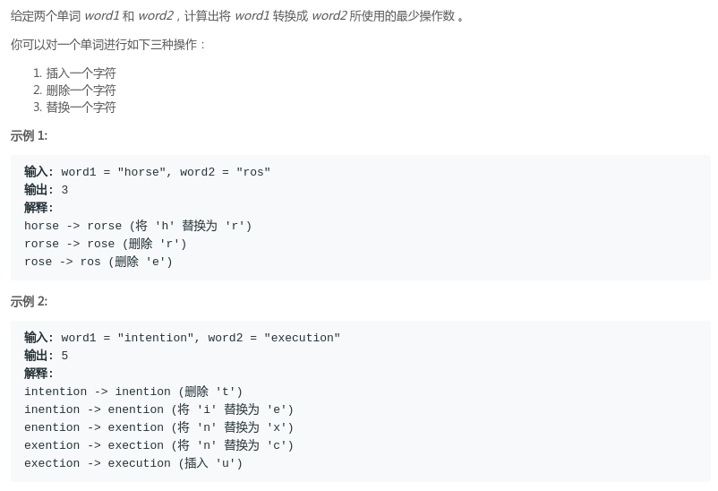
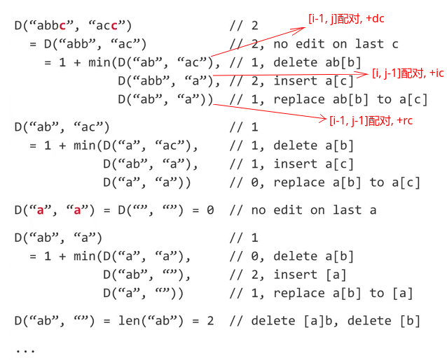
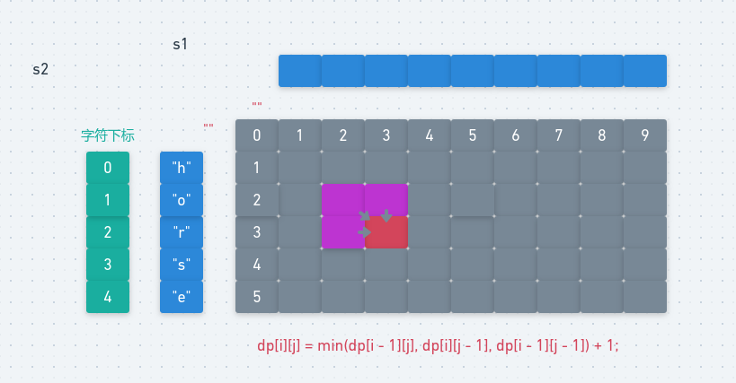
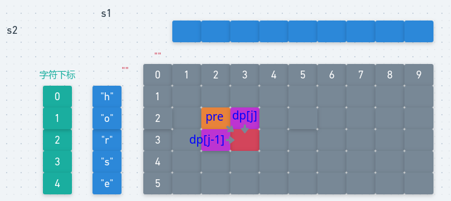
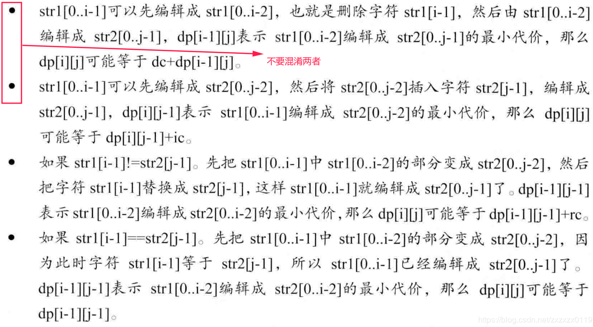

# LeetCode - 72. Edit Distance(编辑距离问题)(三个依赖的滚动优化)

 - 记忆化
 - 二维dp
 - 一维dpO(M)
 - 一维dpO(min(N,M))
 - 加强问题(ic,dc,rc)

#### [题目链接](https://leetcode.com/problems/edit-distance/description/)

> https://leetcode.com/problems/edit-distance/description/

#### 题目


## 1、记忆化
使用递归的解法: 

从两个字符串的最后的位置开始考虑: 

 * 如果最后两个字符`(i,j)`相等，最后两个字符就不要配对，所以等于`minDistance(s1[0..i-1]，s2[0...j-1])`；
 * 如果最后两个字符不相等: 说明要编辑，具体可以分为三种情况: 
  * 如果 `s1[i-1]`和`s2[j]`可以配对，那我就删除`s1[i]`即可(删除)；
  * 如果 `s1[i]和s2[j-1]`可以配对，那我就在`s1`的后面加上`s2[j]`即可(插入)；
  * 如果 `s1[i-1]和s2[j-1]`可以配对，那我就把`s1[i]`修改(`replace`)成`s2[j]`即可；

图:
<div align="center"></div><br>

然后就是使用一个`dp`数组记录递归中已经求解的子问题。

```java
class Solution {

    private int[][] dp;
    private char[] s1;
    private char[] s2;

    public int minDistance(String word1, String word2) {
        s1 = word1.toCharArray();
        s2 = word2.toCharArray();
        dp = new int[s1.length][s2.length];
        for (int[] arr : dp) Arrays.fill(arr, -1);
        return rec(s1.length - 1, s2.length - 1);
    }

    public int rec(int i, int j) {
        if (j == -1) return i+1;   //将s1编辑成空串(注意空串是-1，不是0),  注意下标是i 但是有i+1个(下标从0开始)
        if (i == -1) return j+1;   //将s2编辑成空串
        if (dp[i][j] != -1) return dp[i][j];
        if (s1[i] == s2[j])
            dp[i][j] = rec(i - 1, j - 1);
        else {
            dp[i][j] = 1 + Math.min(rec(i - 1, j),     // delete i
                    Math.min(rec(i, j - 1),            // add i+1  index
                    rec(i - 1, j - 1)));             // replace   i
        }
        return dp[i][j];
    }
}
```

当然你也可以是`i==0`的时候返回`j`，不过这样你判断的时候就是`s1[i-1]`和`s2[j-1]`，而且你的dp数组就要多开一个空间。(下面的dp也是基于这个版本)

```java
class Solution {

    private int[][] dp;
    private char[] s1;
    private char[] s2;

    public int minDistance(String word1, String word2) {
        s1 = word1.toCharArray();
        s2 = word2.toCharArray();
        dp = new int[s1.length+1][s2.length+1];//多一个空间
        for (int[] arr : dp) Arrays.fill(arr, -1);
        return rec(s1.length , s2.length);
    }

    public int rec(int i, int j) {
        if (j == 0) return i;   
        if (i == 0) return j;
        if (dp[i][j] != -1) return dp[i][j];
        if (s1[i-1] == s2[j-1]) //不是 s1[i] == s2[j]
            dp[i][j] = rec(i - 1, j - 1);
        else {
            dp[i][j] = 1 + Math.min(rec(i - 1, j),     // delete i
                    Math.min(rec(i, j - 1),            // add i+1  index
                            rec(i - 1, j - 1)));             // replace   i
        }
        return dp[i][j];
    }
}
```


## 2、二维dp



二维`dp`就是使用一个二维数组从左到右，从上倒下来递归出最后的答案，注意几点: 

 - `dp`数组的大小 `dp[chs1.length + 1] [chs2.length + 1]`，因为一开始是空串`" "`，所以要多开一个；
 - 一开始初始化第一行和第一列，第一行表示的是`chs1`为`""`，变成`chs2`要添加`chs2`长度的次数。第一列表示的是要删除的。

```java
class Solution {

    public int minDistance(String word1, String word2) {
        int[][] dp = new int[word1.length() + 1][word2.length() + 1];    //注意要 + 1因为一开始是空串
        for (int i = 0; i < word1.length() + 1; i++) dp[i][0] = i; // 0 是空串，所以我们要多考虑一个位置
        for (int j = 0; j < word2.length() + 1; j++) dp[0][j] = j;
        char c1, c2;
        for (int i = 1; i < word1.length() + 1; i++) {
            for (int j = 1; j < word2.length() + 1; j++) {
                c1 = word1.charAt(i - 1); // 注意是 i-1, 0是空串，后面的都要累加
                c2 = word2.charAt(j - 1);
                dp[i][j] = c1 == c2 ? dp[i - 1][j - 1] : 
                        min(dp[i - 1][j], dp[i][j - 1], dp[i - 1][j - 1]) + 1;
            }
        }
        return dp[word1.length()][word2.length()];
    }

    public int min(int a, int b, int c) {
        return Math.min(Math.min(a, b), c);
    }
}
```
## 3、一维dpO(M)
这个题目的滚动优化和之前的动态规划有一点点不同，不同的地方在于: 

 - 一个普通位置依赖的位置有三个地方，而如果只使用一个数组的话，左上角的位置的在更新的时候产生了变动；

解决的办法是使用两个变量`temp`和`pre`保存，在更新之前，使用`temp`保存`dp[j]`，然后`dp[j]`要被更新，然后将`dp[j]`赋值给`pre`，下次递推的时候，左上角的值就是`pre`； 



代码

```java
class Solution {

    public int minDistance(String word1, String word2) {
        char[] chs1 = word1.toCharArray();
        char[] chs2 = word2.toCharArray();
        int[] dp = new int[word2.length() + 1]; //注意要 + 1因为一开始是空串
        for (int j = 0; j < word2.length() + 1; j++) dp[j] = j;
        char c1, c2;
        int temp, pre;
        for (int i = 1; i < word1.length() + 1; i++) {
            pre = dp[0]; //上一排的
            dp[0] = i;   //这一排新dp[0]
            for (int j = 1; j < word2.length() + 1; j++) {
                c1 = word1.charAt(i - 1);
                c2 = word2.charAt(j - 1); //注意下标对应的关系
                temp = dp[j];  // 先要保存，因为等下就更新了
                dp[j] = c1 == c2 ? pre : min(dp[j], dp[j - 1], pre) + 1;
                pre = temp;      //记得先保存一下左上角的　pre的值(在二维的dp中就是dp[i-1][j-1])
            }
        }
        return dp[word2.length()];
    }

    public int min(int a, int b, int c) {
        return Math.min(Math.min(a, b), c);
    }
}
```
***
## 4、一维dpO(min(N,M))
**这个就是上面的一点改进，选取行和列中最小的作为`dp`数组的大小**。
```java
class Solution {

    public int minDistance(String word1, String word2) {
        char[] chs1 = word1.toCharArray();
        char[] chs2 = word2.toCharArray();

        char[] more = chs1.length >= chs2.length ? chs1 : chs2;
        char[] less = chs1.length < chs2.length ? chs1 : chs2;

        int[] dp = new int[less.length + 1];
        for (int j = 0; j < less.length + 1; j++) dp[j] = j;

        int temp, pre;
        for (int i = 1; i < more.length + 1; i++) {
            pre = dp[0];
            dp[0] = i;
            for (int j = 1; j < less.length + 1; j++) {
                temp = dp[j];
                dp[j] = more[i - 1] == less[j - 1] ? pre : min(dp[j], dp[j - 1], pre) + 1;
                pre = temp;
            }
        }
        return dp[less.length];
    }

    public int min(int a, int b, int c) {
        return Math.min(Math.min(a, b), c);
    }
}
```

***
## 5、加强问题(ic,dc,rc)

题目: 
给定两个字符串`str1`和`str2`，再给定三个整数`ic、dc`和`rc`，分别代表插入、删除和替换一个字符的代价，返回将`str1`编辑成`str2`的最小代价。

这个问题是上面问题的加强版，不同的地方在于这里三个编辑的代价不同，所以我们要更加的清楚是哪个编辑的更新: 



**也就是说:** 

 - `dp[i-1][j]`代表的是删除了 `chs1[i-1]`，然后配对`chs1[i-2]`和`chs2[j-1]`， 所以加上`dc`(删除`chs1[i-1]`的)；
 - `dp[i][j-1]`代表的是配对`chs1[i-1]`和`chs2[j-2]`，所以我们在`chs1`后面添加一个来和`chs2[j-1]`字符配对，所以加上`ic`；

```java
class Solution {

    /**
     * 给定的  ic,  dc  ,rc  分别代表的是 插入，删除　取代的代价
     * 　普通二维dp
     */
    public int minDistance(String word1, String word2, int ic, int dc, int rc) {
        char[] chs1 = word1.toCharArray();
        char[] chs2 = word2.toCharArray();

        int[][] dp = new int[chs1.length + 1][chs2.length + 1];

        for (int i = 0; i < chs1.length + 1; i++) dp[i][0] = i * dc; //chs1是   , chs2是""   ->要删除
        for (int j = 0; j < chs2.length + 1; j++) dp[0][j] = j * ic; //chs1 是"" 转换成chs2   -> 要添加

        for (int i = 1; i < chs1.length + 1; i++) {
            for (int j = 1; j < chs2.length + 1; j++) {
                dp[i][j] = chs1[i - 1] == chs2[j - 1] ? dp[i - 1][j - 1]
                        : min(dp[i][j - 1] + ic, dp[i - 1][j] + dc, dp[i - 1][j - 1] + rc); //dp[i-1][j]代表的是删除了 chs1[i-1] 所以加上dc
            }
        }
        return dp[chs1.length][chs2.length];
    }

    public int min(int a, int b, int c) {
        return Math.min(Math.min(a, b), c);
    }
    
}
```

空间优化: 

**这里要注意如果`chs1`作为更短的话，要进行字符串的调换**。

```java
class Solution {

    //空间 O(min(N,M))
    public int minDistance(String word1, String word2, int ic, int dc, int rc) {
        char[] chs1 = word1.toCharArray();
        char[] chs2 = word2.toCharArray();

        char[] more = chs1.length >= chs2.length ? chs1 : chs2;
        char[] less = chs1.length < chs2.length ? chs1 : chs2;

        int temp, pre;
        if (chs1 == less) {   //把chs1作为了列对应的字符串  就交换一下
            temp = ic;
            ic = dc;
            dc = temp;
        }

        int[] dp = new int[less.length + 1];
        for (int j = 0; j < less.length + 1; j++) dp[j] = j * ic;

        for (int i = 1; i < more.length + 1; i++) {
            pre = dp[0];
            dp[0] = i * dc;
            for (int j = 1; j < less.length + 1; j++) {
                temp = dp[j];
                dp[j] = more[i - 1] == less[j - 1] ? pre : min(pre + rc, dp[j] + dc, dp[j - 1] + ic);
                pre = temp;
            }
        }
        return dp[less.length];
    }

    public int min(int a, int b, int c) {
        return Math.min(Math.min(a, b), c);
    }

}
```
