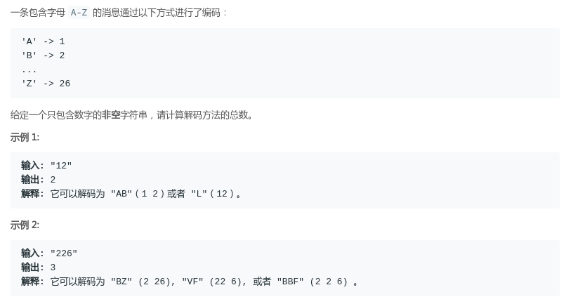
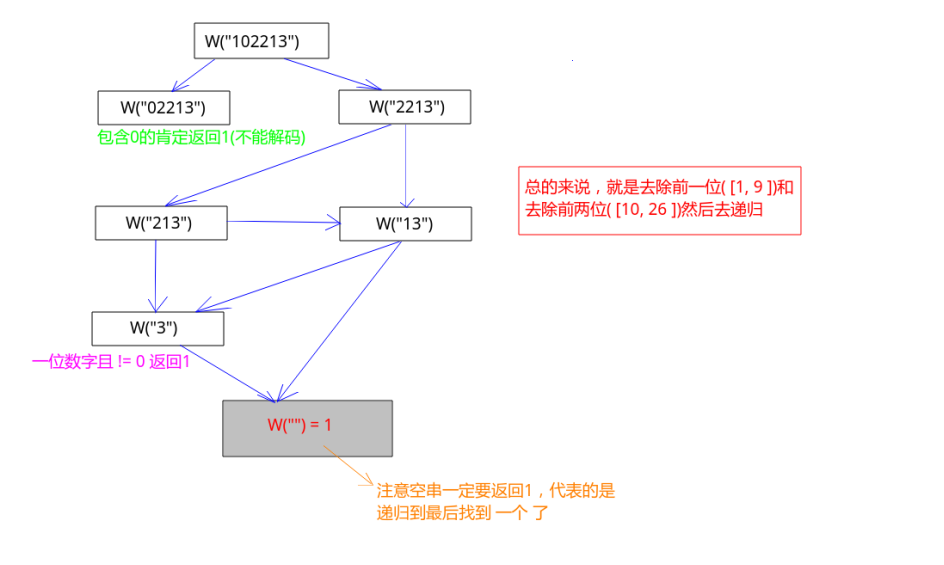

# LeetCode - 91. Decode Ways

#### [题目链接](https://leetcode.com/problems/decode-ways/)

> https://leetcode.com/problems/decode-ways/

#### 题目


## 解析

也是很明显的DP题目，递归思路

* 当前的字符串，当前的位置，总共的可能就是两种情况；
* 第一种情况，拆分出来当前的`str[i]`，然后求出`[i+1, s.length()]`的方法数`r1`，只要当前`str[i] != 0`，答案`res`就累加`r1`，然后我们还可以考虑将`str[i], str[i+1]`这两个字符拆分出来，这两个字符组成的数字只要满足`10 <= X <= 26 `，则递归`[i+2, s.length()]`得到的结果`r2`，则`res = r1 + r2`；
* 然后用记忆化记录结果即可；

图:



直观的递归代码: 

```java
class Solution {
    HashMap<String, Integer> dp;

    public int numDecodings(String s) {
        if(s == null || s.length() == 0)
            return 0;
        dp = new HashMap<>();
        return ways(s);
    }

    private int ways(String s){
        if(s.length() == 0)//找到一个了
            return 1; 
        if(s.charAt(0) == '0')
            return 0;
        if(s.length() == 1)//len = 1, 防止下面substr(0, 2)出错
            return 1;
        if(dp.containsKey(s))
            return dp.get(s);
        int res = ways(s.substring(1)); 
        int se = Integer.parseInt(s.substring(0, 2));
        if(se <= 26)
            res += ways(s.substring(2));
        dp.put(s, res);
        return res;
    }
}
```
也可以将字符串改成下标的方式，这样内存更少开销。
```java
class Solution {
    private int[] dp;

    public int numDecodings(String s) {
        if(s == null || s.length() == 0)
            return 0;
        dp = new int[s.length()];
        Arrays.fill(dp, -1);
        return ways(s.toCharArray(), 0);
    }

    private int ways(char[] chs, int pos){
        if(pos == chs.length)//越界/空串
            return 1;
        if(chs[pos] == '0')
            return 0;
        if(pos == chs.length-1)//一个字符返回1
            return 1;
        if(dp[pos] != -1)
            return dp[pos];
        int res = ways(chs, pos+1);
        int se = 10 * (chs[pos] - '0') + (chs[pos+1] - '0');
        if(se <= 26)
            res += ways(chs, pos+2);
        dp[pos] = res;
        return res;
    }
}
```
也可以改成递推的代码: (注意这里的特殊处理，空串是在`n == s.length()`的位置)。
```java
class Solution {
    
    public int numDecodings(String s) {
        if (s == null || s.length() == 0)
            return 0;
        int n = s.length();
        char[] chs = s.toCharArray();
        int[] dp = new int[n + 1];
        dp[n] = 1; // 空串要特殊处理
        dp[n-1] = chs[n-1] == '0' ? 0 : 1;
        for(int i = n-2; i >= 0; i--){
            if(chs[i] == '0')
                dp[i] = 0;
            else {
                dp[i] = dp[i+1];
                int se = 10 * (chs[i] - '0') + (chs[i+1] - '0');
                if(se <= 26)
                    dp[i] += dp[i+2];
            }
        }
        return dp[0];
    }
}
```
