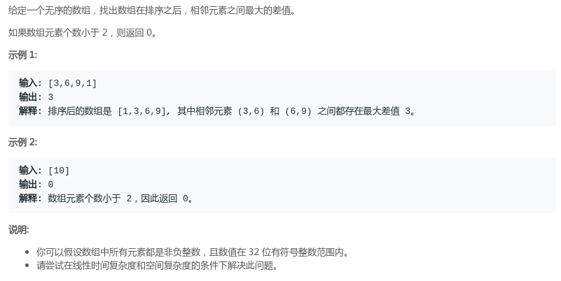
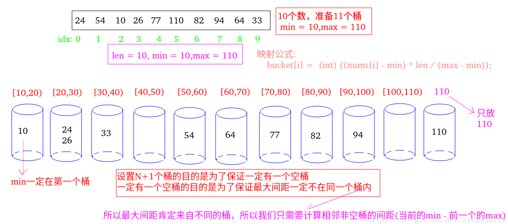
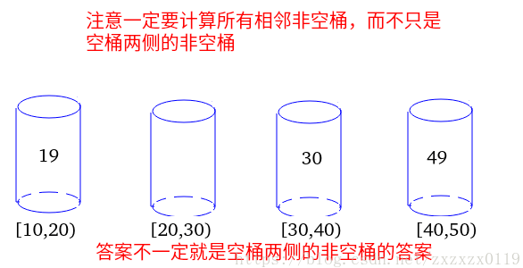

## LeetCode - 164. Maximum Gap(最大间距)(桶)
#### [题目链接](https://leetcode-cn.com/problems/maximum-gap/description/)

> https://leetcode-cn.com/problems/maximum-gap/description/

#### 题目


#### 解析
桶排序思想和相关实现可以看下[这篇博客](https://github.com/ZXZxin/ZXBlog/blob/master/%E6%95%B0%E6%8D%AE%E7%BB%93%E6%9E%84%E7%AE%97%E6%B3%95/Algorithm/Sort/%E5%90%84%E7%A7%8D%E6%8E%92%E5%BA%8F%E7%AE%97%E6%B3%95%E6%80%BB%E7%BB%93(%E5%85%A8%E9%9D%A2).md#%E6%A1%B6%E6%8E%92%E5%BA%8F)。
思路: 

*  先找到数组的最大值和最小值，记为`max`和`min`；
* 假设数组长度为`N`，准备`N+1`个桶，把`max`放在`N+1`号桶，`nums`中在`[min,max)`范围上的数放在`1~N`号桶中，对于`1 ~ N`号桶的每一个桶来说，负责的区间大小为`(max - min )/N`；
* 注意每个桶中存的不是很多的数，只存三个值，是否有数进入过这个桶，以及所有进入这个桶的数的最大值、最小值；
* 最后计算相邻非空桶的间距(当前桶的`min` 减去前一个桶的`max`) ，然后记录更新最大值；

比如下面的例子: 



注意不一定就是空桶两侧的非空桶的答案: 



代码:

```java
class Solution {
    //将 num 映射到对应的桶子
    public int mapToBucket(long num, long len, long min, long max) {
        return (int) ((num - min) * len / (max - min));
    }

    public int maximumGap(int[] nums) {
        if (nums == null || nums.length < 2)
            return 0;
        int len = nums.length;
        int min = Integer.MAX_VALUE, max = Integer.MIN_VALUE;
        for (int i = 0; i < nums.length; i++) {
            min = nums[i] < min ? nums[i] : min;
            max = nums[i] > max ? nums[i] : max;
        }
        if (max == min)
            return 0;
        //准备 n + 1个桶
        boolean[] hasNum = new boolean[len + 1];
        int[] mins = new int[len + 1];
        int[] maxs = new int[len + 1];

        for (int i = 0; i < nums.length; i++) {
            int bid = mapToBucket(nums[i], len, min, max);
            mins[bid] = hasNum[bid] ? Math.min(mins[bid], nums[i]) : nums[i];
            maxs[bid] = hasNum[bid] ? Math.max(maxs[bid], nums[i]) : nums[i];
            hasNum[bid] = true;
        }
        int res = 0, preMax = maxs[0]; //第一个桶一定不空  因为一定有一个 最小值
        // 每一个非空桶 都找到 左边离它最近的非空桶  然后计算答案
        for (int i = 1; i <= len; i++) {
            if (hasNum[i]) { // 是非空的
                res = Math.max(res, mins[i] - preMax);
                preMax = maxs[i];
            }
        }
        return res;
    }
}
```


