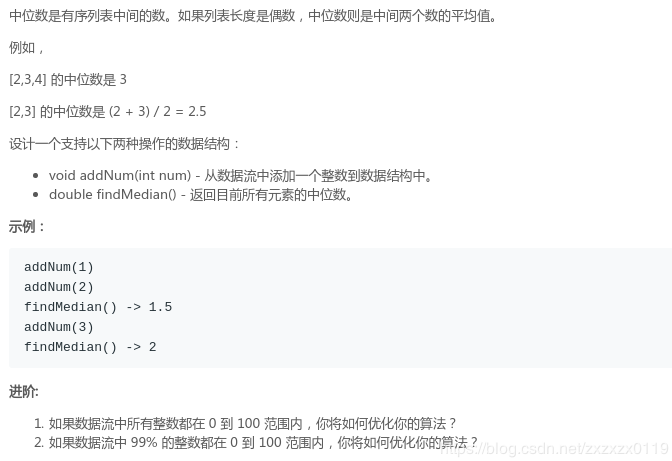

# LeetCode - 295. Find Median from Data Stream

#### [题目链接](https://leetcode.com/problems/find-median-from-data-stream/)

> https://leetcode.com/problems/find-median-from-data-stream/

#### 题目

#### 解析
准备两个堆: 一个最大堆(`maxHeap`)，一个最小堆`minHeap`。

* 最大堆存储较小元素的一半，最大堆存储较大元素的一半；
* 添加元素后，始终要维持要么两个堆的元素相等，要么左边的堆(`maxHeap`)元素比右边多一个；
* 如果不是上面两种情况，就要在添加元素之后维护；
* `findMedian`函数: 查询时，如果两个堆的元素个数相等就返回两个堆顶的元素的和除以一半，否则返回`maxHeap.peek()`； 

看一个例子: 
| num  | smaller(<font color = red>maxHeap</font>) | bigger(<font color = red>minHeap</font>) | median                    |
| ---- | ----------------------------------------- | ---------------------------------------- | ------------------------- |
| 5    | 5                                         |                                          | 5.0                       |
| 8    | <font color = red>5                       | <font color = red>8                      | 6.5                       |
| 2    | [2、<font color = red>5</font>]           | 8                                        | 5                         |
| 11   | [2、<font color = red>5</font>]           | [<font color = red>8</font>、11]         | 6.5                       |
| 3    | [2、3、<font color = red>5</font>]        | [8、11]                                  | 5                         |
| 4    | [2、3、4、5]                              | [8、11]                                  | <font color = blue>先调整 |
|      | [2、3、<font color = red>4</fonT>]        | [<font color = red>5</fonT>、8、11]      | 4.5                       |
| 14   | [2、3、4]                                 | [5、8、11、14]                           | <font color = blue>先调整 |
|      | [2、3、4、<font color = red>5</font>]     | [8、11、14]                              | 5                         |

代码:


```java
class MedianFinder {

    private PriorityQueue<Integer>maxHeap; // 第一个(更小的)是最大堆 (左边的)
    private PriorityQueue<Integer>minHeap; // 第二个(更大的)是最小堆 (右边的)
   
    public MedianFinder() {
        maxHeap = new PriorityQueue<>((o1, o2) -> o2 - o1);
        minHeap = new PriorityQueue<>(); // java默认是最小堆 (堆顶最小)
    }

    public void addNum(int num) {
        if(maxHeap.isEmpty() || (!maxHeap.isEmpty() && num <= maxHeap.peek()))
            maxHeap.add(num);
        else
            minHeap.add(num);

        if(maxHeap.size() < minHeap.size())
            maxHeap.add(minHeap.poll());
        else if(maxHeap.size() - minHeap.size() == 2)
            minHeap.add(maxHeap.poll());
    }

    public double findMedian() {
        if(maxHeap.size() == minHeap.size())
            return (maxHeap.peek() + minHeap.peek())/2.0;
        else    // minHeap.size() = maxHeap.size() + 1;
            return maxHeap.peek();
    }
}
```
