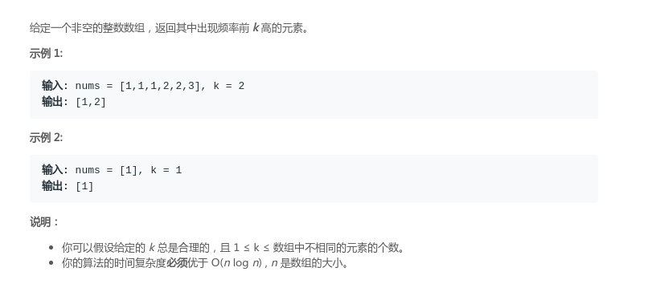
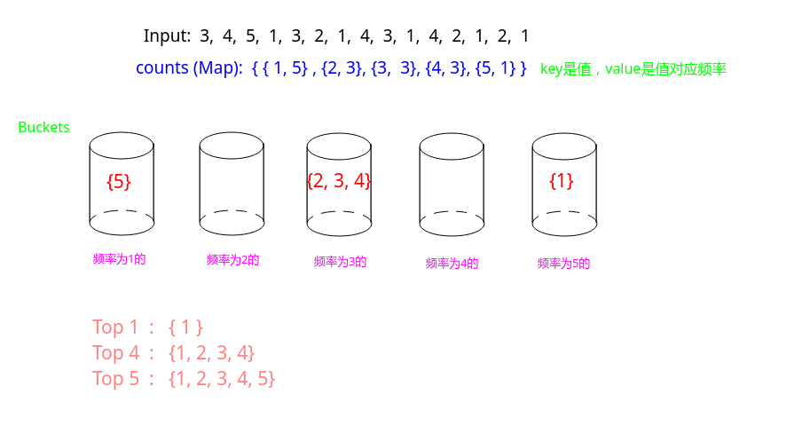

# LeetCode - 347. Top K Frequent Elements (堆  | 桶)
#### [题目链接](https://leetcode.com/problems/top-k-frequent-elements/)

> https://leetcode.com/problems/top-k-frequent-elements/

#### 题目


## 解析

两种解法，一种`O(N  * logK)`，一种`O(N)`。

`O(N*logK)`，维护一个K个数的堆即可。这里用`PriorityQueue`。
```java
class Solution {

    private class Freq {
        int e;
        int freq; //元素和频次

        public Freq(int e, int freq) {
            this.e = e;
            this.freq = freq;
        }
    }

    //维护一个K个数的优先队列
    public List<Integer> topKFrequent(int[] nums, int k) {
        HashMap<Integer, Integer> counts = new HashMap<>();
        for (int num : nums)
            counts.put(num, 1 + counts.getOrDefault(num, 0));
        PriorityQueue<Freq> heap = new PriorityQueue<>((o1, o2) -> o1.freq - o2.freq);
        counts.forEach((key, val) -> {
            heap.add(new Freq(key, val));
            if(heap.size() > k) 
                heap.poll();
        });
        List<Integer> res = new ArrayList<>();
        while (!heap.isEmpty())
            res.add(heap.poll().e);
        return res;
    }
}
```

代码:

```java
class Solution {

    //维护一个K个数的优先队列
    public List<Integer> topKFrequent(int[] nums, int k) {
        HashMap<Integer, Integer> counts = new HashMap<>();
        for (int num : nums)
            counts.put(num, 1 + counts.getOrDefault(num, 0));
        PriorityQueue< Map.Entry<Integer, Integer> > heap =
                new PriorityQueue<>((o1, o2) -> o1.getValue()  -o2.getValue());
        for (Map.Entry<Integer, Integer> entry: counts.entrySet()) {
            heap.add(entry);
            if(heap.size() > k)
                heap.poll();
        }
        List<Integer> res = new ArrayList<>();
        while (!heap.isEmpty())
            res.add(heap.poll().getKey());
        return res;
    }
}
```

`O(N)`解法: 

* 先用一个`HashMap`来统计每个值出现的频率；
* 然后记最大频率为`maxFreq`，然后生成`maxFreq`个桶，每个桶中放对应的频率的集合；
* 然后从后向前取从高频率到低频率的桶中的元素即可(取到`k`个就退出)；

图:



代码:

```java
class Solution {
    public List<Integer> topKFrequent(int[] nums, int k) {
        HashMap<Integer, Integer> counts = new HashMap<>();
        int maxFreq = 1;
        for(int num : nums){
            counts.put(num, 1 + counts.getOrDefault(num, 0));
            maxFreq = Math.max(maxFreq, counts.get(num));
        }
        HashMap<Integer, ArrayList<Integer>> buckets = new HashMap<>();
        counts.forEach((key, val) -> {
            ArrayList<Integer> tmp = buckets.getOrDefault(val, new ArrayList<>());
            tmp.add(key);
            buckets.put(val, tmp);
        });
        ArrayList<Integer>res = new ArrayList<>();
        for(int freq = maxFreq; freq >= 1; freq--){
            if(buckets.containsKey(freq))
                res.addAll(buckets.get(freq));
            if(res.size() == k)
                break;
        }
        return res;
    }
}
```

还有一种和`Java8`更密切的写法(利用`streamAPI`): 
```java
class Solution {
    public List<Integer> topKFrequent(int[] nums, int k) {
        Map<Integer, Integer> counts = new HashMap<>();
        Map<Integer, Set<Integer>> buckets = new HashMap<>();

        IntStream.of(nums).forEach(n -> counts.put(n, counts.getOrDefault(n, 0) + 1));

        // Sort by occurrences, so we can later get the most frequent.
        counts.forEach((key, val) -> {
            Set<Integer> set = buckets.getOrDefault(val, new HashSet<>());
            set.add(key);
            buckets.put(val, set);
        });

        //buckets.forEach((key, value) -> System.out.format("[%d->%s]", key, Arrays.asList(value.toArray())));
        List<Integer> res = new ArrayList<>();

        // Sort in reverse order and get the first K items, but since this is a set we need to save into a list.
        buckets.keySet().stream().sorted(Comparator.reverseOrder()).limit(k).forEach(freq -> res.addAll(buckets.get(freq)));
         
        return res.stream().limit(k).collect(Collectors.toList());
    }
}
```
