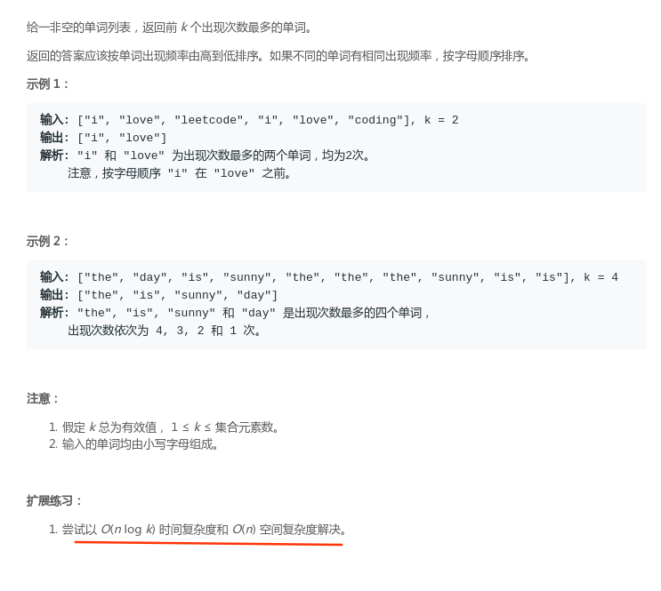

# LeetCode - 692. Top K Frequent Words

#### [题目链接](https://leetcode.com/problems/top-k-frequent-words/)

> https://leetcode.com/problems/top-k-frequent-words/

#### 题目



## 解析

题目明确是`O(n log k)`，很明显是用堆了。

解法一: 直接排序取前`K`个。(主要是见识一下`Java8`的一些写法)

`O(N*logN)`: 
```java
class Solution {
    public List<String> topKFrequent(String[] words, int k) {
        Map<String, Integer> freqs = new HashMap();
        for (String word: words)
            freqs.put(word, 1 + freqs.getOrDefault(word, 0));
        List<String> res = new ArrayList(freqs.keySet()); 
        Collections.sort(res, (w1, w2) -> freqs.get(w1) == freqs.get(w2) ? w1.compareTo(w2) :
                freqs.get(w2) - freqs.get(w1));
        return res.subList(0, k);
    }
}
```
解法二: 维护一个`K`个数的堆。

`O(N*logK)`
```java
class Solution {

    private class Freq{
        String word;
        int freq;

        public Freq(String word, int freq) {
            this.word = word;
            this.freq = freq;
        }
    }

    public List<String> topKFrequent(String[] words, int k) {
        List<String> res = new ArrayList<>();
        if(words == null)
            return res;
        Queue<Freq>heap = new PriorityQueue<>((o1, o2) -> { // lambda will be slow
            if(o1.freq == o2.freq)
                return o1.word.compareTo(o2.word); 
            return -(o1.freq - o2.freq); // big heap
        });
        HashMap<String, Integer> counts = new HashMap<>();
        for(String word : words)
            counts.put(word,1 + counts.getOrDefault(word, 0));
        counts.forEach((key, val) -> heap.add(new Freq(key, val))); // java 8
        for(int i = 0; i < k; i++)
            res.add(heap.poll().word);
        return res;
    }
}
```
