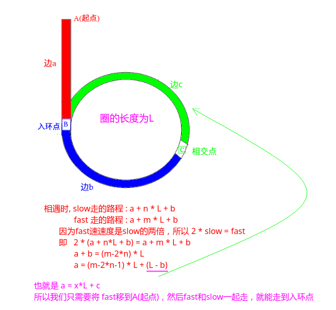

# LeetCode - 142. Linked List Cycle II-找到第一个入环节点

#### [题目链接](https://leetcode.com/problems/linked-list-cycle-ii/)

> https://leetcode.com/problems/linked-list-cycle-ii/

#### 题目

## 解析
同样可以使用`HashSet`，但是也不符合题目使用`O(1)`空间的要求。

`O(1)`空间的解法还是使用快慢指针，唯一的不同就是：

**他们相遇之后，让`fast`回到`head`(头结点)，然后两个指针每次都只走一步，他们一定会相遇，而且相遇的节点就是第一个入环节点**；

按照上面的思路写出代码很简单，关键是怎么证明就是那样走? 

看下图的解释，需要证明的是 边`a == 边c`，即最后可以`fast`和`slow`一起一步一步的走。。。

图:



代码:


```java
public class Solution {
    public ListNode detectCycle(ListNode head) {
        if (head == null)
            return null;
        ListNode fast = head;
        ListNode slow = head;

        while (fast.next != null && fast.next.next != null) {
            fast = fast.next.next;
            slow = slow.next;
            if (fast == slow) {//当fast和slow相交的时，让fast回到起点，fast和slow都只走一步，然后fast和slow第一次相遇的地方就是交点
                fast = head;
                while (fast != slow) {
                    fast = fast.next;
                    slow = slow.next;
                }
                return fast;
            }
        }
        return null;
    }
}
```