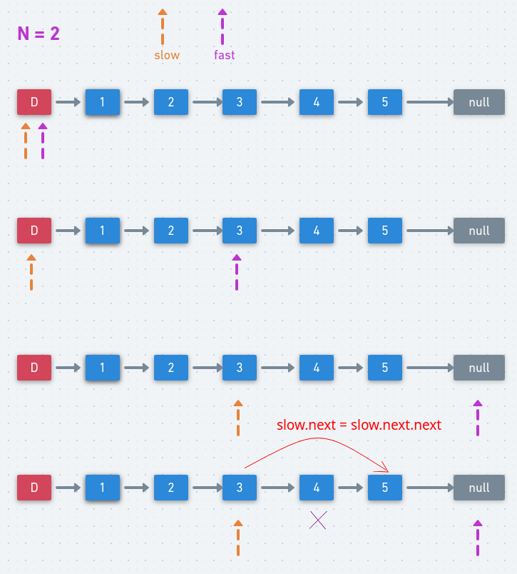

# LeetCode - 19. Remove Nth Node From End of List

#### [题目链接](https://leetcode.com/problems/remove-nth-node-from-end-of-list/)

> https://leetcode.com/problems/remove-nth-node-from-end-of-list/

#### 题目


## 解析

两种方法，一种遍历二次，一种遍历一次。

比较直接的思路，先求出长度`len`，然后第从前往后遍历`len - n`次就可以了。

```java
public class Solution {

    // 两次遍历的方法
    public ListNode removeNthFromEnd(ListNode head, int n) {
        int len = 0;
        ListNode cur = head;
        while (cur != null) {
            len++;
            cur = cur.next;
        }
        if (len < n) return null;
        ListNode dummyHead = new ListNode(-1);
        dummyHead.next = head;
        cur = dummyHead;
        for (int i = 0; i < len - n; i++) cur = cur.next;
        cur.next = cur.next.next;//删除倒数第N个节点
        return dummyHead.next;
    }
}
```

第二种思路是使用快慢指针。

第一个指针`fast`从列表的开头向前移动 `n+1`步，而第二个指针`slow`将从列表的开头出发。

现在，这两个指针被 `n` 个结点分开。我们通过同时移动两个指针向前来保持这个恒定的间隔，直到第一个指针到达最后一个结点。此时第二个指针将指向从最后一个结点数起的第 `n` 个结点。

然后我们重新链接第二个指针所引用的结点的 `next` 指针指向该结点的下下个结点。

<div align="center"></div><br>

代码:

```java
public class Solution {

    public ListNode removeNthFromEnd(ListNode head, int n) {
        ListNode dummyHead = new ListNode(-1);
        dummyHead.next = head;
        ListNode fast = dummyHead;
        ListNode slow = dummyHead;
        for (int i = 0; i < n + 1; i++)
            fast = fast.next;
        while (fast != null) {
            fast = fast.next;
            slow = slow.next;
        } 
        slow.next = slow.next.next;
        return dummyHead.next;
    }
}
```

