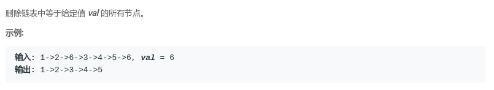
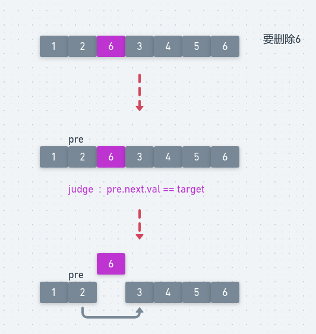
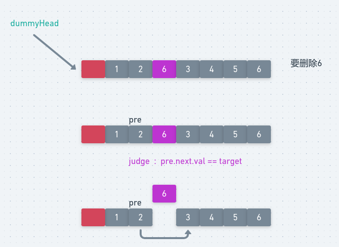
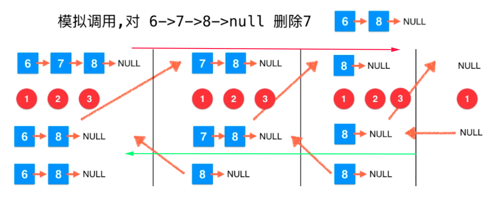

## LeetCode - 203. Remove Linked List Elements(删除链表中的元素(多个))

 - 不设置dummyHead
 - 设置dummyHead
 - 使用递归

***
#### [题目链接](https://leetcode.com/problems/remove-linked-list-elements/)

> https://leetcode.com/problems/remove-linked-list-elements/

#### 题目


## 非递归

链表非递归的一般都有设置`dummyHead`和不设置`dummyHead`（虚拟头结点）。

删除一个结点的操作: 

 - 先找到对应结点`node`的`pre`结点，然后令`pre.next = pre.next.next`就让`node`结点脱离整个链即可；
 - 注意要先判断一下，链表一开始相等的部分，要把前面所有相等的部分都先删除；

图:

<div align="center"></div><br>

代码:

```java
class Solution {

    public ListNode removeElements(ListNode head, int val) {
        if (head == null)
            return null;
        while (head != null && head.val == val) 
            head = head.next; //删除一开始的
        if (head == null)
            return null;
        ListNode pre = head;
        while (pre.next != null) {
            if (pre.next.val == val) {
                pre.next = pre.next.next;
            } else {
                pre = pre.next;//注意这里必须写在else中，因为pre.next删除之后，还是要检查pre.next
            }
        }
        return head;
    }
}
```
**这个就是设置一个虚拟的头结点，让我们不再需要特判链表的第一个元素**。

<div align="center"></div><br>

代码:

```java
class Solution {

    public ListNode removeElements(ListNode head, int val) {
        if (head == null) return null;
        ListNode dummyHead = new ListNode(-1);
        dummyHead.next = head;
        ListNode pre = dummyHead;
        while (pre.next != null) {
            if (pre.next.val == val)
                pre.next = pre.next.next;
            else
                pre = pre.next;
        }
        return dummyHead.next;
    }
}

```
## 递归

宏观的来看: 

 - **就是先去处理我的`next`，我的`next`链开始的链先给我删除那些`val`的，然后我再连接上**；
 - **我连接的时候，要看看自己要不要被删除，如果要，就直接返回我的`next`就可以了，如果不要就先连接上，然后返回**；

微观的来看: 



代码:

```java
class Solution {

    public ListNode removeElements(ListNode head, int val) {
        if (head == null) return null;

        ListNode res = removeElements(head.next, val);
        if (head.val == val) {
            return res;
        } else {
            head.next = res;
            return head;
        }
    }
}
```

```java
class Solution {

    public ListNode removeElements(ListNode head, int val) {
        if (head == null) return null;
        head.next = removeElements(head.next, val);  //我的next 等于 你后面的先处理完val我再连上你
        return head.val == val ? head.next : head;   //我自己的话 就要判断一下
    }
}
```

