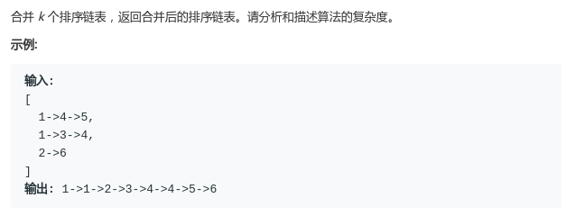
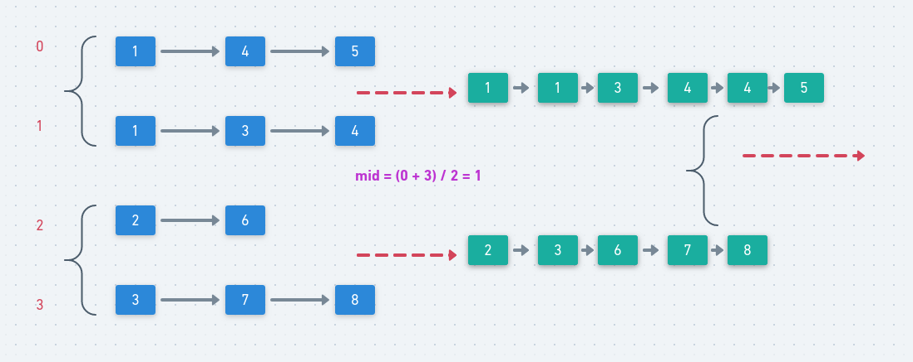

# LeetCode - 23. Merge K Sorted Lists

#### [题目链接](https://leetcode-cn.com/problems/merge-k-sorted-lists/)

> https://leetcode-cn.com/problems/merge-k-sorted-lists/

#### 题目



### 解析

做这题之前可以先做一下[LeetCode - 21 Merge Two Sorted List](https://leetcode-cn.com/problems/merge-two-sorted-lists/)。

这题是合并K个有序链表。

分治解法: 每次取数组链表的中点，然后划分，递归到底的时候使用合并两个链表的算法解决即可。



代码： 

```java
class Solution {

    public ListNode mergeKLists(ListNode[] lists) {
        if(lists == null || lists.length == 0) return null;
        return mergeK(lists, 0, lists.length - 1);
    }

    private ListNode mergeK(ListNode[] lists, int L, int R){
        if(L >= R) return lists[L];
        int mid = L + (R - L) / 2;
        ListNode LN = mergeK(lists, L, mid);
        ListNode RN = mergeK(lists, mid + 1, R);
        return merge(LN, RN);
    }

    private ListNode merge(ListNode l1, ListNode l2) {
        if (l1 == null || l2 == null)
            return l1 == null ? l2 : l1;
        if (l1.val < l2.val) {
            l1.next = merge(l1.next, l2);
            return l1;
        } else {
            l2.next = merge(l1, l2.next);
            return l2;
        }
    }
}
```

堆的解法:

* 首先将所有链表头节点加入到优先队列中；
* 然后每次从队列中取出最小的节点，并构造结果链表，且如果这个最小的节点的`next`不为空，就加入优先队列中；

代码:

```java
class Solution {

    public ListNode mergeKLists(ListNode[] lists) {
        PriorityQueue<ListNode> pq = new PriorityQueue<>((a, b) -> a.val - b.val);
        for(ListNode node : lists) if(node != null) pq.add(node);
        ListNode dummyHead = new ListNode(-1);
        ListNode cur = dummyHead;
        while(!pq.isEmpty()){
            ListNode top = pq.poll();
            cur.next = top;
            cur = cur.next;
            if(top.next != null)
                pq.add(top.next);
        }
        return dummyHead.next;
    }
}
```

