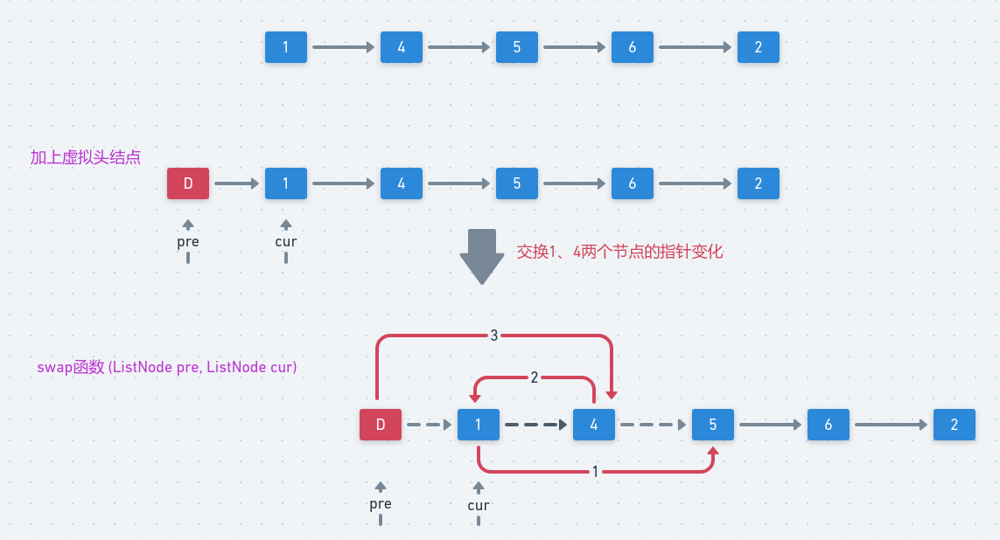

# LeetCode - 24. Swap Nodes in Pairs

#### [题目链接](https://leetcode.com/problems/swap-nodes-in-pairs/)

https://leetcode.com/problems/swap-nodes-in-pairs/

#### 题目


### 解析

可以有两种写法，递归和非递归。

先看非递归。

看下面的链表中交换`1、4`两个节点需要做出的指针的变化，红色是新的指针的指向，虚线是丢弃的指向。



代码:

```java
class Solution {

    public ListNode swapPairs(ListNode head) {
        ListNode dummyHead = new ListNode(-1);
        dummyHead.next = head;
        ListNode pre = dummyHead, cur = head;
        while (cur != null && cur.next != null) {
            swap(pre, cur);
            pre = cur; // 下一轮
            cur = cur.next;
        }
        return dummyHead.next;
    }

    private void swap(ListNode pre, ListNode cur) {
        ListNode next = cur.next;
        cur.next = next.next;
        next.next = cur;
        pre.next = next;
    }
}
```

非递归的写法也比较简单。代码可以更加的简单:

主要是从宏观的思想去想，即使很简单。

```java
class Solution {

    public ListNode swapPairs(ListNode head) {
        if (head == null || head.next == null) return head;
        ListNode next = head.next; //先保存next
        head.next = swapPairs(next.next); // 先交换后面的并且让head.next链接上交换后的头结点
        next.next = head; // 然后next的next指向head
        return next; // 最后返回的是next（作为新的头结点）
    }
}
```

