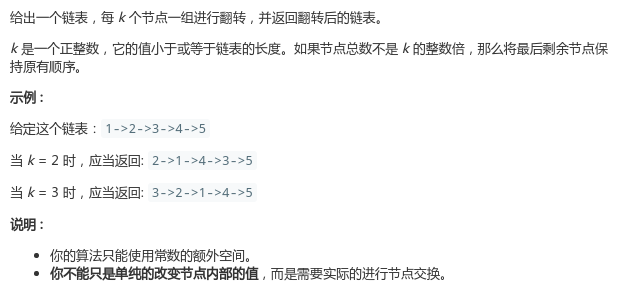
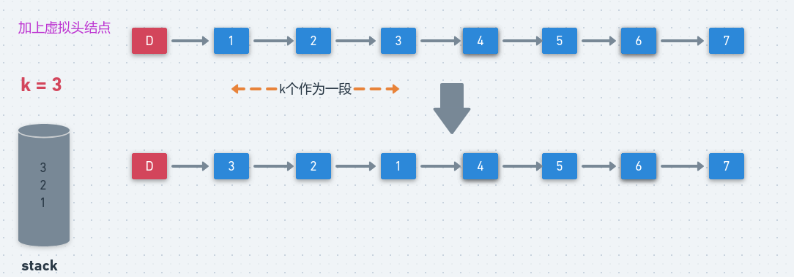
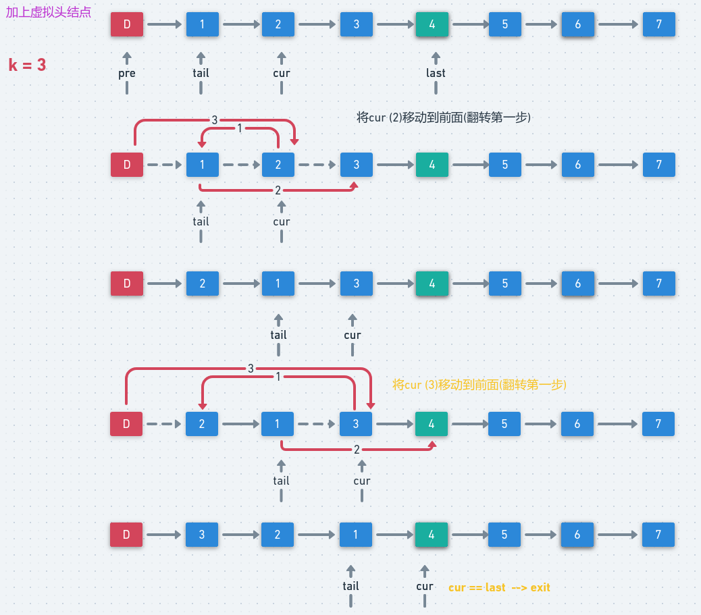

# LeetCode - 25. Reverse Nodes in K-Group

#### [题目链接](https://leetcode.com/problems/reverse-nodes-in-k-group/)

> https://leetcode.com/problems/reverse-nodes-in-k-group/

#### 题目



### 解析

两种做法。一种用栈(`O(K)`空间)，另一种不需要额外空间。

方法一: 使用`O(K)`的空间:

* 每次推入`k`个节点到栈中；
* 然后利用栈来翻转这`k`个节点；
* 注意如果不足`k`个就直接return；
* 然后还要注意段与段之间的衔接；

图:



代码:

```java
class Solution {

    // method 1 : use stack
    public ListNode reverseKGroup(ListNode head, int k) {
        if(head == null) return null;
        Stack<ListNode> stack = new Stack<>();
        ListNode dummy = new ListNode(-1);
        dummy.next = head;
        ListNode cur = dummy, next = dummy.next;
        while(next != null){
            for(int i = 0; i < k && next != null; i++) {
                stack.push(next);
                next = next.next;
            }
            // 最后不足k个了
            if(stack.size() != k) return dummy.next;
            while (!stack.isEmpty()) { //翻转
                cur.next = stack.pop();
                cur = cur.next;
            }
            cur.next = next; //衔接上下一段
        }
        return dummy.next;
    }
}
```

方法二: 不用额外空间:

* 也是每次翻转`k`个，我们规定每次翻转`(pre ~ last)`之间的元素（不包括`pre、last`）；
* 每次都是将从第二个开始的部分放到前面去，例如`1 ~ 2 ~ 3`，先将`2`放到前面，变成`2 ~ 1 ~ 3`，然后将`3`放到前面，变成`3 ~ 2 ～ 1`。
* 每次返回每一段一开始的那个元素作为`tail`，并作为下一段的`pre`。

步骤(从上往下(演示翻转`1 ~ 3`部分)):



代码:

```java
class Solution {

    // method 2 : no extra space
    public ListNode reverseKGroup(ListNode head, int k) {
        if(head == null) return null;
        ListNode dummy = new ListNode(-1);
        dummy.next = head;
        ListNode pre = dummy;
        while(pre != null) pre = reverse(pre, k);
        return dummy.next;
    }

    private ListNode reverse(ListNode pre, int k){
        ListNode last = pre;
        for(int i = 0; i <= k; i++){
            last = last.next;
            if(last == null && i != k) return null; // 不足k个
        }
        ListNode tail = pre.next; //最后要返回的值，作为下一次k个翻转的pre
        ListNode cur = pre.next.next;
        while(cur != last){ // 当 cur == last 的时候说明k个已经完全翻转了
            ListNode next = cur.next;
            cur.next = pre.next;
            pre.next = cur;
            tail.next = next;
            cur = next;
        }
        return tail;
    }
}
```

