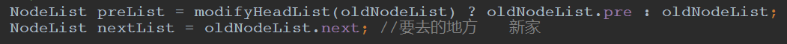

## LeetCode - 460. LFU Cache(LFU缓存算法，二维链表解决)
#### [题目链接](https://leetcode.com/problems/lfu-cache/description/)

> https://leetcode.com/problems/lfu-cache/description/

#### 题目


### 解析
设计使用两个链表: 

 - **一个大链表表示键值对出现次数的链表**；
 - **小链表表示这条链表的次数都一样，但是由于我们的添加可以决定添加的顺序，可以达到在次数相同的情况下，先移除最近最少使用的键值对**；


下面的代码中的方法: 

 - **`addNodeFromHead()`**，大链表的结点(本身也是一个小链表)在头部添加一个键值对)；
 - **`deleteNode()`**，大链表的结点(本身也是一个小链表)　中删除一个结点；
 - `LFU`结构中的`move()`方法，表示要当我操作了一个键值对，对应的次数增加，就需要调整结点的位置，`move()`方法就是从原来的小链表(大链表的结点)移动到一个新的小链表(也就是次数比原来次数`+1`)的新小链表；
 - `modifyHeadList()`表示的当我删除一个结点(也就是在旧的小链表中删除一个之后)有可能这个小链表本来只有这一个元素，所以要销毁这个小链表，为什么要写成`boolean`型的，因为等下在下面的代码中，在`move`的时候，要重新连接一个大链表的结点要知道`preList`，所以需要判断; 



两个链表示意图:


代码有点长，都写了注释：　 
```java
class LFUCache {

    //小链表(挂在下面的)
    private class Node {
        public Integer key;  //map中push的key
        public Integer value;   //map中对应的value
        public Integer times;     //  操作的次数

        public Node up;   //小链表的上一个
        public Node down;  //小链表的下一个

        public Node(Integer key, Integer value, Integer times) {
            this.key = key;
            this.value = value;
            this.times = times;
        }
    }

    //大的链表的结点结构  (每一个结点都是一个小链表)
    private class NodeList {
        public Node head;  //大链表的头部指针
        public Node tail;   //大链表的尾部指针

        public NodeList pre;   //大链表的前一个结点
        public NodeList next;  //大链表的下一个结点

        public NodeList(Node node) {
            head = node;
            tail = node;
        }

        public boolean isEmpty() {//返回这个小链表(小链表本身又是大链表的结点)是不是空的
            return head == null;
        }

        //小链表的头部添加结点
        public void addNodeFromHead(Node newHead) {
            newHead.down = head;
            head.up = newHead;
            head = newHead;
        }

        //删除小链表中的任意一个结点
        public void deleteNode(Node node) {
            if (head == tail) { //只有一个结点
                head = null;
                tail = null;
            } else {
                if (head == node) { //删除的是小链表的头部
                    head = head.down; //头结点变成下一个
                    head.up = null;   //头结点的上一个 置空
                } else if (tail == node) {  //删除的是小链表的尾部
                    tail = tail.up;
                    tail.down = null;
                } else {  //删除的是链表的中间
                    node.up.down = node.down;
                    node.down.up = node.up;
                }
            }
            //完全断链
            node.up = null;
            node.down = null;
        }
    }


    private int capacity;  //最大容量
    private int size;   //当前容量
    // key 对应的node   node是在小链表上面的
    private HashMap<Integer, Node> kNMap;
    //Node对应的NodeList的头是哪个  就是任何一个小结点都能查到在大链表的哪个小链表上
    private HashMap<Node, NodeList> heads;  //一个链表对应的大链表的结点是哪个
    public NodeList headList; //整个大链表的头部  动态的头部  不一定就是1作为头


    public LFUCache(int capacity) {
        this.capacity = capacity;
        size = 0;
        kNMap = new HashMap<>();
        heads = new HashMap<>();
        headList = null;
    }


    public void put(int key, int value) {
        if (capacity == 0) return;  //注意特判
        if (kNMap.containsKey(key)) {  //如果已经存在  就要更新值
            Node node = kNMap.get(key);
            node.value = value;
            node.times++;
            NodeList curNodeList = heads.get(node); //找到属于哪一个大链表
            /**
             * move方法
             * 就是在一个大链表中，和自己的上下级解耦，然后放到下一个词频链表中
             * 比如说现在是5 times链上的，则从5times链中拿出来，如果6存在,放到6times链的头部(头插法)
             * 如果6不存在，建出6times的链表
             */
            move(node, curNodeList);
        } else {  //kNMap中不存在,是新插入的  没包含
            //要先判断容量够不够
            if (size == capacity) {  //已经满了  要删掉一个结点
                //要删掉的就是作为大链表的 头部的尾结点  (次数最少的 用了最久的)
                Node deNode = headList.tail;
                headList.deleteNode(deNode);
                /**
                 * 如果我删掉了  这个deNode  有可能我整个大链表的headList都没有东西了，整个大Node要删掉，要更新大headList
                 * 又因为加入了新节点，所以又要更新headList
                 * 先删再加
                 */
                modifyHeadList(headList);
                kNMap.remove(deNode.key); //不要忘记在kNMap中删掉
                heads.remove(deNode);
                size--;

            }

            Node node = new Node(key, value, 1); //新建  次数为1

            if (headList == null) {    //整个大链表都不存在
                headList = new NodeList(node);  //建出大链表的头部
            } else {   //  已经有了大链表的头部
                /**
                 * 如果有 次数为1的头  就直接添加到大头的头部
                 * 如果没有次数为1大头  就建一个大头   然后添加到大头的尾部
                 */
                if (headList.head.times.equals(1)) { //大链表的头的头 的次数是 1 也就是说 有为times的小链表
                    headList.addNodeFromHead(node);  //加到这里
                } else {   //没有times为 1 的小链表  要自己建一个
                    NodeList newList = new NodeList(node);  //建出一个times为1的小链表
                    newList.next = headList;
                    headList.pre = newList;
                    headList = newList;  //更新大头
                }
            }

            //最后再添加这条记录
            kNMap.put(key, node);
            heads.put(node, headList); //这个结点所在的头 肯定是在大头的头部  也就是times一定是1  因为已经判断了不是1(已经存在的情况)
            size++;
        }
    }

    /**
     * 解耦原来的链表  并放入到一个新的链表中
     * @param node        这个node
     * @param oldNodeList node 的原来属于的list
     */
    private void move(Node node, NodeList oldNodeList) {
        oldNodeList.deleteNode(node); //老链表你自己先删掉
        /**
         * 因为你的老链表删掉了一个结点  是不是有可能 连老链表都没了
         *要判断老链表  是否还存在
         * modifyHeadList(oldNodeList)   返回true就是说老链表都被删掉了  所以要去找老链表的前一个链表
         * 返回false就是说老链表还存在  preList就是老链表
         */
        NodeList preList = modifyHeadList(oldNodeList) ? oldNodeList.pre : oldNodeList;
        NodeList nextList = oldNodeList.next; //要去的地方　　新家

        if (nextList == null) {  //你的oldNodeList是大链表的最后一个
            NodeList newList = new NodeList(node); //建一个　　放在最后
            if (preList != null) {
                preList.next = newList;
            }
            newList.pre = preList;

            if (headList == null) {  //本来就是空的就要给headList一个交代
                headList = newList;
            }
            heads.put(node, newList); //换新家了
        } else { //不是最后一个不是times最高的

            if (nextList.head.times.equals(node.times)) { //下一个存在　　就直接挂在下一个的头部
                nextList.addNodeFromHead(node);
                heads.put(node, nextList);
            } else {   //下一个不是 times + 1的   要自己新建一个node　　然后左右两边重新连接好
                NodeList newList = new NodeList(node);

                if (preList != null) preList.next = newList;
                newList.pre = preList;

                newList.next = nextList;
                nextList.pre = newList;

                if (headList == nextList) { //这个是也要更换头  
                    headList = newList;
                }
                heads.put(node, newList);
            }
        }
    }

    /**
     * 这个方法的调用时机是  把一个node从一个nodelist中删掉 ，然后判断是不是要不这个nodelist给删掉
     * 就是在delete之后， 要不要把整个小链表删掉
     * @param nodeList
     */
    private boolean modifyHeadList(NodeList nodeList) {
        if (nodeList.isEmpty()) {  //为空了才要删掉整个大链表中的这个结点
            if (headList == nodeList) {     //要删的这个  是整个大链表的头部
                headList = headList.next;        //新的头部是老头部的下一个
                if (headList != null) {       //新链表不为空
                    headList.pre = null;
                }
            } else {    //要删的不是头
                nodeList.pre.next = nodeList.next;
                if (nodeList.next != null) {
                    nodeList.next.pre = nodeList.pre;
                }
            }
            return true; //也就是 这个是要整个都要删掉的
        }
        return false;  //不空的话(也就是不只一个)就不要删    留着
    }

    public Integer get(int key) {
        if (capacity == 0) return -1;  //特判一下
        if (!kNMap.containsKey(key)) {
            return -1;
        }
        Node node = kNMap.get(key); //获取结点所在的原来的链表
        node.times++;
        NodeList curNodeList = heads.get(node);  //找到这个结点属于的小链表
        move(node, curNodeList);
        return node.value;  //返回对应的node的值
    }
}
```
