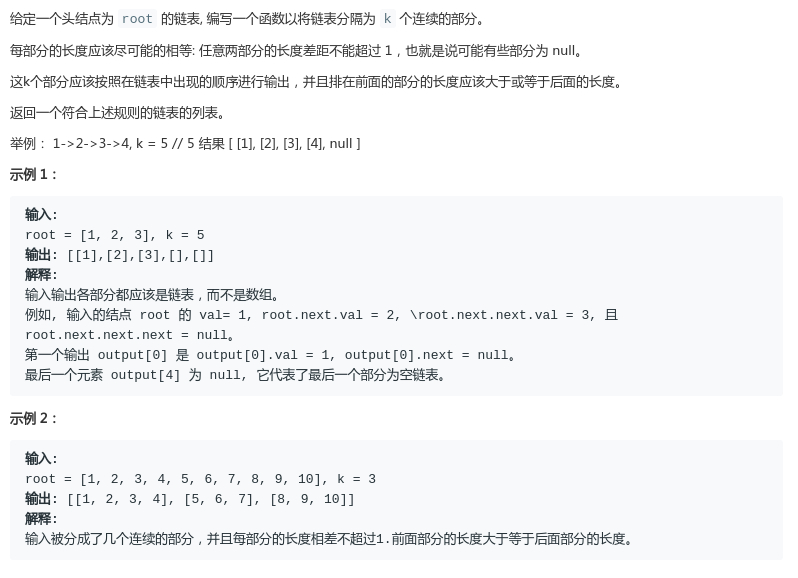

# LeetCode - 725. Split Linked List in Parts

#### [题目链接](https://leetcode.com/problems/split-linked-list-in-parts/)

> https://leetcode.com/problems/split-linked-list-in-parts/

#### 题目



## 解析

这种题目就是考察你的代码实现能力，强力建议不要看别人的代码，一定要自己手撸实现。

代码:

```java

class Solution {
    public ListNode[] splitListToParts(ListNode root, int k) {
        ListNode[] res = new ListNode[k];
        ListNode cur = root;
        int cnt = 0;
        while (cur != null) {
            cur = cur.next;
            cnt++;
        }
        int split = cnt / k;
        int remain = cnt % k;
        int r = 0;
        cur = root;
        for (int c = 0; c < k; c++) {
            ListNode head = cur;
            ListNode tmp = head;
            if (tmp == null)
                break;
            cur = cur.next;
            for (int i = 0; i < split - 1; i++) {
                tmp.next = cur;
                tmp = tmp.next;
                if (cur != null) cur = cur.next;
            }
            if (split > 0 && remain > 0) {
                remain--;
                tmp.next = cur;
                tmp = tmp.next;
                if (cur != null) cur = cur.next;
            }
            tmp.next = null;
            res[r] = new ListNode(-1);
            res[r++] = head;
        }
        return res;
    }

}
```

