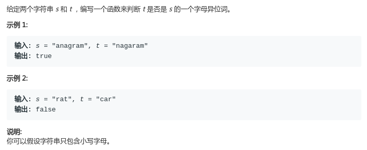

# LeetCode - 242. Valid Angram

#### [题目链接](https://leetcode.com/problems/valid-anagram/)

> https://leetcode.com/problems/valid-anagram/

#### 题目



## 解析

很简单的用哈希表统计个数的问题。过于简单就不画图了。。

值得一提的是`Arrays`里面有一个可以比较两个数组内容是否都相同的静态方法`equals`。可以省掉代码。

```java
import java.util.Arrays;

class Solution {
    public boolean isAnagram(String s, String t) {
        if (s.length() != t.length()) return false;
        int c1[] = new int[26];
        int c2[] = new int[26];
        for (int i = 0; i < s.length(); i++) {
            c1[s.charAt(i) - 'a']++;
            c2[t.charAt(i) - 'a']++;
        }
        return Arrays.equals(c1, c2); // Arrays里面的工具类
    }
}
```

也可以省略一个`count`数组，第一个累加，第二个减，最后看是不是全是`0`就可以了。

```java
import java.util.Arrays;

class Solution {
    public boolean isAnagram(String s, String t) {
        if (s.length() != t.length()) return false;
        int c[] = new int[26];
        for (int i = 0; i < s.length(); i++) {
            c[s.charAt(i) - 'a']++;
            c[t.charAt(i) - 'a']--;
        }
        for(int n : c)if(n != 0) return false;
        return true;
    }
}
```

