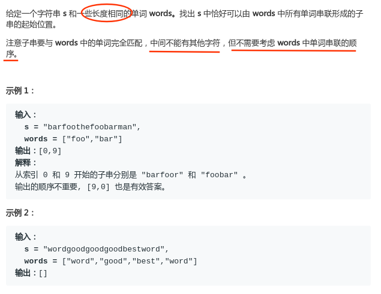
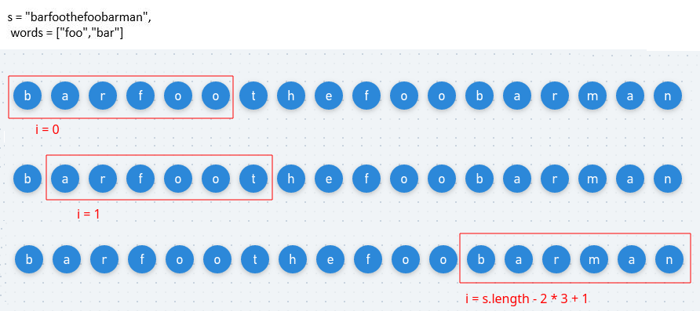
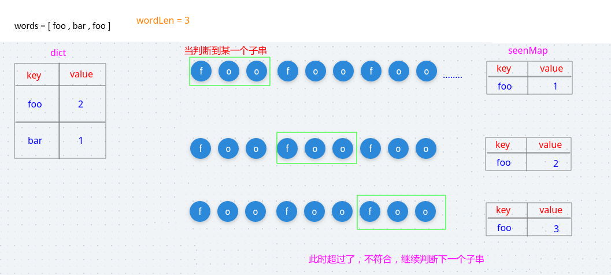

# LeetCode - 30. Substring with Concatenation of All Words

#### [题目链接](https://leetcode.com/problems/substring-with-concatenation-of-all-words/)

> https://leetcode.com/problems/substring-with-concatenation-of-all-words/

#### 题目



### 解析

第一种暴力的解法。

遍历每个子串看是不是满足条件。



怎么判断子串是否符合？如果是两个单词 A，B，我们只需要判断子串是否是 AB 或者 BA 即可。如果是三个单词 A，B，C 也还好，只需要判断子串是否是 ABC，或者 ACB，BAC，BCA，CAB，CBA 就可以了，但如果更多单词呢？**可以求出排列，但是更好的方法是使用两个Map**。

首先，我们把所有的单词存到 HashMap 里，key 直接存单词，value 存单词出现的个数（因为给出的单词可能会有重复的，所以可能是 1 或 2 或者其他）。然后扫描子串的单词，如果当前扫描的单词在之前的 HashMap 中，就把该单词存到新的 HashMap 中，并判断新的 HashMap 中该单词的 value 是不是大于之前的 HashMap 该单词的 value ，如果大了，就代表该子串不是我们要找的，接着判断下一个子串就可以了。如果不大于，那么我们接着判断下一个单词的情况。**子串扫描结束，如果子串的全部单词都符合，那么该子串就是我们找的其中一个**。



代码:

```java
class Solution {
    // 给定一个字符串 s 和一些  长度相同 的 词 words。
    // 找出 s 中 所有 恰好可以由 words 中所有单词(可以打乱顺序)串联形成的子串的起始位置。
    // 输入：s = "barfoothefoobarman", words = ["foo","bar"]
    // 输出：[0,9]
    public List<Integer> findSubstring(String s, String[] words) {
        List<Integer> res = new ArrayList<>();
        if(words.length == 0) return res;
        HashMap<String, Integer> dict = new HashMap<>();
        for(String word : words) dict.put(word, dict.getOrDefault(word, 0) + 1);
        int wordLen = words[0].length(); // words中所有单词长度一样
        int sLen = s.length();
        for(int i = 0; i < sLen - words.length * wordLen + 1; i++){  // 遍历所有的子串
            HashMap<String, Integer> seen = new HashMap<>();
            int j = 0; // 遍历 words的数目
            while(j < words.length){
                String word = s.substring(i + j * wordLen, i + (j+1) * wordLen);
                if(!dict.containsKey(word)) break; // 必须要在dict中
                seen.put(word, seen.getOrDefault(word, 0) + 1);
                if(seen.get(word) > dict.get(word)) break; // 当超过了也不行
                j++;
            }
            if(j == words.length) res.add(i); // 所有的单词都是符合的
        }
        return res;
    }
}
```

这题还可以优化。具体可以参考下面链接。

<https://leetcode.com/problems/substring-with-concatenation-of-all-words/discuss/13656/An-O(N)-solution-with-detailed-explanation%E3%80%82>