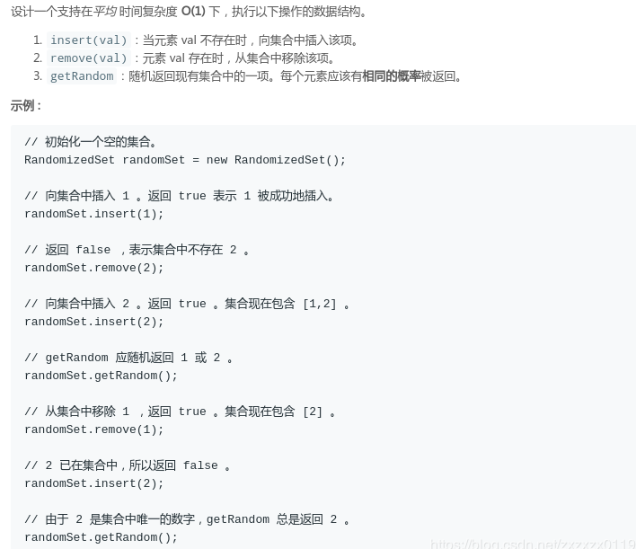
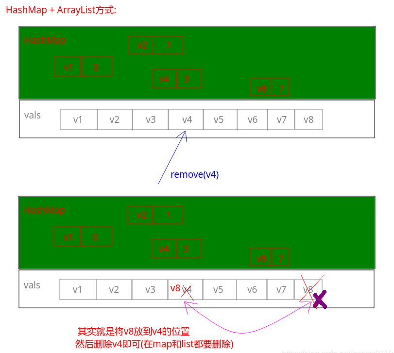

# LeetCode - 380. Insert Delete GetRandom O(1) (常数时间插入、删除和获取随机元素)

* [HashMap + List 实现](#hashmap---list-实现)
* [两个HashMap实现](#两个hashmap实现)

***

#### [题目链接](https://leetcode.com/problems/insert-delete-getrandom-o1/)

> https://leetcode.com/problems/insert-delete-getrandom-o1/

#### 题目


***
### HashMap + List 实现

解析: 

* 准备一个`HashMap`和一个`List`容器，`HashMap`存放`val`到`index`的映射，`List`容器中存放`val`集合；
* `insert()`: 将`val`插入`List`，并加`<val, val在List对应的索引>` 放入`HashMap`；
* `remove()`:  先获取要移除的值`val`的 `index`，记为`removeIndex`，然后取`List`中的最后一个元素，记为`lastVal`，然后执行` valIndexMap.put(lastVal, removeIndex);`和` vals.set(removeIndex, lastVal); `也就是将最后一个元素放到要删除的位置。 最后在两个容器中移除要删除的元素即可；
* `getRandom()`: 在`List`中随机取一个元素即可；

图: 



代码:

```java
class RandomizedSet {

    private HashMap<Integer, Integer>valIndexMap; // val -> index
    private ArrayList<Integer> vals;

    public RandomizedSet() {
        valIndexMap = new HashMap<>();
        vals = new ArrayList<>();
    }

    public boolean insert(int val) {
        if(valIndexMap.containsKey(val))
            return false;
        valIndexMap.put(val, vals.size());
        vals.add(val);
        return true;
    }

    public boolean remove(int val) {
        if(!valIndexMap.containsKey(val)) // doesn't exit, return false;
            return false;

        int removeIndex = valIndexMap.get(val);
        Integer lastVal = vals.get(vals.size()-1);
        
        valIndexMap.put(lastVal, removeIndex); // put the lastVal to the removeIndex position
        vals.set(removeIndex, lastVal); // update vals

        valIndexMap.remove(val);
        vals.remove(vals.size() - 1);
        
        return true;
    }

    public int getRandom() {
        if(vals.size() == 0)
            throw new RuntimeException();
        int randomIndex = (int)(Math.random() * vals.size());
        return vals.get(randomIndex);
    }
}
```
***

### 两个HashMap实现

这个和上面那个也是类似的: 

* 通过一个`size`变量来维护这个**容器**的容量；
* 然后要增加一个`index -> val`的容器，这个就是替代了那个`List`，可以通过`index`来获取`val`；
* 主要的思想还是通过将最后一个元素(`size - 1`)放到删除元素的位置(`removeIndex`)；


```java
class RandomizedSet {

    private HashMap<Integer, Integer>valIndexMap; // val -> index 
    private HashMap<Integer, Integer>indexValMap; // index -> val 
    private int size;
    
    public RandomizedSet() {
        valIndexMap = new HashMap<>();
        indexValMap = new HashMap<>();
        size = 0;
    }
    
    public boolean insert(int val) {
        if(valIndexMap.containsKey(val))
            return false;
        valIndexMap.put(val, size);
        indexValMap.put(size++, val);
        return true;
    }
    
    public boolean remove(int val) {
        if(!valIndexMap.containsKey(val)) // doesn't exit, return false;
            return false;
        int removeIndex = valIndexMap.get(val);  // get the index of deleteVal 
        int lastIndex = --size;             // the last element's index
        
        Integer lastVal = indexValMap.get(lastIndex);
        
        valIndexMap.put(lastVal, removeIndex);  
        indexValMap.put(removeIndex, lastVal);
        
        // remove val and the lastIndex
        valIndexMap.remove(val);
        indexValMap.remove(lastIndex); 
        return true;
    }
    
    public int getRandom() {
        if(size == 0)
            throw new RuntimeException();
        int randomIndex = (int)(Math.random() * size);
        return indexValMap.get(randomIndex);
    }
}
```

