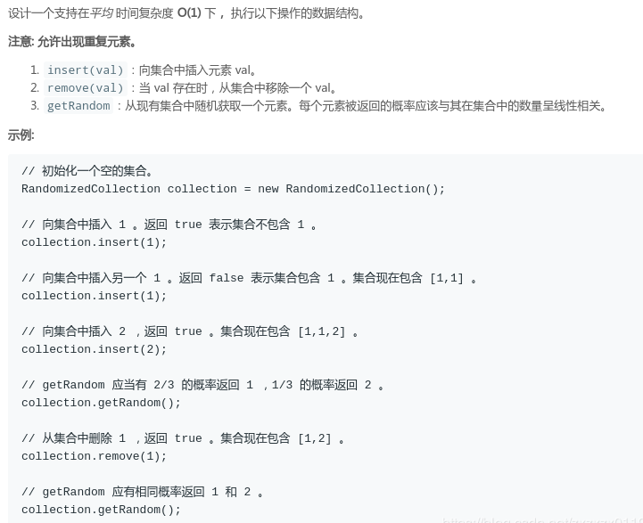
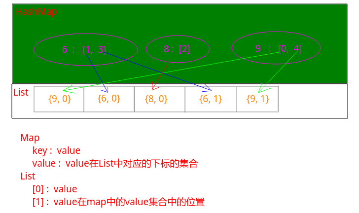
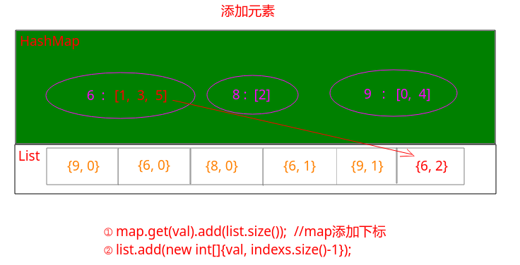
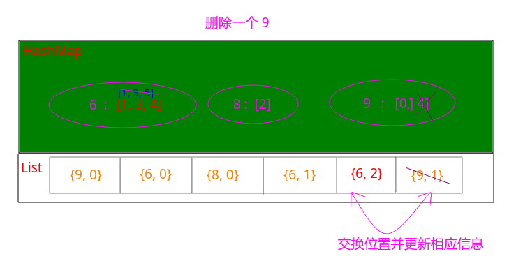

#  LeetCode - 381. Insert Delete GetRandom O(1) - Duplicates allowed(允许重复)

#### [题目链接](https://leetcode.com/problems/insert-delete-getrandom-o1-duplicates-allowed/)

> https://leetcode.com/problems/insert-delete-getrandom-o1-duplicates-allowed/

#### 题目


#### 解析
做这题之前先做[**LeetCode - 380**](https://github.com/ZXZxin/ZXBlog/blob/master/%E5%88%B7%E9%A2%98/LeetCode/Data%20Structure/Map/LeetCode%20-%20380.%20Insert%20Delete%20GetRandom%20O(1)%20(%E5%B8%B8%E6%95%B0%E6%97%B6%E9%97%B4%E6%8F%92%E5%85%A5%E3%80%81%E5%88%A0%E9%99%A4%E5%92%8C%E8%8E%B7%E5%8F%96%E9%9A%8F%E6%9C%BA%E5%85%83%E7%B4%A0).md)。


这一题加上了可以加入重复的元素，题目就变得复杂了一些。

* 大体思路还是使用`HashMap + ArrayList`，只不过`Map`是`HashMap<Integer, ArrayList<Integer>>`的形式，而`List`则是`ArrayList<int[]>`形式；
* 其中`Map`的`key`存的是值`val`，而对应的`value`存的是一个<font color = blue>下标的集合</font>，即`List`中值是`val`的下标的集合；
* `List`中每个位置也要存两个信息，一个是值`val`（数组`[0]`位置），另一个存这个值`val`在`map`中的下标集合中的位置（数组`[1]`位置）；

下图展示了存储

容器中有`2`个`6`、`1`个`8`、`2`个`9`。




添加元素很简单，维护`map`和`list`即可。

例如添加元素`6`: 



删除元素思想也是和最后一个元素交换位置，不过也要维护相应的信息即可。

删除元素`9`: 



代码:

```java
class RandomizedCollection {

    private HashMap<Integer, ArrayList<Integer>>valIndexsMap;
    private ArrayList<int[]> vals;   // store the position in the map's value

    public RandomizedCollection() {
        valIndexsMap = new HashMap<>();
        vals = new ArrayList<>();
    }

    public boolean insert(int val) {
        boolean contain = !valIndexsMap.containsKey(val);
//        ArrayList<Integer>indexs = valIndexsMap.get(val);
//        if(indexs == null){
//            indexs = new ArrayList<>();
//        }
//        indexs.add(vals.size());
        ArrayList<Integer>indexs = valIndexsMap.computeIfAbsent(val, k -> new ArrayList<>());
        indexs.add(vals.size());
        vals.add(new int[]{val, indexs.size()-1});
        return contain;
    }

    public boolean remove(int val) {
        if(!valIndexsMap.containsKey(val))
            return false;
        ArrayList<Integer>indexs = valIndexsMap.get(val);
        int removeIndex = indexs.get(indexs.size() - 1);
        indexs.remove(indexs.size()-1);
        if(indexs.isEmpty())
            valIndexsMap.remove(val);

        if(removeIndex < vals.size()-1){ // exchange
            // 将最后一个元素放在 removeIndex位置
            vals.get(removeIndex)[0] = vals.get(vals.size()-1)[0];
            vals.get(removeIndex)[1] = vals.get(vals.size()-1)[1];
            valIndexsMap.get(vals.get(removeIndex)[0]).set(vals.get(removeIndex)[1], removeIndex);
        }
        vals.remove(vals.size()-1);
        return true;
    }

    public int getRandom() {
        return vals.get((int)(Math.random() * vals.size()))[0];
    }
}

```

这里注意`Java8`中`computeIfAbsent`用法: 

类似下面的用法
```java
Object key = map.get("key");
if (key == null) {
    key = new Object();
    map.put("key", key);
}
//上面的操作可以简化为一行，若key对应的value为空，会将第二个参数的返回值存入并返回
Object key2 = map.computeIfAbsent("key", k -> new Object());
```

具体用法举例: 

```java
import java.util.*;

public class Test {

    public static void main(String[] args){
        Map<String, List<String>> map = new HashMap<>();
        List<String> list;

        list = map.get("list-1");
        if (list == null) {
            list = new ArrayList<>();
            map.put("list-1", list);
        }
        list.add("one");

        //使用 computeIfAbsent 可以这样写
        map.computeIfAbsent("list-1", k -> new ArrayList<>()).add("one");

        System.out.println(map); //  {list-1=[one, one]}
    }
}

```

