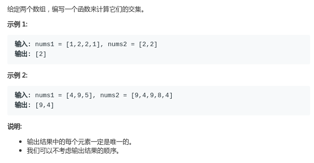
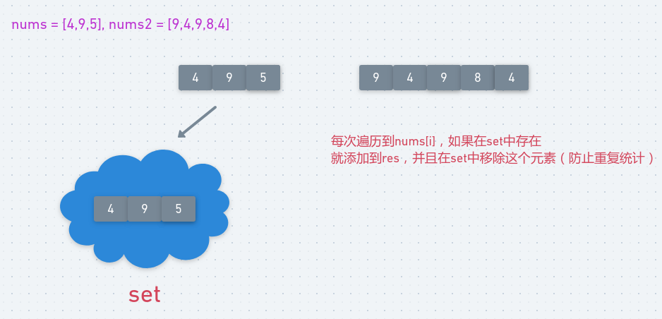

# LeetCode - 349. Intersection of Two Arrays

#### [题目链接](https://leetcode.com/problems/intersection-of-two-arrays/)

> https://leetcode.com/problems/intersection-of-two-arrays/

#### 题目



## 解析

比较直观的使用`HashSet`的题目。

思路:



代码:

```java
class Solution {
    public int[] intersection(int[] nums1, int[] nums2) {
        HashSet<Integer>set = new HashSet<>();
        for(int n : nums1) set.add(n);
        ArrayList<Integer> list = new ArrayList<>();
        for(int n : nums2) {
            if(set.contains(n)){
                list.add(n);
                set.remove(n); // 下次不需要重复统计
            }
        }
        int[] res = new int[list.size()];
        int k = 0;
        for(int n : list) res[k++] = n;
        return res;
    }
}
```

也可以用两个`set`，后面那个`set`用来存结果，这样我们第一个`set`就不需要`remove()`之前的了。

```java
public class Solution {
    public int[] intersection(int[] nums1, int[] nums2) {
        HashSet<Integer> set = new HashSet<>();
        HashSet<Integer> intersect = new HashSet<>();
        for (int n : nums1) set.add(n);
        for(int n : nums2) if(set.contains(n)) intersect.add(n);
        int[] res = new int[intersect.size()];
        int k = 0;
        for (Integer num : intersect) res[k++] = num;
        return res;
    }
} 
```

还有一种`N *logN`的解法，对两个数组都排序，结果还需要一个`set`去重。

```java
public class Solution {
    public int[] intersection(int[] nums1, int[] nums2) {
        HashSet<Integer> set = new HashSet<>();
        Arrays.sort(nums1);
        Arrays.sort(nums2);
        for (int i = 0, j = 0; i < nums1.length && j < nums2.length; ) {
            if (nums1[i] < nums2[j]) {
                i++;
            } else if (nums1[i] > nums2[j]) {
                j++;
            } else {
                set.add(nums1[i]);
                i++;
                j++;
            }
        }
        int[] res = new int[set.size()];
        int k = 0;
        for (Integer num : set) res[k++] = num;
        return res; 
    }
}
```

