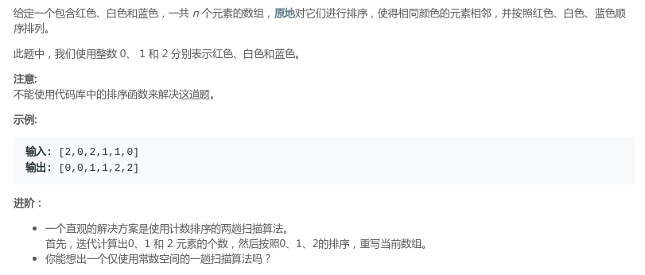

# LeetCode - 75. Sort Colors(计数排序和快速排序变形)

 - 使用类似计数排序解决
 - 使用快速排序的partition过程解决

#### [题目链接](https://leetcode.com/problems/sort-colors/description/)

> https://leetcode.com/problems/sort-colors/description/

#### 题目

***
## 1、使用类似计数排序解决
这个思路很简单，直接统计这三个数字出现的次数，然后填充一遍即可。

<div align="center"></div><br>

代码:

```java
class Solution {
    public void sortColors(int[] nums) {
        int[] count = new int[3];
        for(int i = 0; i < nums.length; i++)
            count[nums[i]]++;
        int k = 0;
        for(int i = 0; i < 3; i++){
            for(int j = 0; j < count[i]; j++){
                nums[k++] = i;
            }
        }
    }
}
```
## 2、使用快速排序的partition过程解决
还可以使用快速排序中的三路快排的思想来解决这个问题，快速排序和三路快排看我的[这篇博客](https://blog.csdn.net/zxzxzx0119/article/details/79826380#t8)，快速排序的

`partition`过程也是经典的荷兰国旗问题。

<div align="center"></div><br>

代码:

```java
class Solution {
    public void sortColors(int[] nums) {
        if (nums == null || nums.length < 2) return;
        partition(nums, 0, nums.length - 1);
    }

    public void partition(int[] arr, int L, int R) {
        int less = -1;//左边界
        int more = arr.length; //右边界 
        int cur = 0;
        while (cur < more) {
            if (arr[cur] == 0)
                swap(arr, ++less, cur++);
            else if (arr[cur] == 2)
                swap(arr, --more, cur);
            else
                cur++;
        }
    }

    private void swap(int[] arr, int i, int j) {
        int t = arr[i];
        arr[i] = arr[j];
        arr[j] = t;
    }
}
```

