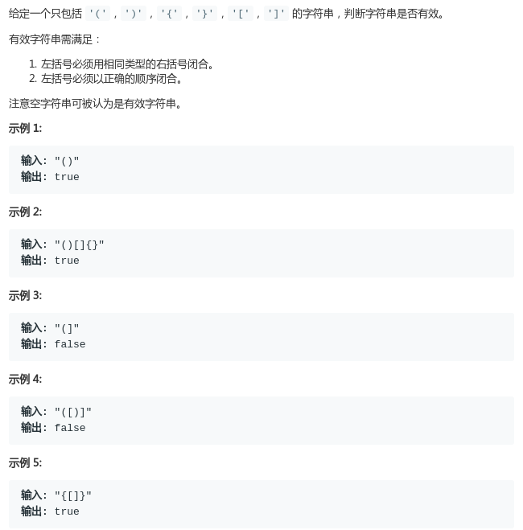
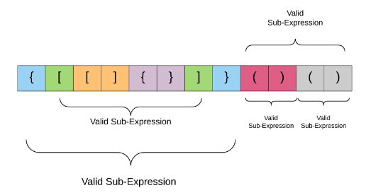
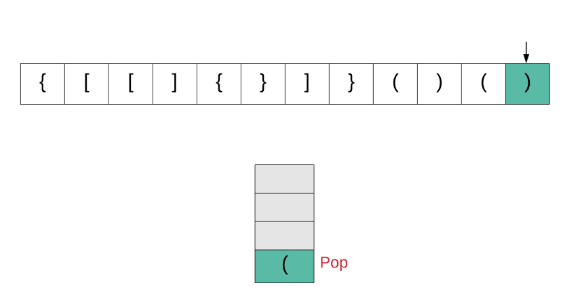

# LeetCode - 20. Valid Parentheses

#### [题目链接](https://leetcode.com/problems/valid-parentheses/)

> https://leetcode.com/problems/valid-parentheses/

#### 题目



## 解析

很简单的用栈处理的括号匹配问题。栈的入门题目吧。

这里看到`LeetCode`官方题解中有两个很好的图，这里就借用一下吧`^_^`。

* 每次碰到`(、[、{`就入栈；
* 否则就要看当前字符和对应的栈顶是不是匹配的。如果不匹配就返回`false`；
* 最后如果栈空就是`true`；

图:

<div align="center"></div><br>

操作过程:

<div align="center"></div><br>


代码:

```java
class Solution {
    public boolean isValid(String s) {
        Stack<Character> stack = new Stack<>();
        for(int i = 0; i < s.length(); i++){
            char c = s.charAt(i);
            if(c == '(' || c == '[' || c == '{')
                stack.push(c);
            else {
                if(stack.isEmpty()) return false;
                if(stack.peek() == '(' && c != ')') return false;
                if(stack.peek() == '[' && c != ']') return false;
                if(stack.peek() == '{' && c != '}') return false;
                stack.pop();
            }
        }
        return stack.isEmpty();
    }
}
```

