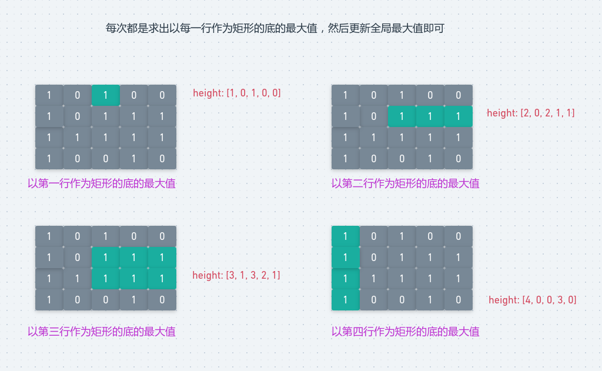

# LeetCode - 85. Maximal Rectangle

#### [题目链接]()

#### 题目


## 解析

这个题目就是[**LeetCode - 84. 直方图最大矩形覆盖**](https://github.com/ZXZxin/ZXBlog/blob/master/%E5%88%B7%E9%A2%98/LeetCode/Data%20Structure/Stack/LeetCode%20-%2084.%20Largest%20Rectangle%20in%20Histogram(%E5%8D%95%E8%B0%83%E6%A0%88).md)的一个变式: 
我们只需要求出以**每一行作为底最大的矩形是多少**，每一行都有一个`height`数组，把每个数组都调用上个题目的方法就可以求出，以每一行作为底(直方图最下面)时最大矩形面积，然后记录最大值即可。
**关键就是每次更新`height`数组，`height`数组代表的是这一列上面有多少个连续的**`1`


例如: 
```c
map = 1  0  1  1
      1  1  1  1 
      1  1  1  0
```

以第一行做切割后，`height = {1, 0, 1, 1}`，`height[j]`表示目前的底上(第`1`行)，`j`位置往上(包括`j`位置)有多少连续的`1`；

以第`2`行做切割后，`height = {2,  1, 2, 2}`，注意到从第一行到第二行，`height`数组的更新是十分方便的，即`height[j] = matrix[i][j] == 0 ? 0 : height[j] + 1`；(这里有点dp的意思)

第`3`行做切割后，`height = {3, 2, 3, 0}`；

最后的结果: 对于每一次切割，都利用更新后的`height`数组来求出以每一行为底的情况下，最大的矩形是多大（然后记录最大值即可）。

拿样例的例子来看:



由于只需要计算`N`行，而单调栈过程是`O(N)`，所以时间复杂度为`O(N^2)`。

```java
class Solution {
    public int maximalRectangle(char[][] matrix) {
        if (matrix == null || matrix.length == 0 || matrix[0].length == 0)
            return 0;
        int maxArea = 0;
        int[] height = new int[matrix[0].length];  //依次的求每一行的直方图最大面积
        for (int i = 0; i < matrix.length; i++) {
            for (int j = 0; j < matrix[0].length; j++)
                height[j] = matrix[i][j] == '0' ? 0 : height[j] + 1; //有点dp的意思, 如果是1的话就是上面的height[j] + 1
            maxArea = Math.max(largestRectangleArea(height), maxArea); // 计算以当前行作为底的最大矩形
        }
        return maxArea;
    }
    // 这个就是 LeetCode - 84的代码
    public int largestRectangleArea(int[] h) {
        if (h == null || h.length == 0) return 0;
        Stack<Integer> stack = new Stack<>();
        int maxArea = 0;
        for (int i = 0; i < h.length; i++) {
            while (!stack.isEmpty() && h[i] <= h[stack.peek()]) {
                int top = stack.pop();
                int L = stack.isEmpty() ? -1 : stack.peek();
                maxArea = Math.max(maxArea, (i - L - 1) * h[top]);//注意i自己就是右边界  左边界到右边界中间的格子(i-L-1)
            }
            stack.push(i); //注意是下标入栈
        }
        //处理完整个数组之后，再处理栈中的
        while (!stack.isEmpty()) {
            int top = stack.pop();
            int L = stack.isEmpty() ? -1 : stack.peek();
            maxArea = Math.max(maxArea, (h.length - 1 - L) * h[top]);//注意所有还在栈中的右边界都是 数组的长度右边没有比它小的
        }
        return maxArea;
    }
}
```

