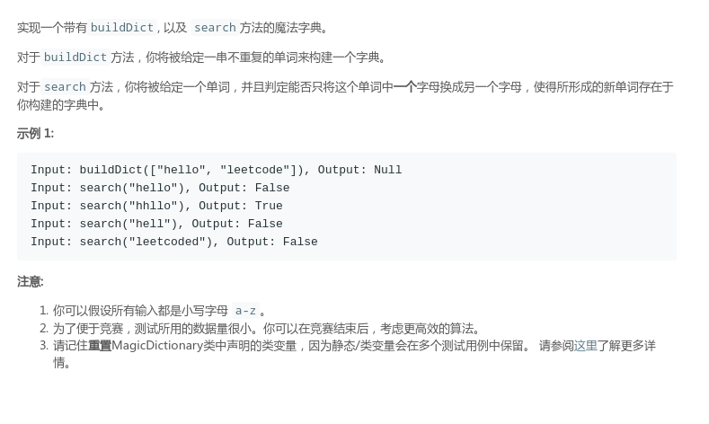
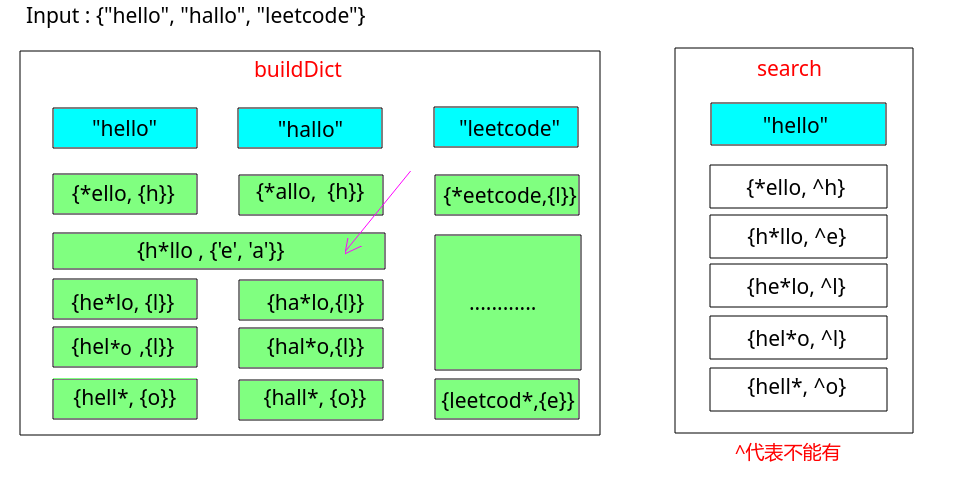

# LeetCode - 676. Implement Magic Dictionary
#### [题目链接](https://leetcode.com/problems/implement-magic-dictionary/)

> https://leetcode.com/problems/implement-magic-dictionary/

#### 题目

#### 解析 

两种解法: **模糊搜索和利用字典树**。


**模糊搜索**:


`buildDict`过程: 

* 准备一个`HashMap<String, HashSet<Character>>`，`key`存字符串，`val`存的是字符的集合；
* 其中`key`是在枚举每一个字符串的每一个位置，去掉原来的那个字符，然后用一个特殊字符加入进去，并把替换的字符加入`val`中的`set`集合。

`search`过程: 

* 查看在替换任意一个字符，之后的集合，且这个集合中不能包含替换的字符，或者可以包含但是`set.size() > 1`也行。

图:



代码:

```java
class MagicDictionary {

    private HashMap<String, HashSet<Character>>magicMap;

    /** Initialize your data structure here. */
    public MagicDictionary() {
        magicMap = new HashMap<>();
    }

    /** Build a dictionary through a list of words */
    public void buildDict(String[] dict) {
        for(int i = 0; i < dict.length; i++){
            for(int j = 0; j < dict[i].length(); j++){
                String key = dict[i].substring(0, j) + "*" + dict[i].substring(j+1, dict[i].length());
                HashSet<Character>valSet = magicMap.get(key);
                if(valSet == null)
                    valSet = new HashSet<>();
                valSet.add(dict[i].charAt(j));
                magicMap.put(key, valSet);
            }
        }
    }

    /** Returns if there is any word in the trie that equals to the given word after modifying exactly one character */
    public boolean search(String word) {
        for(int i = 0; i < word.length(); i++){
            String key = word.substring(0, i) + "*" + word.substring(i+1, word.length());
            HashSet<Character>valSet = magicMap.get(key);
            if(valSet == null)
                continue;
            // 只要有一个满足这种情况就可以了 注意第二种情况,例如查询 hello，之前map里如果有hello, hallo (valSet.size() > 1)也是可以的
            if(!valSet.contains(word.charAt(i)) || valSet.size() > 1)
                return true;
        }
        return false;
    }
}
```

**字典树写法**

字典树基础可以看[这里](https://github.com/ZXZxin/ZXBlog/blob/master/%E6%95%B0%E6%8D%AE%E7%BB%93%E6%9E%84%E7%AE%97%E6%B3%95/Data%20Structure/Trie/LeetCode%20-%20208.%20Implement%20Trie%20(Prefix%20Tree)%E4%BB%A5%E5%8F%8A%E5%AE%9E%E7%8E%B0%E5%AD%97%E5%85%B8%E6%A0%91(%E5%89%8D%E7%BC%80%E6%A0%91).md)。

插入没什么好说的，建立字典树即可，`search`的过程要维护一个`isOneDiff`变量。表示的是当前是否已经有一个不同了。然后`dfs`即可。


```java
class MagicDictionary {

    private class Node{
        public boolean end;
        public Node[] nexts;
        public Node() {
            end = false;
            this.nexts = new Node[26];
        }
    }

    private class Trie{

        private Node root;

        public Trie() {
            this.root = new Node();
        }

        public void insert(String word){
            Node cur = root;
            for(int i = 0; i < word.length(); i++){
                int index = word.charAt(i) - 'a';
                if(cur.nexts[index] == null)
                    cur.nexts[index] = new Node();
                cur = cur.nexts[index];
            }
            cur.end = true;
        }
    }

    private Trie trie;

    public MagicDictionary() {
        trie = new Trie();
    }

    public void buildDict(String[] dict) {
        for(int i = 0; i < dict.length; i++)
            trie.insert(dict[i]);
    }

    public boolean search(String word) {
        return rec(trie.root, word,  0, false);
    }

    public boolean rec(Node node, String word, int i, boolean isOneDiff){
        if(i == word.length() && node.end && isOneDiff)
            return true;
        else if(i == word.length())
            return false;
        int index = word.charAt(i) - 'a';
        for(int k = 0; k < 26; k++){
            if(node.nexts[k] == null)
                continue;
            if(k == index && !isOneDiff){
                if(rec(node.nexts[k], word, i+1, false))
                    return true;
            } else if(k == index && isOneDiff){
                if(rec(node.nexts[k], word, i+1, true))
                    return true;
            }else if(k != index && !isOneDiff){
                if(rec(node.nexts[k], word, i+1, true))
                    return true;
            }
            // k!=index && isOneDiff shouldn't be consider
        }
        return false;
    }
}
```

***