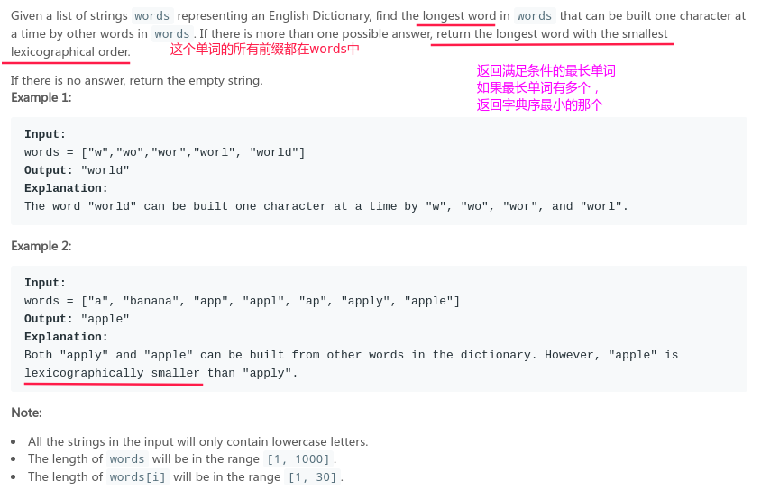
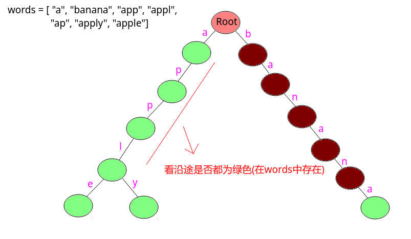

# LeetCode - 720. Longest Word in Dictionary(字典树) 

#### [题目链接](https://leetcode.com/problems/longest-word-in-dictionary/)

> https://leetcode.com/problems/longest-word-in-dictionary/

#### 题目



## 解析

第一种方法: 暴力。这方法没什么好说的。。

* 先将`words`构建成一个`HashSet`表，这样查询快；
* 然后对于每一个`word`，去到`HashSet`中查是不是都在，如果都在，就和最优答案比较就行了，注意长度和字典序的更新；

代码:

```java
import java.io.*;
import java.util.*;

class Solution {

    // return the longest word(have all prefix in the words) with the smallest lexicographical order.
    public String longestWord(String[] words) {
        HashSet<String>dict = new HashSet<>(Arrays.asList(words));
        String res = "";
        for(int i = 0; i < words.length; i++){
            // 剪枝
            if(words[i].length() < res.length() || (words[i].length() == res.length() && words[i].compareTo(res) > 0))
                continue;
            StringBuilder prefix = new StringBuilder();
            boolean ok = true;
            for(int j = 0; j < words[i].length(); j++){
                prefix.append(words[i].charAt(j));
                if(!dict.contains(prefix.toString())){
                    ok = false;
                    break;
                }
            }
            if(ok)
                res = words[i];
        }
        return res;
    }

    public static void main(String[] args){
        Scanner cin = new Scanner(new BufferedInputStream(System.in));
        PrintStream out = System.out;
        String[] words = {"a", "banana", "app", "appl", "ap", "apply", "apple" };
        out.println(new Solution().longestWord(words));
    }
}

```

第二种方法: 利用字典树

也很简单:

* 先构造好字典树，对`words`中的每一个`word`都`insert`进字典树；
* 然后对于每一个`word`在字典树中遍历，看是否每个前缀都在字典树中，如果是，就更新最好答案即可；

图:



代码:

```java
import java.io.*;
import java.util.*;

class Solution {

    private class Trie{
        public int end;
        public Trie[] next;

        public Trie(){
            end = 0;
            next = new Trie[26];
        }
    }

    private Trie root;

    // return the longest word(have all prefix in the words) with the smallest lexicographical order.
    public String longestWord(String[] words) {
        root = new Trie();
        Trie cur;
        for(int i = 0; i < words.length; i++){
            cur = root;
            for(int j = 0; j < words[i].length(); j++){
                int idx = words[i].charAt(j) - 'a';
                if(cur.next[idx] == null)
                    cur.next[idx] = new Trie();
                cur = cur.next[idx];
            }
            cur.end = 1;
        }
        String res = "";
        for(int i = 0; i < words.length; i++){
            // 剪枝，这样就不要在下面判断了
            if(words[i].length() < res.length() || (words[i].length() == res.length() && words[i].compareTo(res) > 0))
                continue;
            boolean ok = true;
            cur = root;
            for(int j = 0; j < words[i].length(); j++){
                int idx = words[i].charAt(j) - 'a';
                if(cur.next[idx].end == 0){
                    ok = false;
                    break;
                }
                cur = cur.next[idx];
            }
            if(!ok)
                continue;
//            if(words[i].length() > res.length() || (words[i].length() == res.length() && words[i].compareTo(res) < 0))
                res = words[i]; // 不判断了，在开始已经剪枝了，这样更快
            
        }
        return res;
    }

    public static void main(String[] args){
        Scanner cin = new Scanner(new BufferedInputStream(System.in));
        PrintStream out = System.out;
        String[] words = {"a", "banana", "app", "appl", "ap", "apply", "apple" };
        out.println(new Solution().longestWord(words));
    }
}

```