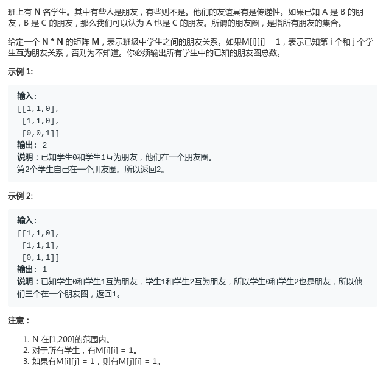

# LeetCode - 547. Friend Circles

#### [题目链接](https://leetcode.com/problems/friend-circles/)

> https://leetcode.com/problems/friend-circles/

#### 题目



## 解析

就是求连通块的数量，非常简单的图论入门题目。

DFS:

```java
class Solution {

    private boolean[] vis;

    public int findCircleNum(int[][] M) {
        int n = M.length;
        int res = 0;
        vis = new boolean[n + 1];
        for (int i = 0; i < n; i++) {
            if (!vis[i]) {
                dfs(i, M);
                res++;
            }
        }
        return res;
    }

    private void dfs(int v, int[][] M) {
        vis[v] = true;
        for (int i = 0; i < M.length; i++)if (M[v][i] == 1 && !vis[i]) dfs(i, M);
    }
}
```

并查集:

```java
class Solution {

    class UF {

        private int[] parent;
        private int[] rank;

        public UF(int n) {
            parent = new int[n];
            rank = new int[n];
            for (int i = 0; i < n; i++) {
                parent[i] = i;
                rank[i] = 0;
            }
        }

        public int find(int p) {
            while (p != parent[p]) {
                parent[p] = parent[parent[p]];
                p = parent[p];
            }
            return p;
        }

        public void union(int a, int b) {
            int aR = find(a);
            int bR = find(b);
            if (aR == bR)
                return;
            if (rank[aR] < rank[bR]) {
                parent[aR] = bR;
            } else if (rank[aR] < rank[bR]) {
                parent[bR] = aR;
            } else {
                parent[aR] = bR;
                rank[bR]++;
            }
        }
    }


    public int findCircleNum(int[][] M) {
        int n = M.length;
        UF uf = new UF(n);
        for (int i = 0; i < n; i++) {
            for (int j = 0; j < n; j++) {
                if (M[i][j] == 1) uf.union(i, j);
            }
        }
        int res = 0;
        for (int i = 0; i < n; i++) if (uf.find(i) == i) res++;
        return res;
    }
}
```

