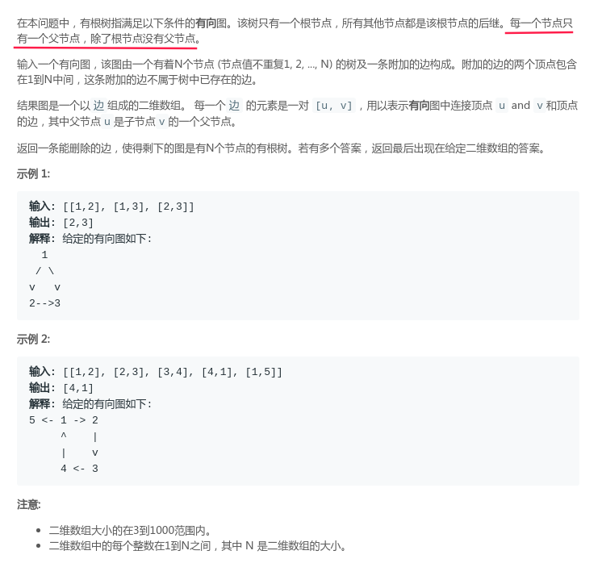
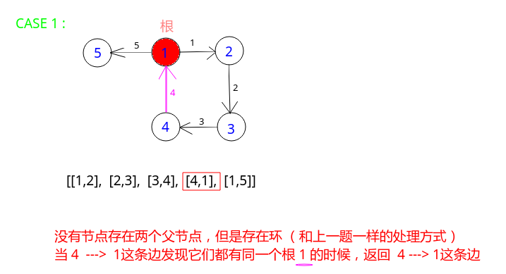
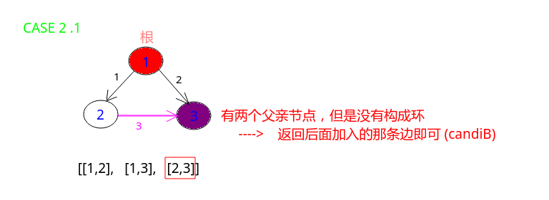
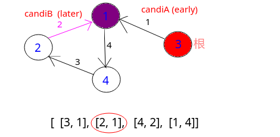

# LeetCode - 685. Redundant Connection II

#### [题目链接](https://leetcode.com/problems/redundant-connection-ii/)

> https://leetcode.com/problems/redundant-connection-ii/

#### 题目


#### 解析

这个和上面那个不同的是这里是有向图。

由于必须要求父节点个数为`1`(除根节点)，那么添加额外边后不合法只有两种情况 : 

* `case 1` : **没有节点存在两个父节点**，但是存在环； (和`LeetCode - 684. Redundant Connection`一样)


* `case 2` : 又可以分为两种情况: 
  * `case 2.1` : 一个节点存在两个父节点但是不存在环；

    
  * `case 2.2` :  一个节点存在两个父节点且存在环；

    


代码实现: 

* 一开始先处理有两个父亲的节点，分别将有两个父亲的节点相连的边记为 `candiA(更早的)、candiB(更晚的)`；
* 然后有一个很重要的处理，将<font color = red>更晚的</font>的父亲对应的那条边(`candiB`)标记为`-1`，这条边在后续并查集中不考虑；(如果后面并查集没有找到环，就会返回`candiB`)；
* 并查集过程: <font color = red>①若存在回路且没有节点有两个父节点，那么返回最后遇到的一条边即可(`case1`)；②若存在回路且有节点是有`2`个`parent`，则返回`candiA`（更早标记的那条在环中的边）；
* 注意最后返回的`candiB`有两种情况: ①`case 2.1`；②`case 2.2`的变式，看下面，如果给定数组的顺序改变如下: 
  
  
  
代码:

```java
import java.io.*;
import java.util.*;

class Solution {
    
    private int[] parent;
    private int[] rank;

    public int findRoot(int p){
        while(parent[p] != p){
            parent[p] = parent[parent[p]];
            p = parent[p];
        }
        return p;
    }
    
    public void union(int a, int b){
        int aRoot = findRoot(a);
        int bRoot = findRoot(b);
        if(aRoot == bRoot)
            return;
        if(rank[aRoot] < rank[bRoot]){
            parent[aRoot] = bRoot;
        }else if(rank[aRoot] > rank[bRoot]){
            parent[bRoot] = aRoot;
        }else {
            parent[aRoot] = bRoot;
            rank[bRoot]++;
        }
    }

    public int[] findRedundantDirectedConnection(int[][] edges) {
        if(edges == null || edges.length == 0 || edges[0].length == 0)
            return new int[2];
        int n = edges.length;
        parent = new int[n + 1];
        rank = new int[n + 1];

        int[] candiA = new int[]{-1, -1};
        int[] candiB = new int[]{-1, -1};

        // 第一遍循环，若节点存在有两个父节点，那么将这两条边分别作为候选A, B
        for(int[] edge : edges){ 
            int from = edge[0];
            int to = edge[1];

            if(parent[to] == 0){ // now, 'to' don't have parent
                parent[to] = from; // now, 'to' only have one parent, is 'from'
            }else { // 'to' already have a parent 
                candiA[0] = parent[to]; // pre parent
                candiA[1] = to;

                candiB[0] = from;
                candiB[1] = to;

                edge[0] = edge[1] = -1; // mark this, unionSet will don't consider this
            }
        }

        // init unionSet
        for(int i = 1; i <= n; i++){ 
            parent[i] = i;
            rank[i] = 1; // height 
        }

        for(int[] edge : edges){ 
            int from = edge[0];
            int to = edge[1];
            if(from == -1 || to == -1) // the later(second) edge, don't consider
                continue; 
            if(findRoot(from) == findRoot(to)){ // 添加这条边之后存在回路 
                if(candiA[0] == -1 && candiA[1] == -1) // no 2 parent 
                    return edge;
                else    // have 2 parent, can't return edge, return previous candinate
                    return candiA;
            }else 
                union(from, to);
        }

        return candiB;  // case2.1 && case2.2 egde[0] = edge[1] = -1 
    }

    public static void main(String[] args){ 
        PrintStream out = System.out;

        int[][] edges = {
            {1, 2},
            {2, 3},
            {3, 4},
            {4, 1},
            {1, 5}
        };
        out.println(Arrays.toString(new Solution().
            findRedundantDirectedConnection(edges))
        );
    }
}
```

