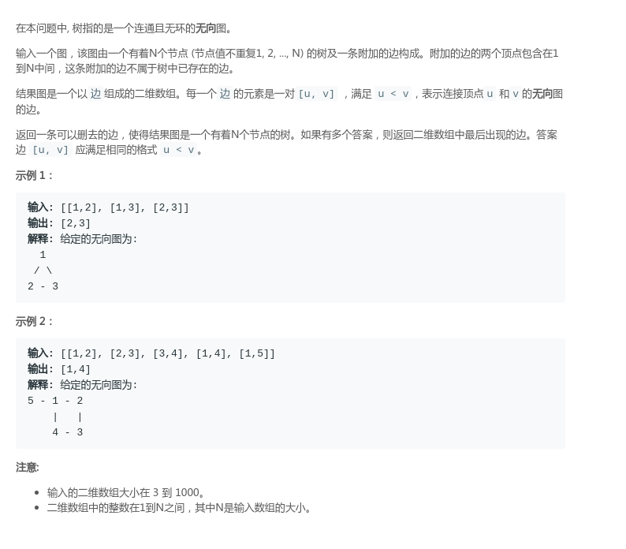

# LeetCode - 684. Redundant Connection (DFS | 并查集)

#### [题目链接](https://leetcode.com/problems/redundant-connection/)
> https://leetcode.com/problems/redundant-connection/

#### 题目


#### DFS

比较简单的图论题。

思路:

* 每次添加一条边，然后判断加上这条边之后会不会构成环；
* 判断一个图有没有环用`dfs`，这里需要维护一个`pre`变量，表示上次访问的节点，然后使用`vis`数组标记以及访问的节点，如果再次访问到，就表明有环了；

代码:


```java
class Solution {
    public int[] findRedundantConnection(int[][] edges) {
        if (edges == null || edges.length == 0)
            return new int[2];
        int n = edges.length;
        ArrayList<Integer> G[] = new ArrayList[n+1]; //二维数组中的整数在1到N之间，其中N是输入数组的大小。
        for(int i = 1; i <= n; i++)
            G[i] = new ArrayList<>();
        for (int i = 0; i < edges.length; i++) {
            int from = edges[i][0];
            int to = edges[i][1];
            G[from].add(to);
            G[to].add(from);
            boolean[] vis = new boolean[n+1];
            if(!dfs(from, -1, vis, G))// 从当前节点出发查找
                return edges[i];
        }
        return new int[2];
    }
    
    // 判断一个图有没有环(维护一个pre变量)
    private boolean dfs(int v, int pre, boolean[] vis, ArrayList<Integer>G[]){
        if(vis[v])
            return false;
        vis[v] = true;
        for(int next : G[v]){
            if(next != pre)
                if(!dfs(next, v, vis, G))
                    return false;
        }
        return true;
    }
}
```

***
### 并查集

并查集模板题。

* 直接判断当前的两个顶点有没有在同一个集合中，如果是，则一定会构成环；
* 否则合并这两个顶点即可；
代码:

```java
class Solution {

    private int[] parent;
    private int[] rank;

    public int findRoot(int p) {
        while (parent[p] != p) {
            parent[p] = parent[parent[p]];
            p = parent[p];
        }
        return p;
    }

    public void union(int a, int b) {
        int aRoot = findRoot(a);
        int bRoot = findRoot(b);
        if (aRoot == bRoot)
            return;
        if (rank[aRoot] < rank[bRoot]) {
            parent[aRoot] = bRoot;
        } else if (rank[aRoot] > rank[bRoot]) {
            parent[bRoot] = aRoot;
        } else {
            parent[aRoot] = bRoot;
            rank[bRoot]++;
        }
    }

    public int[] findRedundantConnection(int[][] edges) {
        if (edges == null || edges.length == 0)
            return new int[2];
        int n = edges.length;
        parent = new int[n + 1];
        rank = new int[n + 1];
        for (int i = 1; i <= n; i++) {
            parent[i] = i;
            rank[i] = 1;
        }

        for (int i = 0; i < edges.length; i++) {
            int from = edges[i][0];
            int to = edges[i][1];
            if (findRoot(from) == findRoot(to))
                return edges[i];
            else
                union(from, to);
        }
        return new int[2];
    }
}
```