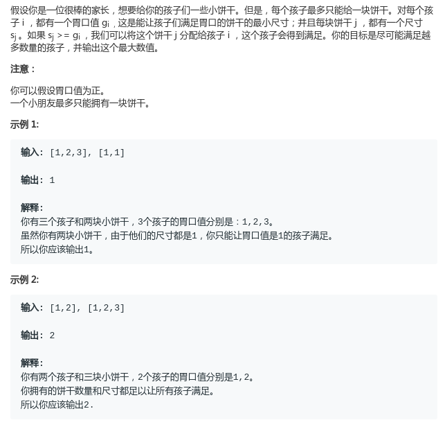

# LeetCode - 455. Assign Cookies

#### [题目链接](https://leetcode.com/problems/assign-cookies/)

> https://leetcode.com/problems/assign-cookies/

#### 题目



## 解析

很简单的贪心题。。

先对两个数组都排序，然后用两个指针跑。如果`s[j] >= g[i]`，就分配，否则就不行。

最后返回`g`数组的指针即可。

代码:

```java
class Solution {

    // g是孩子的胃口，s是饼干大小, 如果s[j] >= g[i]，就可以将s[j]分配给g[i]孩子
    public int findContentChildren(int[] g, int[] s) {
        Arrays.sort(g);
        Arrays.sort(s);
        int i = 0, j = 0;
        while (i < g.length && j < s.length) {
            if (s[j] >= g[i]) {
                i++;
                j++;
            } else {
                j++;
            }
        }
        return i;
    }
}
```

