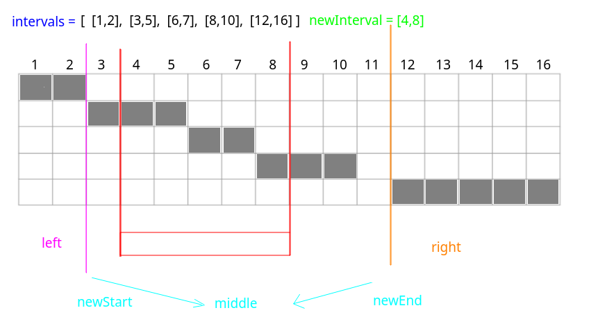

# LeetCode - 57. Insert Interval

#### [题目链接](https://leetcode.com/problems/insert-interval/)

> https://leetcode.com/problems/insert-interval/

#### 题目


两种写法。

## 解析

第一种解法是和上一题`LeetCode - 56`一样的解法，**因为已经对所有的区间排过序了**，

所以只需要在上一题的基础上，**先找到`newInterval`的合适插入位置**。

然后调用上一题的`merge`过程即可。

```java
class Solution {
    public List<Interval> insert(List<Interval> intervals, Interval newInterval) {
        List<Interval> res = new ArrayList<>();
        if(intervals == null) // 注意这里不能加上 intervals.size() == 0
            return res;
        // find the suitable position that the new interval should insert
        int p = 0;
        for(p = 0; p < intervals.size() && intervals.get(p).start < newInterval.start; ) 
            p++;
        intervals.add(p, newInterval);
        
        // just like leetcode - 56. Merge Intervals
        Interval pre = intervals.get(0);
        for(Interval cur : intervals){
            if(pre.end >= cur.start)
                pre.end = Math.max(pre.end, cur.end); // the same as above special situation, [1, 4]、[2, 3]
            else {  // no interval
                res.add(pre);
                pre = cur;
            }
        }
        res.add(pre);
        return res;
    }
}
```

第二种方法:

* 就是遍历一遍`intervals`，然后如果当前遍历的`cur`，如果和`newInterval`没有交集的话，就分别各自加到`left、right`(都是`List`集合)中；
* 如果有交集的话就需要一直维护一个最左端点`newStart`和最右端点`newEnd`的区间，具体看下面(题目的样例)；



代码:

```java
import java.io.*;
import java.util.*;

class Interval {
    int start;
    int end;

    Interval() {
        start = 0;
        end = 0;
    }

    Interval(int s, int e) {
        start = s;
        end = e;
    }

    @Override
    public String toString() {
        return "[" + start +
                ", " + end +
                ']';
    }
}

class Solution {

    public List<Interval> insert(List<Interval> intervals, Interval newInterval) {
        List<Interval> res = new ArrayList<>();
        if (intervals == null)
            return res;
        int newStart = newInterval.start, newEnd = newInterval.end;
        List<Interval> L = new ArrayList<>();
        List<Interval> R = new ArrayList<>();
        for (Interval cur : intervals) {
            if (cur.end < newStart) // cur small than newInterval
                L.add(cur);
            else if (cur.start > newEnd)// cur bigger than newInterval
                R.add(cur);
            else {  // have overlaps(intersect)  --> get the final newInterval's left and right position
                newStart = Math.min(newStart, cur.start);  // the smallest
                newEnd = Math.max(newEnd, cur.end);        // the biggest
            }
        }
        res.addAll(L);
        res.add(new Interval(newStart, newEnd));
        res.addAll(R);
        return res;
    }

    public static void main(String[] args) {
        List<Interval> intervals = Arrays.asList(new Interval(1, 2), new Interval(3, 5),
                new Interval(6, 7), new Interval(8, 10), new Interval(12, 16));
        Interval newInterval = new Interval(4, 8);
        System.out.println(new Solution().
                insert(intervals, newInterval)
        );
    }
}
```