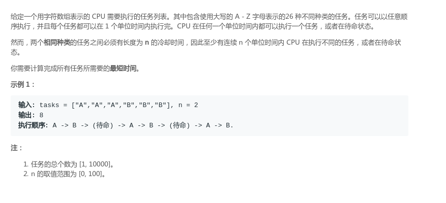
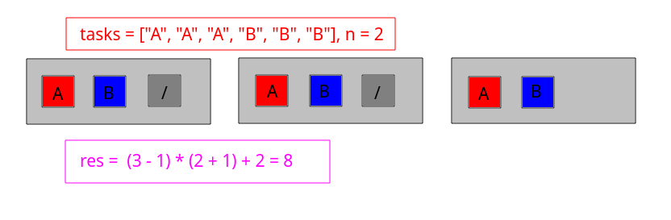
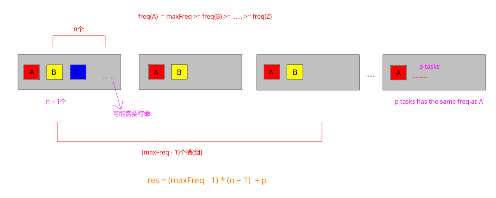
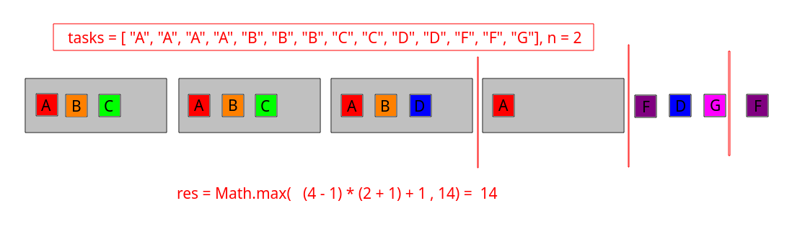

# LeetCode - 621. Task Scheduler(贪心)

#### [题目链接](https://leetcode.com/problems/task-scheduler/)

> https://leetcode.com/problems/task-scheduler/

#### 题目

#### 解析

贪心的大体想法就是: 要尽量将CPU均匀分配完，尽量减少CPU的空闲时间。

* 按照频率排序，记最大的频率是`maxFreq`，最大的结果最多是(`maxFreq * (n + 1)`)；
* 然而最后一组如果有`p`个剩下的(也就是如果有`p`个和`maxFreq`相同的频率)，则最后一组可以在同一个槽中；
* 所以按照上面的方法的计算结果是`(maxFreq - 1) * (n + 1) + p`，但是这个结果可能小于总的`tasks`的数量，那是因为在前面一直都填满了，没有空闲时间，此时答案就是`tasks.length`即可；

题目中的案例: 





没有空闲时间，直接取`task.length`的情况: 



按照上面的计算的方法:

```java
class Solution {
    public int leastInterval(char[] tasks, int n) {
        HashMap<Character, Integer> counts = new HashMap<>();
        int maxFreq = 0;
        for (char c : tasks) {
            counts.put(c, 1 + counts.getOrDefault(c, 0));
            maxFreq = Math.max(maxFreq, counts.get(c));
        }
        int res = (maxFreq - 1) * (n + 1);
        for (Integer v : counts.values())
            if (v == maxFreq)
                res++;
        return Math.max(res, tasks.length);
    }
}
```

```java
class Solution {
    public int leastInterval(char[] tasks, int n) {
        int[] freqs = new int[26]; 
        for (char c : tasks)
            freqs[c - 'A']++;
        Arrays.sort(freqs);
        int count = 0;
        for (int i = 25; i >= 0 && freqs[i] == freqs[25]; i--)
            count++;
        return Math.max((freqs[25] - 1) * (n + 1) + count, tasks.length);
    }
}

```

还有一种使用优先队列(按照**频率大的在堆顶**)模拟的写法: 
```java
class Solution {
    public int leastInterval(char[] tasks, int n) {
        int[] freqs = new int[26];
        for (char c : tasks)
            freqs[c - 'A']++;
        // initialCapacity, descend Comparator
        Queue<Integer> maxHeap = new PriorityQueue<>(26, Collections.reverseOrder());
        for(int freq : freqs)if(freq != 0)
            maxHeap.add(freq);
        int res = 0;
        while(!maxHeap.isEmpty()){
            List<Integer>tmp = new ArrayList<>();
            int i = 0;
            while(i < n + 1 && !maxHeap.isEmpty()){
                if(maxHeap.peek() > 1)  // freq > 1 , just update freq -= 1
                    tmp.add(maxHeap.poll() - 1); // 现在 -1, 待会还要装回去
                else // == 1, 直接移除
                    maxHeap.poll();
                res++;
                i++;
            }
            if(tmp.size() > 0)// 这个就是在这个周期没有装满，需要待命
                res += n + 1 - i;
            maxHeap.addAll(tmp); // 装回去
        }
        return res;
    }
}
```


