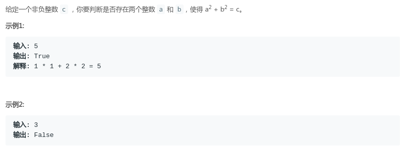

# LeetCode - 633. Sum of Square Numbers(平方数之和)(数学/二分)
* [方法一-数学](#方法一-数学)
* [方法二-Hash表](#方法二-hash表)
* [方法三-二分](#方法三-二分)

***
#### [题目链接](https://leetcode.com/problems/sum-of-square-numbers/)

> https://leetcode.com/problems/sum-of-square-numbers/

#### 题目

### 方法一-数学
首先想到肯定不会是双重循环的枚举，只需要枚举一个数`a`，去检查`b`是否满足即可，又因为是平方数，所以最对只需要枚举`sqrt( c )`即可： 

```java
class Solution {
    public boolean judgeSquareSum(int c) {
        if (c == 0)
            return true;
        for (int a = 0; a <= Math.sqrt(c); a++) {
            int b = (int) Math.sqrt(c - a * a);
            if (c == a * a + b * b)
                return true;
        }
        return false;
    }
}
```
或者这样，原理是一样的: 

```java
class Solution {
    public boolean judgeSquareSum(int c) {
        if (c == 0)
            return true;
        for (int a = 0; a <= Math.sqrt(c); a++) {
            int b2 = c - a * a;
            int b = (int) Math.sqrt(b2);
            if (b * b == b2)
                return true;
        }
        return false;
    }
}
```
这里有个问题就是，当我们把`for`循环中的`a <= Math.sqrt( c ) `改一下，改成下面的代码，就会超时：

```java
class Solution {
    public boolean judgeSquareSum(int c) {
        if (c == 0)
            return true;
        for (int a = 0; a * a <= c; a++) {
            int b2 = c - a * a;
            int b = (int) Math.sqrt(b2);
            if (b * b == b2)
                return true;
        }
        return false;
    }
}
```
这是为什么呢?因为当 `c `接近于`Math.Integer`的时候，`a*a`有可能会发生溢出，于是枚举的时候将`a`改成`long`类型:
```java
class Solution {
    public boolean judgeSquareSum(int c) {
        if (c == 0)
            return true;
        for (long a = 0; a * a <= c; a++) {
            long b2 = c - a * a;
            long b = (long) Math.sqrt(b2);
            if (b * b == b2)
                return true;
        }
        return false;
    }
}
```
***
### 方法二-Hash表
这题也可以和`LeetCode - 1. Two Sum`一样，使用`Hash`表存储答案的一边，然后遍历去寻找另一边: 

```java
class Solution {
    public boolean judgeSquareSum(int c) {
        if (c == 0)
            return true;
        HashSet<Integer> set = new HashSet<>();
        for (int a = 0; a <= Math.sqrt(c); a++)
            set.add(a * a);
        for (int b = 0; b <= Math.sqrt(c); b++) {
            if (set.contains(c - b * b))
                return true;
        }
        return false;
    }
}
```
同样可以从`2*N`优化到`N`，只需要遍历一遍数组 ：
但是这里要注意: 
`set.add(c - a * a);`这一句和那个第一题不同，这个要放在判断的前面，因为像`1 * 1 + 1 * 1 = 2`这种情况，就要这样判断。
```java
class Solution {
    public boolean judgeSquareSum(int c) {
        if (c == 0)
            return true;
        HashSet<Integer> set = new HashSet<>();
        for (int a = 0; a <= Math.sqrt(c); a++) {
            set.add(c - a * a); //这个要放在前面，因为像　1*1 + 1*1 = 2就是这种例子
            if (set.contains(a * a))
                return true;
        }
        return false;
    }
}
```
***
### 方法三-二分
还有一个很巧妙的方法: 

* 因为`a`和`b`都一定在`[0,sqrt( c )]`之间；
* 我们可以在` [0,sqrt( c )]`，设置两个指针`L,R`，每次看这两个指针对应的平方和是否` = c`；
* 如果等于就返回`true`；
* 如果 `>` ，说明右边值要缩小才有可能` = ` ，所以`R--`；
* 如果 `<` ，说明左边值要增加才有可能` = ` ，所以`L++`；

代码:

```java
class Solution {
    public boolean judgeSquareSum(int c) {
        int L = 0, R = (int)Math.sqrt(c);
        while(L <= R){
            int cur = L*L + R*R;
            if(cur == c)
                return true;
            else if(cur > c)
                R--;
            else 
                L++;
        }
        return false;
    }
}
```

