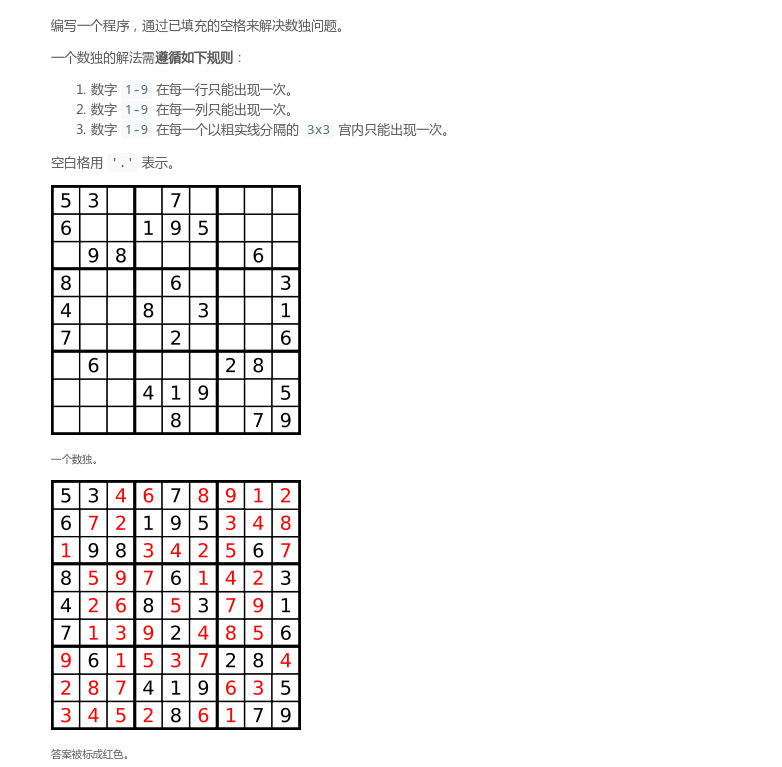
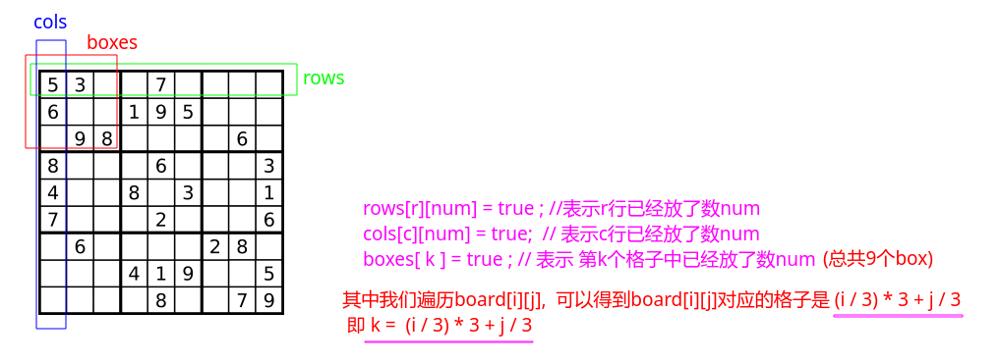

## LeetCode - 37. Sudoku Solver (DFS、回溯)
#### [题目链接](https://leetcode.com/problems/sudoku-solver/)

> https://leetcode.com/problems/sudoku-solver/

#### 题目

#### 解析
这个题目和[**N皇后问题**](https://github.com/ZXZxin/ZXBlog/blob/master/%E5%88%B7%E9%A2%98/LeetCode/Search/LeetCode%20-%2051.%20N-Queens(N%E7%9A%87%E5%90%8E%E9%97%AE%E9%A2%98).md)很像: 

* `N`皇后问题的数组标记法中用三个数组标记**列、主对角线、副对角线**是否已经摆法了皇后，这里同样也需要用三个二维数组来标记之前是否已经摆放(求解)了数字。
* 使用三个数组标记之后，然后就是递归去尝试求解了。**一开始将不是`.`的先标记已经放置了(置为`true`)，然后递归求解即可，记得递归之后回溯**；

图: 



代码:

```java
import java.io.*;
import java.util.*;

class Solution {

    private boolean[][] rows, cols, boxes; // record position is used 

    public void solveSudoku(char[][] board) {
        if(board == null || board.length == 0 || board[0].length == 0)
            return; 
        rows = new boolean[9][10]; 
        cols = new boolean[9][10]; 
        boxes = new boolean[9][10];
        for(int i = 0; i < 9; i++){ 
            for(int j = 0; j < 9; j++){ 
                if(board[i][j] == '.') continue; 
                int num = board[i][j] - '0';
                rows[i][num] = true; // i row have num
                cols[j][num] = true; // j col have num
                // 9宫格 一维和坐标的对应关系 boxKey = (r/3)*3 + c/3
                boxes[i/3 * 3 + j/3][num] = true; // which box have the num
            }
        }
        dfs(board, 0, 0); // recursive to fill the board
    }

    private boolean dfs(char[][] board, int r, int c){
        if(r == 9) // 0~8, when r = 9, already fill all the grid
            return true;
        // next position
        int nc = (c + 1) % 9; 
        int nr = (nc == 0) ? r + 1 : r; // new line or the old line
        // cur position don't need to fill, just go new position
        if(board[r][c] != '.')
            return dfs(board, nr, nc); 
        // cur position should fill
        for(int i = 1; i <= 9; i++){ // try all possibile num
            int boxKey = r/3 * 3 + c/3; // boxKey = (r/3)*3 + c/3
            if(rows[r][i] || cols[c][i] || boxes[boxKey][i])
                continue;
            rows[r][i] = cols[c][i] = boxes[boxKey][i] = true;
            board[r][c] = (char)('0' + i); // fill
            if(dfs(board, nr, nc))
                return true;
            board[r][c] = '.'; // backtrack
            rows[r][i] = cols[c][i] = boxes[boxKey][i] = false; // backtrack
        }
        return false;
    }
	//test
    public static void main(String[] args){
        PrintStream out = System.out;
        char[][] board = {
                {'5','3','.','.','7','.','.','.','.'},
                {'6','.','.','1','9','5','.','.','.'},
                {'.','9','8','.','.','.','.','6','.'},
                {'8','.','.','.','6','.','.','.','3'},
                {'4','.','.','8','.','3','.','.','1'},
                {'7','.','.','.','2','.','.','.','6'},
                {'.','6','.','.','.','.','2','8','.'},
                {'.','.','.','4','1','9','.','.','5'},
                {'.','.','.','.','8','.','.','7','9'}
        };
        new Solution().solveSudoku(board);
        out.println(Arrays.deepToString(board));
    }
}
```

