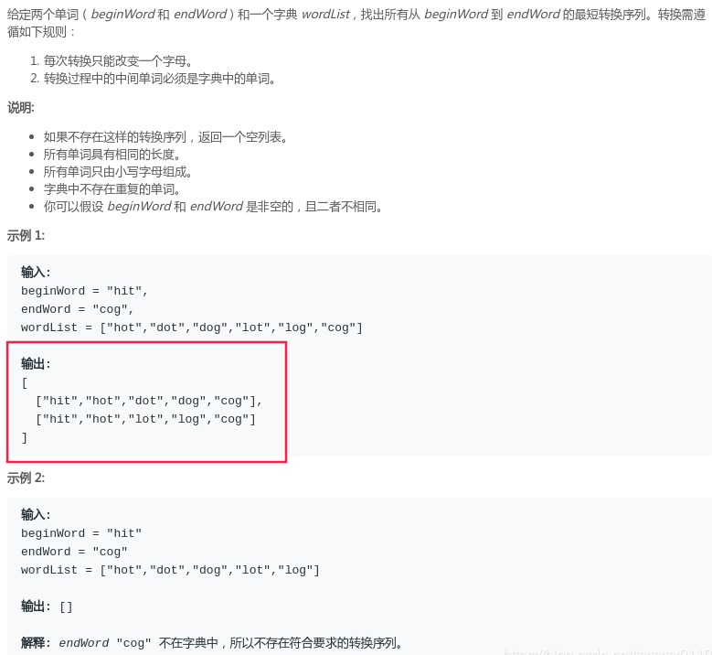
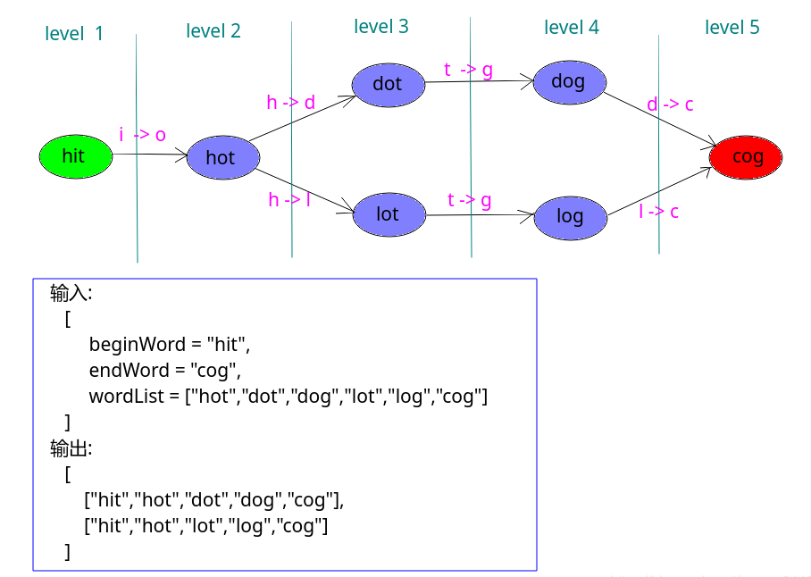

# LeetCode - 126. Word LadderII

#### [题目链接](https://leetcode.com/problems/word-ladder-ii/)

> https://leetcode.com/problems/word-ladder-ii/

#### 题目


## 解析
单向`BFS`解法: 

* 记录当前扩展的`next`的`parent`是`cur`即可；
* 但是这里每个`next`可能有多个`parent`，所以在循环中，不能先移除`dict.remve(next)`，而是使用一个`set`集合`used`数组先标记，退出这次循环之后再一次性移除；
* 最后从`endWord`往前`DFS`求出路径即可(中间集合使用`LinkedList`(可以支持头部插入))；

图:



使用单向`BFS + DFS`: 
```java
class Solution {

    public List<List<String>> findLadders(String beginWord, String endWord, List<String> wordList) {
        List<List<String>> res = new ArrayList<>();
        if (wordList == null || wordList.isEmpty())
            return res;
        Set<String> dict = new HashSet<>(wordList);
        if (!dict.contains(endWord))
            return res;
        dict.remove(beginWord);

        Set<String> used = new HashSet<>();  //不能像前一题一样，找到一个就移除一个，而是搞完一层，才一次性移除
        Map<String, HashSet<String>> parents = new HashMap<>(); //当前节点(单词)的所有的父亲
        Queue<String> queue = new LinkedList<>();
        queue.add(beginWord);
        boolean found = false;
        while (!queue.isEmpty() && !found) {
            int qsize = queue.size();
            for (int size = 0; size < qsize; size++) {
                String cur = queue.poll();
                for (int i = 0; i < cur.length(); i++) {
                    char[] chs = cur.toCharArray();
                    for (char c = 'a'; c <= 'z'; c++) {
                        if (c == chs[i])
                            continue;
                        chs[i] = c;
                        String next = new String(chs);
                        if (!dict.contains(next))
                            continue;
                        if (next.equals(endWord))  // 就算找到了，还是要做完当前这一层
                            found = true;
                        queue.add(next);
                        parents.computeIfAbsent(next, k -> new HashSet<>()).add(cur);// next的其中一个父亲为cur
                        used.add(next);// 只是记录，而不是直接dict.remove(next)
                    }
                }
            }
            dict.removeAll(used);  // 不能像前一题单向那样直接在循环里面移除 next, 而是在这里(这一层结束之后)，才移除，不然会丢失路径 例如 : dog->cog, log->cog
            used.clear();
        }
        if (!found)
            return res;

		//DFS从节点的parent集合中求解答案
        LinkedList<String> list = new LinkedList<>(); // 中间变量
        list.add(endWord);
        dfs(parents, res, endWord, beginWord, list); //backtrack from the endWord(child) to beginWord(parent)
        return res;
    }

    private void dfs(Map<String, HashSet<String>> parents, List<List<String>> res,
                     String curStr, String beginWord, LinkedList<String> list) {
        if (curStr.equals(beginWord)) { //到了起点， 找到一条了
            res.add(new ArrayList<>(list));
            return;
        }
        for (String parent : parents.get(curStr)) {
            list.addFirst(parent);   // 注意是加到开头
            dfs(parents, res, parent, beginWord, list);
            list.removeFirst();      // backtrack
        }
    }
}
```

另外可以添加一个`Map<String, Integer> steps`记录每一个节点的最短路径长度(层数) (**这题不需要**):

测试:

```java
import java.util.*;

public class Solution {

    public List<List<String>> findLadders(String beginWord, String endWord, List<String> wordList) {
        List<List<String>> res = new ArrayList<>();
        if (wordList == null || wordList.isEmpty())
            return res;
        Set<String> dict = new HashSet<>(wordList);
        if (!dict.contains(endWord))
            return res;
        dict.remove(beginWord);

        Set<String> used = new HashSet<>();  //不能像前一题一样，找到一个就移除一个，而是搞完一层，才一次性移除
        Map<String, HashSet<String>> parents = new HashMap<>(); //当前单词的所有的父亲
        Map<String, Integer> steps = new HashMap<>(); // 扩展到当前单词所需要的最小步数
        Queue<String> queue = new LinkedList<>();
        queue.add(beginWord);
        boolean found = false;
        int step = 0;
        while (!queue.isEmpty() && !found) {
            int qsize = queue.size();
            ++step;
            for (int size = 0; size < qsize; size++) {
                String cur = queue.poll();
                for (int i = 0; i < cur.length(); i++) {
                    char[] chs = cur.toCharArray();
                    for (char c = 'a'; c <= 'z'; c++) {
                        if (c == chs[i])
                            continue;
                        chs[i] = c;
                        String next = new String(chs);
                        if (!dict.contains(next))
                            continue;
                        if (next.equals(endWord))  // 就算找到了，还是要做完当前这一层
                            found = true;
                        queue.add(next);
                        steps.put(next, step + 1);
                        parents.computeIfAbsent(next, k -> new HashSet<>()).add(cur);
                        used.add(next);
                    }
                }
            }
            dict.removeAll(used);  // 不能像前一题那样直接在循环里面移除 next, 而是在这里(这一层结束之后)，才移除，不然会丢失路径 例如 : dog->cog, log->cog
            used.clear();
        }
        if (!found)
            return res;
        LinkedList<String> list = new LinkedList<>(); // 中间变量
        list.add(endWord);
        dfs(parents, res, endWord, beginWord, list); //backtrack from the endWord(child) to beginWord(parent)

        System.out.println(steps); //输出 steps
        return res;
    }

    private void dfs(Map<String, HashSet<String>> parents, List<List<String>> res,
                     String curStr, String beginWord, LinkedList<String> list) {
        if (curStr.equals(beginWord)) { //到了起点， 找到一条了
            res.add(new ArrayList<>(list));
            return;
        }
        for (String parent : parents.get(curStr)) {
            list.addFirst(parent);   // 注意是加到开头
            dfs(parents, res, parent, beginWord, list);
            list.removeFirst();      // backtrack
        }
    }


    public static void main(String[] args) {
        String beginWord = "hit";
        String endWord = "cog";
        List<String> wordList = Arrays.asList("hot", "dot", "dog", "lot", "log", "cog");

        System.out.println(new Solution().findLadders(beginWord, endWord, wordList));
    }
}
```
输出:

```java
{lot=3, log=4, dot=3, cog=5, hot=2, dog=4}
[[hit, hot, lot, log, cog], [hit, hot, dot, dog, cog]]
```