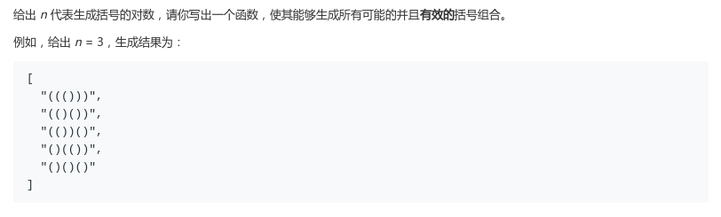
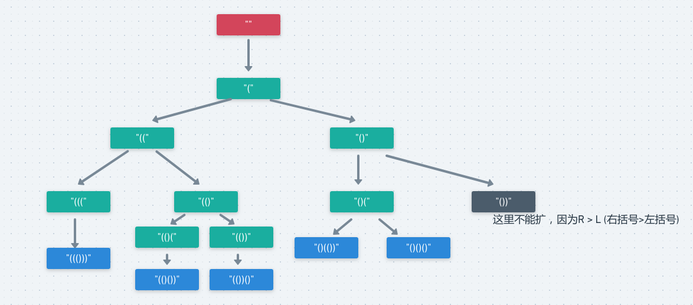

## LeetCode - 22. Generate Parentheses

#### [题目链接](https://leetcode.com/problems/generate-parentheses/)

> https://leetcode.com/problems/generate-parentheses/

#### 题目



### 解析

看一个`n == 3`的例子:



思路: 

* 思路就是，当`L < n`的时候，都可以尝试添加；
* 当时当`R >= L`的时候，就不能添加右括号，所以上面灰色就是那种情况，所以添加右括号的时候，注意`R < L`；
* 边界就是只要当右括号`R == n`就添加到结果，因为上面保证了`R <= L`；

使用`String`会使代码更加简洁:

```java
class Solution {

    private List<String>res;

    public List<String> generateParenthesis(int n) {
        res = new ArrayList<>();
        dfs("", n, 0, 0);
        return res;   
    }

    private void dfs(String curr, int n, int L, int R){
        if(R == n){
            res.add(curr);
            return;
        }
        if(L < n) dfs(curr + "(", n, L+1, R);
        if(R < L) dfs(curr + ")", n, L, R+1);
    }
}
```

