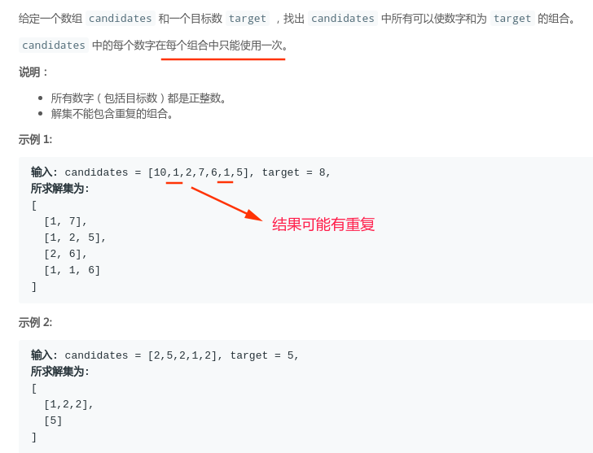
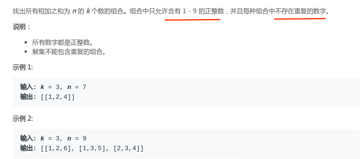

# LeetCode - 40. Combination Sum II && LeetCode - 216. Combination Sum III  (DFS)
* [LeetCode - 40. Combination Sum II](#leetcode---40-combination-sum-ii)
* [LeetCode - 216. Combination Sum III](#leetcode---216-combination-sum-III)

***
**做这题之前可以先做[LeetCode - 39.Combination Sum](https://github.com/ZXZxin/ZXBlog/blob/master/%E5%88%B7%E9%A2%98/LeetCode/Search/LeetCode%20-%2039.%20Combination%20Sum%20(%E7%BB%84%E5%90%88%E6%80%BB%E5%92%8C%20_%20dfs).md)，并知道`dfs`求解组合数的模板**。

## LeetCode - 40. Combination Sum II
#### [题目链接](https://leetcode.com/problems/combination-sum-ii/)

> https://leetcode.com/problems/combination-sum-ii/

#### 题目

#### 解析
这题和[LeetCode - 39.Combination Sum](https://github.com/ZXZxin/ZXBlog/blob/master/%E5%88%B7%E9%A2%98/LeetCode/Search/LeetCode%20-%2039.%20Combination%20Sum%20(%E7%BB%84%E5%90%88%E6%80%BB%E5%92%8C%20_%20dfs).md)不同的地方在于: 

* [LeetCode - 39.Combination Sum](https://github.com/ZXZxin/ZXBlog/blob/master/%E5%88%B7%E9%A2%98/LeetCode/Search/LeetCode%20-%2039.%20Combination%20Sum%20(%E7%BB%84%E5%90%88%E6%80%BB%E5%92%8C%20_%20dfs).md)数组**没有重复的元素，但是你可以使用同一个位置的元素去组成`target`**；
* 而此题，数组中**可能存在重复的元素，但是你不能使用同一个位置的元素**；
* 由于这一题可以使用不同位置上值相同的元素，所以`dfs`得到的结果`res`中可能存在重复的答案，例如第一个示例中，如果不去重，答案会是`[1, 7], [1, 7], [1, 2, 5], [1, 2, 5], [2, 6], [1, 1, 6]`，可以看到有两个重复的答案。所以需要去重。下面给出两种代码实现去重的方式。


①其实只需要在[LeetCode - 39.Combination Sum](https://github.com/ZXZxin/ZXBlog/blob/master/%E5%88%B7%E9%A2%98/LeetCode/Search/LeetCode%20-%2039.%20Combination%20Sum%20(%E7%BB%84%E5%90%88%E6%80%BB%E5%92%8C%20_%20dfs).md)的基础上加上一行代码，当有连续重复(在排序之后)的值时，跳过即可，即`while(i+1 < nums.length && nums[i] == nums[i+1]) i++;`。
```java
import java.io.*;
import java.util.*;

class Solution {

    private List<List<Integer>>res;

    //不同点: 不能使用同一个位置上的元素，但是不同位置上可能有相同值的元素，所以-->需要考虑重复答案的问题
    public List<List<Integer>> combinationSum2(int[] candidates, int target) {
        res = new ArrayList<>();
        if(candidates == null || candidates.length == 0)
            return res;
        Arrays.sort(candidates); //先排序 ,既可以剪枝，由导致相邻相等的元素在一起
        dfs(candidates, target, 0, 0, new ArrayList<>());
        return res;
    }

    private void dfs(int[] nums, int target, int curSum, int cur, List<Integer>curr){ 
        if(curSum == target){ 
            res.add(new ArrayList<>(curr));
            return;
        }
        for(int i = cur; i < nums.length; i++){ 
            if(curSum + nums[i] > target) 
                break; // 因为排序了，所以这里是break，不是continue，剪枝
            curr.add(nums[i]);
            dfs(nums, target, curSum + nums[i], i+1, curr); // notice is i+1             
            curr.remove(curr.size()-1);
            while(i+1 < nums.length && nums[i] == nums[i+1]) i++; //only add this;
        }
    }

    public static void main(String[] args){
        PrintStream out = System.out;
        int[] candidates = {10, 1, 2, 7, 6, 1, 5};
        int target = 8;
        out.println(new Solution().
            combinationSum2(candidates, target)
        );
    }
}
```
②或者在递归之前判断一下和前面的`nums[i-1]`是不是相同，即:` if(i != cur && nums[i] == nums[i-1]) continue;`

```java
class Solution {

    private List<List<Integer>>res;

    //不同点: 不能使用同一个位置上的元素，但是不同位置上可能有相同值的元素，所以-->需要考虑重复答案的问题
    public List<List<Integer>> combinationSum2(int[] candidates, int target) {
        res = new ArrayList<>();
        if(candidates == null || candidates.length == 0)
            return res;
        Arrays.sort(candidates); //先排序 ,既可以剪枝，由导致相邻相等的元素在一起
        dfs(candidates, target, 0, 0, new ArrayList<>());
        return res;
    }

    private void dfs(int[] nums, int target, int curSum, int cur, List<Integer>curr){ 
        if(curSum == target){ 
            res.add(new ArrayList<>(curr));
            return;
        }
        for(int i = cur; i < nums.length; i++){ 
            if(curSum + nums[i] > target) 
                break; 
            if(i != cur && nums[i] == nums[i-1])// judge this 
                continue;
            curr.add(nums[i]);
            dfs(nums, target, curSum + nums[i], i+1, curr); // notice is i+1             
            curr.remove(curr.size()-1);
        }
    }

}
```

***

## LeetCode - 216. Combination Sum III
#### [题目链接](https://leetcode.com/problems/combination-sum-iii/)

> https://leetcode.com/problems/combination-sum-iii/

#### 题目

#### 解析

这题其实也挺简单的，还是组合数的模板稍微改动一下。只不过将枚举数组中的元素改成`for(int i = cur; i <= 9; i++){ `，即枚举
`cur ~ 9`，而`cur`一开始自然是从`1`开始的。
```java
import java.io.*;
import java.util.*;

class Solution {

    private List<List<Integer>> res;

    public List<List<Integer>> combinationSum3(int k, int n) {
        res = new ArrayList<>();
        dfs(0, k, 1, 0, n, new ArrayList<>());// d is depth 
        return res;
    }

    private void dfs(int d, int k, int cur, int curSum, int target, List<Integer>curr){ 
        if(d == k){
            if(curSum == target)
                res.add(new ArrayList<>(curr));
            return;
        }
        for(int i = cur; i <= 9; i++){ 
            if(curSum + i > target)
                break;
            curr.add(i);
            dfs(d + 1, k, i + 1, curSum + i, target, curr);
            curr.remove(curr.size() - 1);
        }
    }

    public static void main(String[] args){
        PrintStream out = System.out;
        int k = 3, n = 9;
        out.println(new Solution().
            combinationSum3(3, 9)
        );
    }
}

```

因为这里的数只从`1 ~ 9`，所以这题还有一种做法就是利用二进制枚举`2 ^ 9`种可能。

* 其中如果二进制(总共`9`位)某位`i`上值为`1`，则说明取了`i+1`(因为二进制位数从`0`开始，但是这里是`1~9`(即从`1`开始))；如果`i`位置上为`0`，则没有取`i+1`；
* 枚举所有的二进制数(`0 ~ 2^9`)，然后每个数，对应哪些位置上是有数的(值为`1`)，如果有，就累加，最后看是不是等于`n`即可；

例如: 

|二进制(`0 ~ 2^9`)|对应集合|
|-|-|
|000000000| [ ] |
|000000001| [ 1 ]|
|000100011| [ 1,  2,  6]|
|010101101| [ 1, 3, 4, 6, 8]|
|111111110|[ 2, 3, 4, 5, 6, 7, 8, 9]|
|111111111|[1, 2, 3, 4, 5, 6, 7, 8, 9]|

代码：
```java
import java.io.*;
import java.util.*;

class Solution {

    public List<List<Integer>> combinationSum3(int k, int n) {
        List<List<Integer>> res = new ArrayList<>();

        for(int mask = 0; mask < (1 << 9); mask++){ 
            List<Integer>cur = new ArrayList<>();
            int sum = 0;
            for(int i = 1; i <= 9; i++)
                // if( (mask & (1 << (i-1))) != 0){ 
                if( (( mask >> (i-1) ) & 1) == 1){// same as above
                    sum += i;
                    cur.add(i);
                }
            if(sum == n && cur.size() == k)
                res.add(new ArrayList<>(cur));
        }
        return res;
    }

    public static void main(String[] args){
        PrintStream out = System.out;
        int k = 3, n = 9;
        out.println(new Solution().
            combinationSum3(3, 9)
        );
    }
}
```

