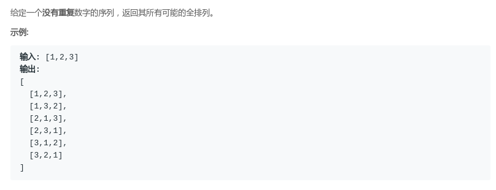
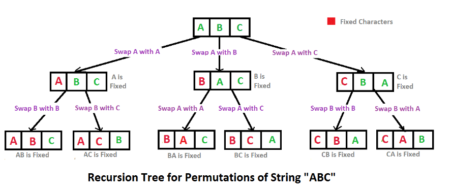
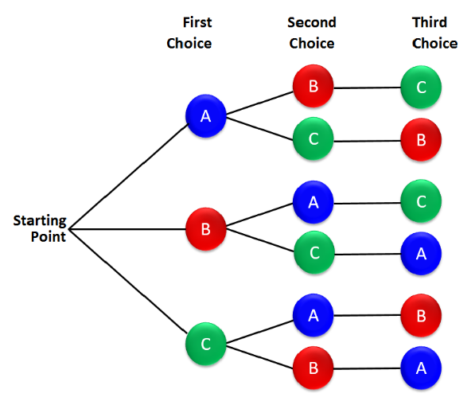
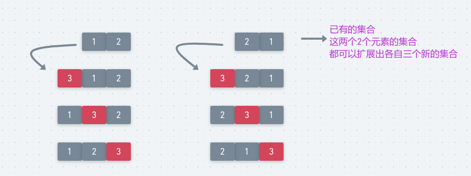

# LeetCode - 46. Permutations

#### [题目链接](https://leetcode.com/problems/permutations/description/)

> https://leetcode.com/problems/permutations/description/

#### 题目



### 1、经典排列


这种方法采用的是位置两两交换，交换后出现一种新的组合。

将这种新的组合添加到中间集，再将中间集添加到结果集中。

另外，[这篇博客](https://blog.csdn.net/summerxiachen/article/details/60579623)讲的不错。

```java
class Solution {
    public List<List<Integer>> permute(int[] nums) {
        List<List<Integer>> res = new ArrayList<>();
        dfs(res, nums, 0);
        return res;
    }

    public void dfs(List<List<Integer>> res, int[] nums, int cur) {
        if (cur == nums.length) {
            List<Integer> temp = new ArrayList<>();
            for (Integer item : nums)
                temp.add(item);
            res.add(temp);
        } else for (int i = cur; i < nums.length; i++) {
            swap(nums, cur, i);
            dfs(res, nums, cur + 1);
            swap(nums, cur, i);  //这里一定要交换回来，因为不是和C++一样是数组的拷贝，Java中是数组的引用，不能改变，不然得不到正确的结果
        }
    }

    public void swap(int[] arr, int a, int b) {
        int temp = arr[a];
        arr[a] = arr[b];
        arr[b] = temp;
    }
}
```
***
### 2、`dfs`记录是否使用
这种方法就是使用一个`bool`数组，记录是否填过，如果没有填过就填(向中间集添加元素)。

然后递归，填到`n`个数就得到一个排列，时间复杂度O(`n* n`<sup>`n-1`</sup>)。


<div align="center"></div><br>
代码:

```java
class Solution {

    private List<List<Integer>> res;

    public List<List<Integer>> permute(int[] nums) {
        res = new ArrayList<>();
        dfs(new ArrayList<>(), nums, new boolean[nums.length]);
        return res;
    }

    public void dfs(List<Integer> curr, int[] arr, boolean[] used) {
        if (curr.size() == arr.length) {
            //注意不能直接添加temp
            res.add(new ArrayList<>(curr)); //以一个集合或数组初始化ArrayList al = new ArrayList(a);//a为集合或数组
            return;
        }
        for (int i = 0; i < arr.length; i++) {
            if (!used[i]) {//记录某个下标的数是否被使用过
                curr.add(arr[i]);
                used[i] = true;
                dfs(curr, arr, used);
                curr.remove(curr.size() - 1); //移除最后一个
                used[i] = false;
            }
        }
    }
}

```
***
### 3、非递归实现

这个方法就是每次在已经有的集合中，每个集合的每个可以放置的位置，我们都放置一遍，并且把原来的移除掉，这样就能得到所有的排列。
看下图，如果集合中有两个子集合`[1,2]`,和`[2,1]`，就可以分别生成下面的集合



代码:

```java
import java.util.*;

class Solution {

    public List<List<Integer>> permute(int[] nums) {
        List<List<Integer>> res = new ArrayList<>();
        if (nums == null || nums.length == 0)
            return res;
        res.add(Arrays.asList(nums[0]));
        List<List<Integer>> newRes;
        for (int i = 1; i < nums.length; i++) {
            newRes = new ArrayList<>();
            for (List<Integer> list : res) { 
                for (int j = 0; j <= list.size(); j++) { //注意这里是<= 有这么多个位置可以插入
                    List<Integer> temp = new ArrayList<>(list);
                    temp.add(j, nums[i]); //在j位置放入nums[i]
                    newRes.add(temp);
                }
            }
            res = newRes;
        }
        return res;
    }
}
```
非递归简单优化。

上面的非递归可以简写成下面的形式，意思是差不多的，每次都全部取出来。

```java
import java.util.*;

class Solution {

    public List<List<Integer>> permute(int[] nums) {
        LinkedList<List<Integer>> res = new LinkedList<List<Integer>>();
        res.add(new ArrayList<>());
        for (int i = 0; i < nums.length; i++) {
            for (int size = res.size(); size > 0; size--) {
                List<Integer> item = res.pollFirst(); //每次取出来一个并且弹出
                for (int j = 0; j <= item.size(); j++) {
                    List<Integer> temp = new ArrayList<>(item);
                    temp.add(j, nums[i]);
                    res.add(temp);
                }
            }
        }
        return res;
    }
}
```
