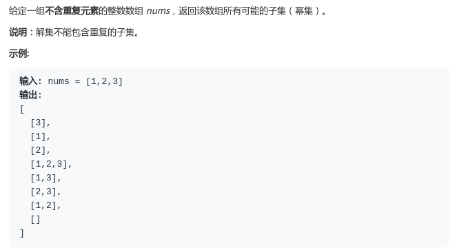
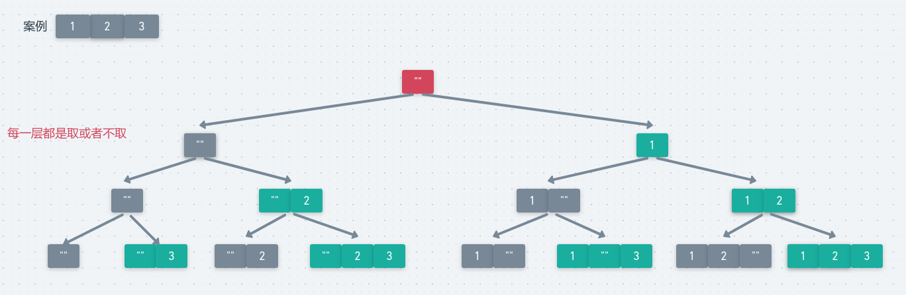
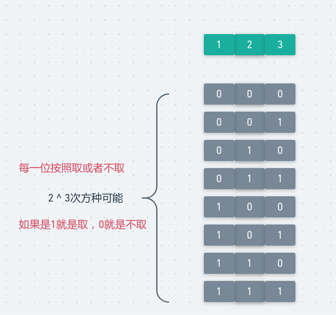
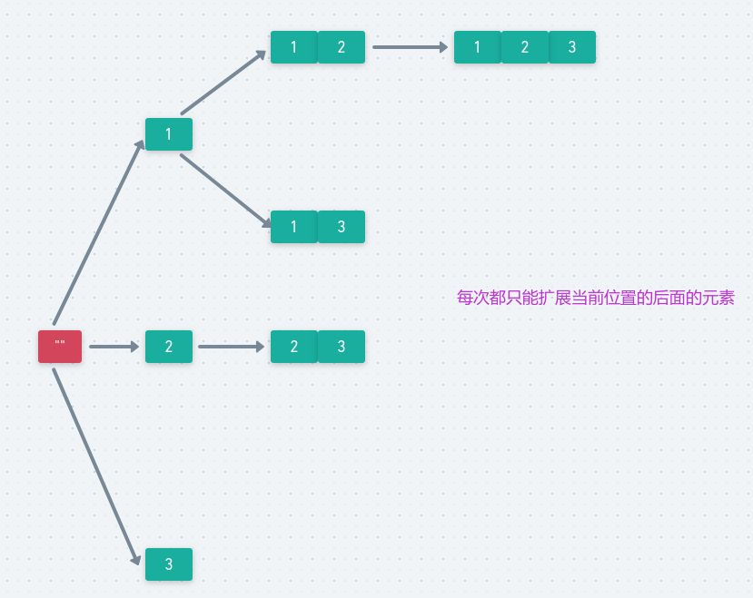

# LeetCode - 78. Subsets

#### [题目链接](https://leetcode-cn.com/problems/subsets/)

> https://leetcode-cn.com/problems/subsets/

#### 题目



### 1、当前位置选或者不选

这个方法我个人觉得也是最容易理解的。我们要求的是所有的子集的可能，于是我们考虑每一位取或者不取，这不就是考虑了所有子集的可能吗?。

图:



可以看到对于案例`[1, 2, 3]`子集的结果总共有`8`个，即`1`个红色的加上`7`个绿色的。

代码:

```java
class Solution {

    private boolean[] bit;
    private List<List<Integer>> res;

    public List<List<Integer>> subsets(int[] nums) {
        res = new ArrayList<>();
        bit = new boolean[nums.length];
        dfs(0, nums);
        return res;
    }

    private void dfs(int cur, int[] arr) {
        if (cur == arr.length) {
            List<Integer> tmp = new ArrayList<>();
            for (int i = 0; i < cur; i++) if (bit[i]) tmp.add(arr[i]);
            res.add(new ArrayList<>(tmp));
            return;
        }
        dfs(cur + 1, arr);  // 不取当前数字
        bit[cur] = true;       // 取当前数字
        dfs(cur + 1, arr);
        bit[cur] = false;
    }
}
```

也可以使用一个`List`来存储当前的位置。和上面的`boolean`数组是一样的。

```java
class Solution {

    private List<List<Integer>> res;

    public List<List<Integer>> subsets(int[] nums) {
        res = new ArrayList<>();
        dfs(0, nums, new ArrayList<>());
        return res;
    }

    private void dfs(int cur, int[] arr, ArrayList<Integer> curr) {
        if (cur == arr.length) {
            res.add(new ArrayList<>(curr));
            return;
        }
        dfs(cur + 1, arr, curr); // 不取当前数

        curr.add(arr[cur]);
        dfs(cur + 1, arr, curr);//取当前数
        curr.remove(curr.size() - 1);
    }
}
```

### 2、二进制子集枚举

这种情况和上面那种其实是一样的，只不过这个是用，数组长度这么多位，来枚举每一位`0`和`1`的情况。

<div align="center"></div><br>

代码:

```java
class Solution {
    public List<List<Integer>> subsets(int[] nums) {
        List<List<Integer>> res = new ArrayList<>();
        for(int mask = 0; mask < (1 << nums.length); mask++){
            List<Integer> tmp = new ArrayList<>();
            for(int i = 0; i < nums.length; i++)
                if( ( (mask >> i) & 1) == 1) tmp.add(nums[i]);
            res.add(tmp);
        }
        return res;
    }
}
```

### 3、经典写法

这种写法的思想是每一次取了当前的数，然后递归去考虑剩下的数`[cur ~ arr.length]`，而且每次都会从下一个开始，也就是说每次是递增构造的，说不太清，看图吧。。。



代码:

```java
class Solution {

    private List<List<Integer>> res;

    public List<List<Integer>> subsets(int[] nums) {
        res = new ArrayList<>();
        dfs(0, nums, new ArrayList<>());
        return res;
    }

    private void dfs(int cur, int[] arr, ArrayList<Integer> curr) {
        res.add(new ArrayList<>(curr));  //任何一个结果都要加入结果集
        for(int i = cur; i < arr.length; i++) {
            curr.add(arr[i]);
            dfs(i + 1, arr, curr); // 从当前的下一个数开始取
            curr.remove(curr.size() - 1);
        }
    }
}
```


这里要区分我们的**排列数、组合数**的dfs写法。

排列数: 

```java
class Solution {

    private List<List<Integer>> res;

    public List<List<Integer>> permute(int[] nums) {
        res = new ArrayList<>();
        dfs(new ArrayList<>(), nums, new boolean[nums.length]);
        return res;
    }

    public void dfs(List<Integer> curr, int[] arr, boolean[] used) {
        if (curr.size() == arr.length) {
            //注意不能直接添加temp
            res.add(new ArrayList<>(curr)); //以一个集合或数组初始化ArrayList al = new ArrayList(a);//a为集合或数组
            return;
        }
        for (int i = 0; i < arr.length; i++) {
            if (!used[i]) {//记录某个下标的数是否被使用过
                curr.add(arr[i]);
                used[i] = true;
                dfs(curr, arr, used);
                curr.remove(curr.size() - 1); //移除最后一个
                used[i] = false;
            }
        }
    }
}

```

组合数:

```java
import java.io.*;
import java.util.*;

public class Main {

    static List<List<Integer>> res;

    static void dfs(int[] arr, int depth, int cur, int n, ArrayList<Integer> curr) {
        if (depth == n) {
            res.add(new ArrayList<>(curr));
            return;
        }
        for (int i = cur; i < arr.length; i++) {
            curr.add(arr[i]); //当前 d 层元素为nums[i]
            dfs(arr, depth + 1, i + 1, n, curr); //去考虑d+1以及后面的层，注意下次直接从i+1开始，不会有重复的
            curr.remove(curr.size() - 1);
        }
    }

    public static void main(String[] args) {
        PrintStream out = System.out;

        int[] arr = {2, 1, 3};

        res = new ArrayList<>();
        dfs(arr, 0, 0, 3, new ArrayList<>()); // 从3个数中取3个数的组合(不是排列)
        out.println(res);

        out.println("-------------------------------");

        res = new ArrayList<>();
        dfs(arr, 0, 0, 2, new ArrayList<>());// 从3个数中取2个数的组合(不是排列)
        out.println(res);
    }
}
```

