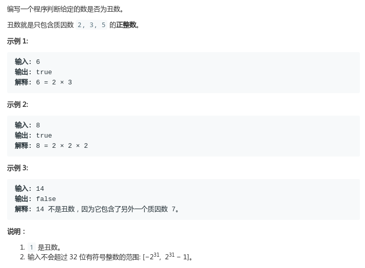

# LeetCode - 263. Ugly Number

#### [题目链接](https://leetcode.com/problems/ugly-number/)

> https://leetcode.com/problems/ugly-number/

#### 题目



## 解析

很简单的题目，相信谁都会做。

```java
class Solution {
    public boolean isUgly(int num) {
        if (num <= 0) return false;
        if (num == 1) return true;
        while (num != 1) {
            if (num % 2 == 0) num /= 2;
            else if (num % 3 == 0) num /= 3;
            else if (num % 5 == 0) num /= 5;
            else return false;
        }
        return true;
    }
}
```

