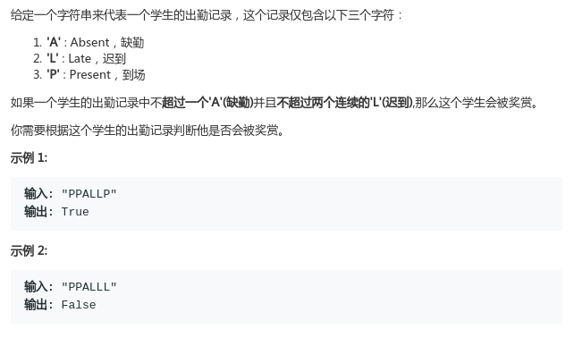

# LeetCode - 551. Student Attendance Record I

#### [题目链接](https://leetcode.com/problems/student-attendance-record-i/)

> https://leetcode.com/problems/student-attendance-record-i/

#### 题目



## 解析

简单题，用两个变量统计一下就可以了。如果`L`不是连续就置为`0`。

代码:

```java
class Solution {
    public boolean checkRecord(String s) {
        int a = 0, l = 0;
        for (int i = 0; i < s.length(); i++) {
            char c = s.charAt(i);
            if (c == 'A') a++;
            if (c == 'L')
                l++;
            else //没有连续就置为0
                l = 0;
            if (a > 1 || l > 2) return false;
        }
        return true;
    }
}
```

