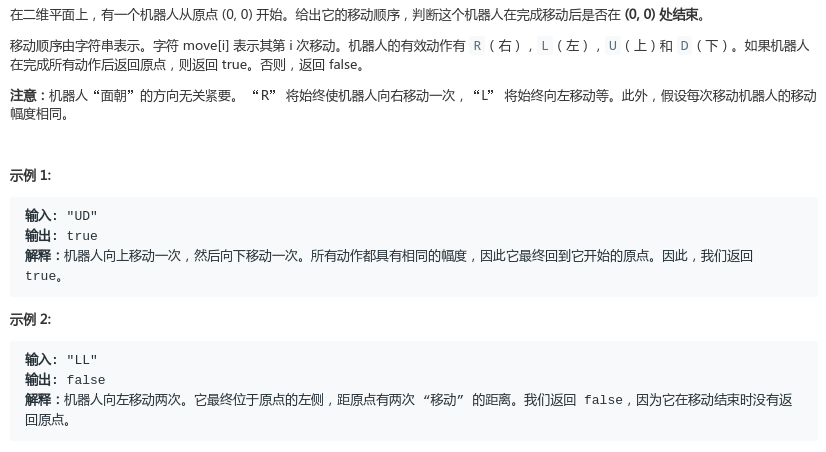

# LeetCode - 657. Robot Return to Origin

#### [题目链接](https://leetcode.com/problems/robot-return-to-origin/)

> https://leetcode.com/problems/robot-return-to-origin/

#### 题目



#### 解析

简单题。

```java
class Solution {
    public boolean judgeCircle(String moves) {
        int x = 0,y = 0;
        for(int i = 0; i < moves.length(); i++){
            switch (moves.charAt(i)){
                case 'L': x--; break;
                case 'R': x++; break;
                case 'U': y++; break;
                case 'D': y--; break;
            }
        }
        return x == 0 && y == 0;
    }
}
```

