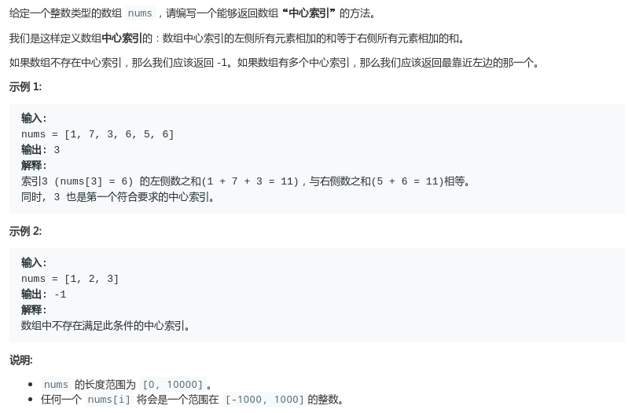

# LeetCode - 724. Find Pivot Index

#### [题目链接](https://leetcode.com/problems/find-pivot-index/)

> https://leetcode.com/problems/find-pivot-index/

#### 题目



## 解析

比较简单的模拟题。前面的累加，然后算出两边是否相等即可。

```java
class Solution {
    public int pivotIndex(int[] nums) {
        int sum = 0, L = 0; 
        for (int i = 0; i < nums.length; i++) sum += nums[i];
        for (int i = 0; i < nums.length; i++) {
            if (L == sum - L - nums[i]) return i;
            L += nums[i];
        }
        return -1;
    }
}
```

