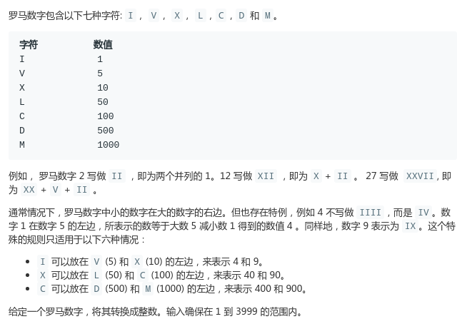

# LeetCode - 13. Roman to Integer

#### [题目链接](https://leetcode-cn.com/problems/integer-to-roman/)

> https://leetcode.com/problems/integer-to-roman/

#### 题目



样例:

```java
示例 1:

输入: "III"
输出: 3
示例 2:

输入: "IV"
输出: 4
示例 3:

输入: "IX"
输出: 9
示例 4:

输入: "LVIII"
输出: 58
解释: L = 50, V= 5, III = 3.
示例 5:

输入: "MCMXCIV"
输出: 1994
解释: M = 1000, CM = 900, XC = 90, IV = 4.
```

## 解析

这题要考虑处理好`900、400、90、40、9、4`这些情况，用什么方法呢？不能和上一题一样，因为有些组合是一个字符串。

能不能找到更加有效的方法呢？

我们可以先用哈希表存储题目中给定的罗马字符和整数的对应关系，然后对于不是`900、400、90、40、9、4`的这些情况，我们直接在哈希表中找到对应的值累加即可。

但是如果是那六种特殊情况呢? 我们也可以找到对应的处理办法:

* 我们从字符串**后面开始处理**；
* 这样当我们遇到那些特殊情况的时候，后面那一位先累加；
* 然后对应的前面一位就要减去自身对应的值；

具体看图和例子:


代码: 

```java
class Solution {

    public int romanToInt(String s) {
        char[] chs = s.toCharArray();
        char[] roman = {'I', 'V', 'X', 'L', 'C', 'D', 'M'};
        int[] values = {1, 5, 10, 50, 100, 500, 1000};
        HashMap<Character, Integer> map = new HashMap<>();
        for(int i = 0; i < roman.length; i++) map.put(roman[i], values[i]);
        int res = map.get(chs[chs.length - 1]);
        for(int i = chs.length - 2; i >= 0; i--){
            // 说明是那种特殊情况，比如900, 此时chs[i] == C(100), < 前面的1000
            if(map.get(chs[i]) < map.get(chs[i+1])){ 
                res -= map.get(chs[i]);
            }else {
                res += map.get(chs[i]);
            }
        }
        return res;
    }
}
```

