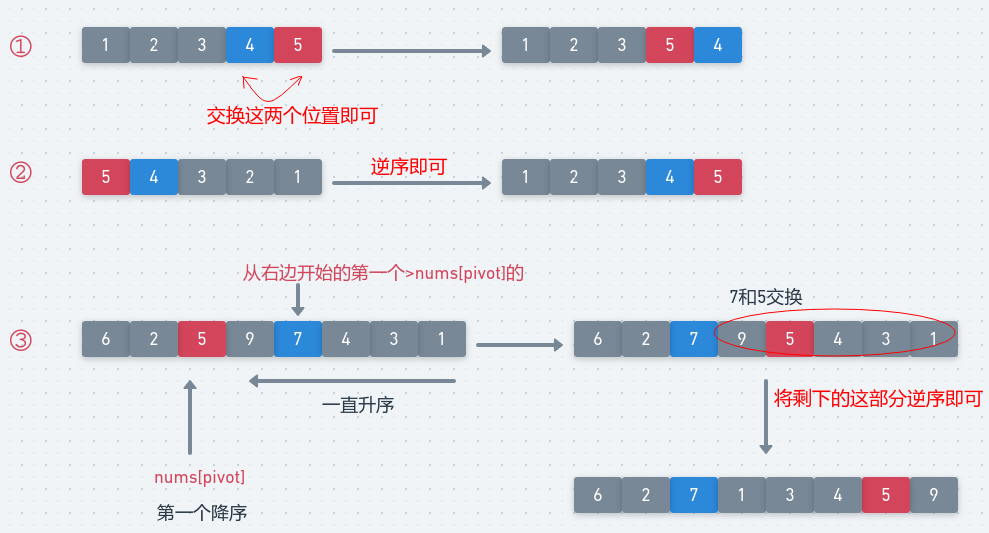

## LeetCode - 31. Next Permutation(下一个排列)
#### [题目链接](https://leetcode.com/problems/next-permutation/description/)

> https://leetcode.com/problems/next-permutation/description/

#### 题目


#### 解析

 可以分为三种情况 : 

 - 一开始就是升序的，此时我们只需要交换最后两个位置，就可以得到下一个排列；
 - 一开始就是降序的，我们只需要把整个数组反转就可以得到一个升序的排列，也就是下一个排列；
 - 普通的情况的做法就是：
    - 从数组的后面往前面开始找，直到找到第一个**当前数不比前一个数小**的位置，记为`nums[pivot]`。
    - 然后再从后面始往前找到第一个比`nums[pivot]`大的位置，交换这个两个位置的数。
    - 然后从`[pivot~nums.length-1]`之间的数翻转过来即可。

图:

<div align="center"></div><br>
代码如下 : 

```java
class Solution {

    public void nextPermutation(int[] nums) {
        if (nums.length == 0 || nums == null) return;
        int pivot = nums.length - 1;
        for (; pivot - 1 >= 0 && nums[pivot] <= nums[pivot - 1]; pivot--) ;
        if (pivot == 0) { //全部降序
            reverse(nums, 0, nums.length - 1);
            return;
        }
        int mini = nums.length - 1;
        for (int i = nums.length - 1; i >= pivot; i--) {
            if (nums[i] > nums[pivot-1]) { // nums[pivot-1]是那个从后往前第一个降序的
                mini = i;
                break;
            }
        }
        swap(nums, mini, pivot - 1);
        reverse(nums, pivot, nums.length - 1);
    }


    public void reverse(int[] arr, int s, int e) {
        while (s < e) swap(arr, s++, e--);
    }

    public void swap(int[] arr, int i, int j) {
        int t = arr[i];
        arr[i] = arr[j];
        arr[j] = t;
    }
}
```
