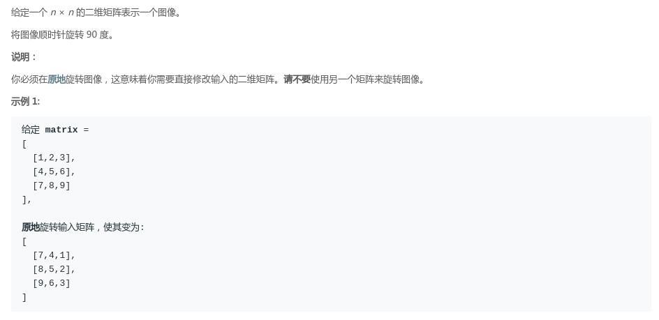
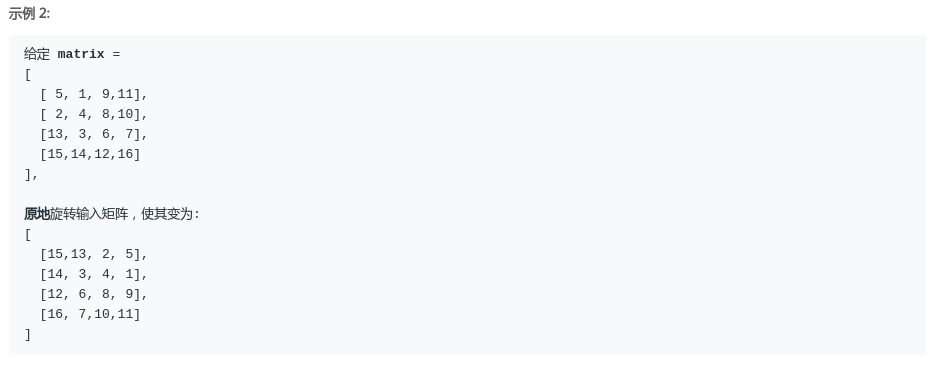
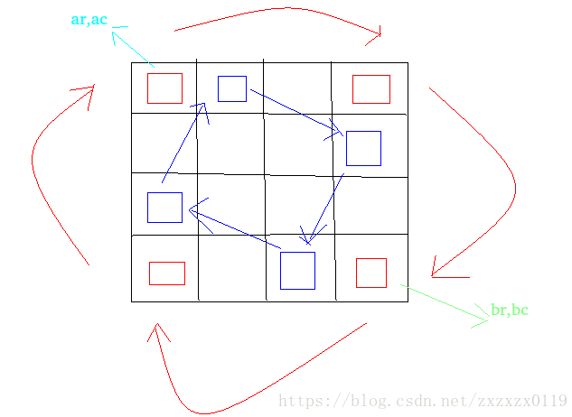

## LeetCode - 48. Rotate Image(将正方形矩阵旋转90度)
#### [题目链接](https://leetcode.com/problems/rotate-image/description/)

> https://leetcode.com/problems/rotate-image/description/

#### 题意






### 解析

* 这个也是一个宏观的调度问题，还是使用分圈的处理方式，每次对一个矩阵的外围进行处理(边界)跑；
* 我们发现只要替换四个数，替换`n-1`次，就把外面的边界替换好了，然后我们缩小范围(左上角的`(ar,ac)`和右下角的`(br,bc)`分别减一)，就可以完成操作，如下图；





代码如下:

```java
class Solution {

    public void rotate(int[][] matrix) {
        int ar = 0;
        int ac = 0;
        int br = matrix.length - 1;
        int bc = matrix[0].length - 1;
        while (ar <= br && ac <= bc) {
            rotateEdge(matrix, ar++, ac++, br--, bc--);
        }
    }

    //具体的分圈的交换旋转
    private void rotateEdge(int[][] matrix, int ar, int ac, int br, int bc) {
        int times = bc - ac;
        int tmp = 0;

        for (int i = 0; i < times; i++) {// times - 1次　　每次交换四个点的值
            tmp = matrix[ar][ac + i];
            matrix[ar][ac + i] = matrix[br - i][ac];
            matrix[br - i][ac] = matrix[br][bc - i];
            matrix[br][bc - i] = matrix[ar + i][bc];
            matrix[ar + i][bc] = tmp;
        }
    }
}
```

