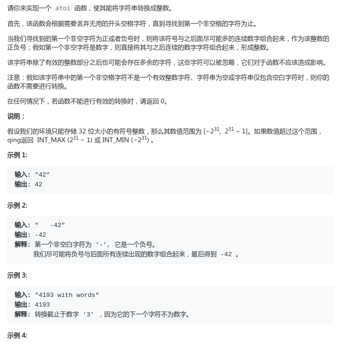
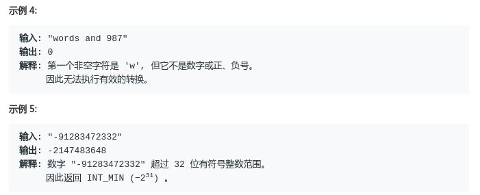
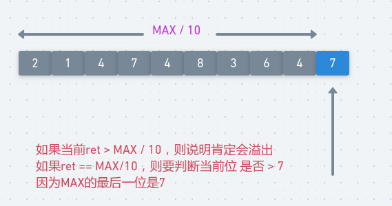

# LeetCode - 8. String to Integer(atoi)

#### [题目链接](https://leetcode.com/problems/string-to-integer-atoi/)

> https://leetcode.com/problems/string-to-integer-atoi/

#### 题目





## 解析

也不难，只是要注意符号和溢出的问题。

关于溢出的判断，我们在当前位，只需要判断前面的乘积`ret > Integer.MAX_VALUE/10`或者`ret == Integer.MAX_VALUE && s[i] > 7`即可。

<div align="center"></div><br>

代码: 

```java
class Solution {
    public int myAtoi(String str) {
        if (str == null || str.length() == 0) return 0;
        char[] s = str.toCharArray();
        int sign = 1, i = 0, ret = 0;
        while (i < s.length && s[i] == ' ') i++;//去掉前面的空格
        if (i == s.length) return 0;//判断越界
        if (s[i] == '-') {
            sign = -1;
            i++;
        } else if (s[i] == '+') {
            i++;
        }
        while (i < s.length && s[i] >= '0' && s[i] <= '9') {
            // max : 2147483647, min : -2147483648
            // Integer.MAX_VALUE/10 = 214748364
            if (ret > Integer.MAX_VALUE / 10
                    || (Integer.MAX_VALUE / 10 == ret && s[i] > '7')) {
//                    || (Integer.MAX_VALUE / 10 == ret && ( (sign == 1 && s[i] > '7') || (sign == -1 && s[i] > '8')))){
                return sign == 1 ? Integer.MAX_VALUE : Integer.MIN_VALUE;
            }
            ret = ret * 10 + s[i++] - '0';
        }
        return ret * sign;
    }

    public static void main(String[] args) {
        System.out.println(new Solution().myAtoi("-2147483648")); //-2147483648
        System.out.println(new Solution().myAtoi("2147483648")); //21474836487
    }
}
```

