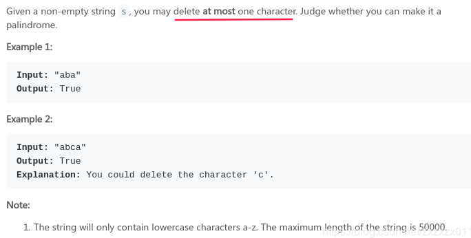
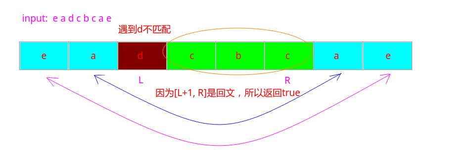
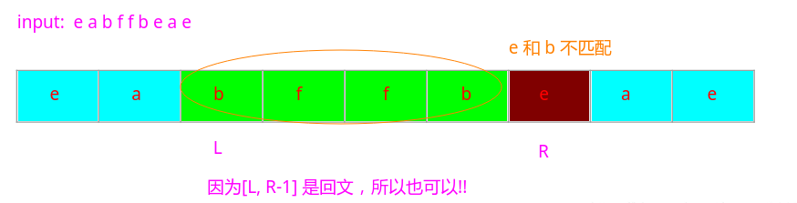

# LeetCode - 680. Valid Palindrome II(删除一个字符判断能否构成回文)
#### [题目链接](https://leetcode.com/problems/valid-palindrome-ii/)

> https://leetcode.com/problems/valid-palindrome-ii/

#### 题目

就是给你一个字符串，问你是否能删除最多一个字符(可以不用删除) ，得到一个回文串。



#### 解析

暴力枚举删除每一个位置的方法肯定是行不通的。

这里需要用到**回文串的性质**。

看下面两个例子: 

案例一: `e a d c b c a e`



另一种情况：　

`e a b f f b e a e`




所以解题步骤: 


设置两个指针，往中间靠拢，然后当遇到`s[L] != s[R]`的时候，就判断`[L + 1, R]`或者`[L, R-1]`部分可以不可以构成回文串，只要有其中一个可以，就返回`true`即可。
```java
class Solution {
    public boolean validPalindrome(String s) {
        int L = 0, R = s.length() - 1;
        while(L < R){
            if(s.charAt(L) != s.charAt(R)){
                return isPalindrome(s, L+1, R) || isPalindrome(s, L, R-1); 
            }else {
                L++;
                R--;
            }
        }
        return true;
    }
    
    private boolean isPalindrome(String s, int L, int R){
        while(L < R)
            if(s.charAt(L++) != s.charAt(R--))
                return false;
        return true;
    }
}
```

