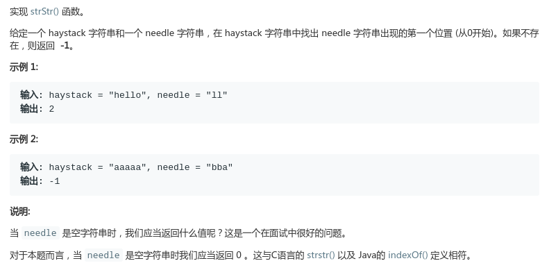

# LeetCode - 28. Implement strStr()

#### [题目链接](https://leetcode.com/problems/implement-strstr/)

> https://leetcode.com/problems/implement-strstr/

#### 题目



### 解析

经典的字符串匹配问题。

暴力解法和KMP解法。

暴力匹配的话就是直接对`s1`的每一个位置，都匹配一次`s2`即可。

<div align="center"></div>

代码:

```java
class Solution {
    // 暴力匹配
    public int strStr(String haystack, String needle) {
        char[] s = haystack.toCharArray();
        char[] p = needle.toCharArray();
        int i = 0, j = 0;
        for(i = 0; i < s.length; i++){
            if(j == p.length) return i - p.length;
            if(s[i] == p[j]) j++; // 继续匹配
            else {
                i -= j; // i回到前面
                j = 0; // j回到开始
            }
        }
        if(j == p.length) return i - p.length;
        return -1;
    }
}
```

KMP算法请移步[这篇博客](https://github.com/ZXZxin/ZXBlog/blob/master/%E6%95%B0%E6%8D%AE%E7%BB%93%E6%9E%84%E7%AE%97%E6%B3%95/String/KMP/Hdu%20-%201711.%20Number%20Sequence%E4%BB%A5%E5%8F%8AKMP%E7%AE%97%E6%B3%95%E6%80%BB%E7%BB%93.md)。

注意这一题要判断一下`needle.length==0`的情况下返回`0`。

代码：

```java
class Solution {

    public int strStr(String haystack, String needle) {
        if(needle.length() == 0) return 0; // 必须要加上这个
        return kmp(haystack.toCharArray(), needle.toCharArray());
    }

    private int kmp(char[] s, char[] p) {
        if (s == null || p == null || p.length < 1 || s.length < p.length) return -1;
        
        int i1 = 0, i2 = 0; //甲乙
        int[] next = getNext(p);
        while (i1 < s.length && i2 < p.length) {
            if (s[i1] == p[i2]) { //能配上，继续
                i1++;
                i2++;
            } else {
                if (next[i2] == -1) { //我str2到了第一个你都配不上(第一个位置都配不上),那你str1就下一个吧
                    i1++;
                } else {//逻辑概念是str2往右边推
                    i2 = next[i2]; //来到next数组指示(最长公共前缀后缀)
                }
            }
        }
        return i2 == p.length ? i1 - i2 : -1;//返回匹配的第一个位置
    }

    private int[] getNext(char[] p) {
        if (p.length == 1) return new int[]{-1};
        int[] next = new int[p.length];
        next[0] = -1;
        next[1] = 0;
        int cn = 0;
        for (int i = 2; i < p.length; ) {
            if (p[i - 1] == p[cn]) {
                next[i++] = ++cn; //就是cn+1
            } else {
                if (cn > 0) cn = next[cn];//往前面跳
                else next[i++] = 0;
            }
        }
        return next;
    }
}
```

