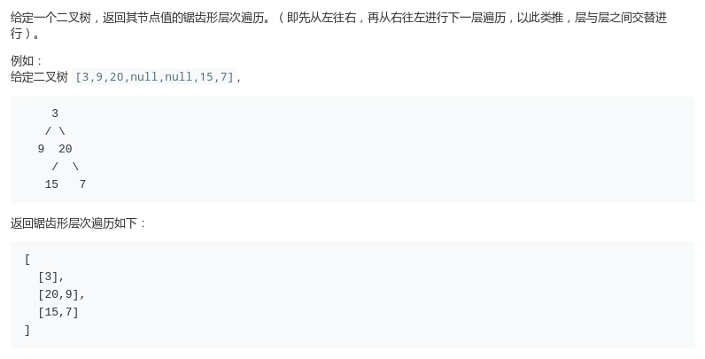
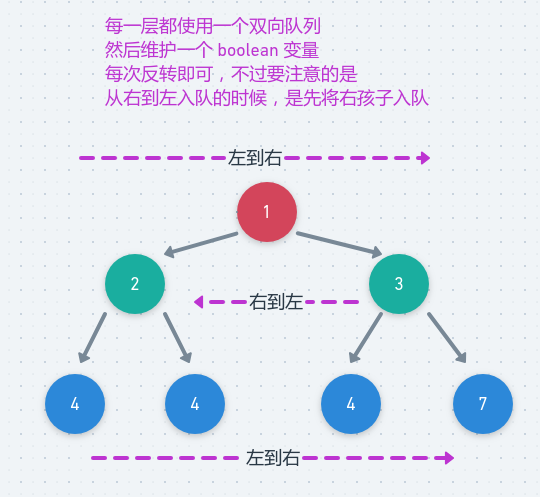

# LeetCode - 103. Binary Tree Zigzag Level Order Traversal

#### [题目链接](https://leetcode.com/problems/binary-tree-zigzag-level-order-traversal/)

> https://leetcode.com/problems/binary-tree-zigzag-level-order-traversal/

#### 题目



## 解析

非递归写法，有几种写法。

第一种，最简单的方法。直接在[LeetCode - 102](https://github.com/ZXZxin/ZXBlog/blob/master/%E5%88%B7%E9%A2%98/LeetCode/Tree/LeetCode%20-%20102.%20Binary%20Tree%20Level%20Order%20Traversal(%E5%B1%82%E6%AC%A1%E9%81%8D%E5%8E%86%E4%BF%9D%E5%AD%98).md)的基础上，把偶数层反转一下即可。

```java
class Solution {

    public List<List<Integer>> zigzagLevelOrder(TreeNode root) {
        List<List<Integer>> res = new ArrayList<>();
        if (root == null)
            return res;
        Queue<TreeNode> queue = new LinkedList<>();
        queue.add(root); 
        boolean ok = false;
        ArrayList<Integer> list = new ArrayList<>();
        while (!queue.isEmpty()) {
            int n = queue.size();
            ArrayList<Integer> tmp = new ArrayList<>();
            for (int i = 0; i < n; i++) {
                TreeNode cur = queue.poll();
                tmp.add(cur.val);
                if (cur.left != null) queue.add(cur.left);
                if (cur.right != null) queue.add(cur.right);
            }
            if (ok) Collections.reverse(tmp);
            ok = !ok;
            res.add(tmp);
        }
        return res;
    }
}
```

第二种，用到双向队列，或者自己维护一下是在左边添加还是在右边添加。

<div align="center"></div><br>

代码:

```java
class Solution {
    public List<List<Integer>> zigzagLevelOrder(TreeNode root) {
        List<List<Integer>> res = new ArrayList<>();
        if (root == null)
            return res;
        LinkedList<TreeNode> queue = new LinkedList<>();
        queue.add(root);
        boolean ok = false;
        while (!queue.isEmpty()) {
            ArrayList<Integer> tmp = new ArrayList<>();
            int n = queue.size();
            if (!ok) { // 从左往右
                for (int i = 0; i < n; i++) {
                    TreeNode cur = queue.removeFirst();
                    tmp.add(cur.val);
                    if(cur.left != null) queue.addLast(cur.left);
                    if(cur.right != null) queue.addLast(cur.right);
                }
            } else {
                for (int i = 0; i < n; i++) { //从右往左
                    TreeNode cur = queue.removeLast();
                    tmp.add(cur.val);
                    if(cur.right != null) queue.addFirst(cur.right);//从右往左要先添加右孩子
                    if(cur.left != null) queue.addFirst(cur.left);
                }
            }
            ok = !ok;
            res.add(tmp);
        }
        return res;
    }
}
```

递归写法。

和上一题[LeetCode - 102](https://github.com/ZXZxin/ZXBlog/blob/master/%E5%88%B7%E9%A2%98/LeetCode/Tree/LeetCode%20-%20102.%20Binary%20Tree%20Level%20Order%20Traversal(%E5%B1%82%E6%AC%A1%E9%81%8D%E5%8E%86%E4%BF%9D%E5%AD%98).md)的一样，只不过判断一下层数的奇偶即可。

```java
class Solution {

    List<List<Integer>> res;

    public List<List<Integer>> zigzagLevelOrder(TreeNode root) {
        res = new ArrayList<>();
        if (root != null) pre(root, 0);
        return res;
    }

    public void pre(TreeNode node, int level) {
        if (node == null) return;
        if (level >= res.size())
            res.add(new ArrayList<>());
        if (level % 2 == 0)
            res.get(level).add(node.val);
        else
            res.get(level).add(0, node.val);
        pre(node.left, level + 1);
        pre(node.right, level + 1);
    }
}
```

