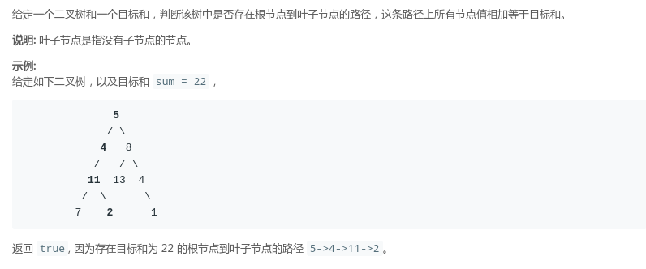
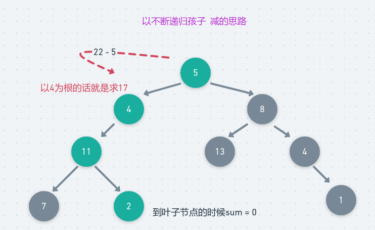

# LeetCode - 112. PathSum

#### [题目链接](https://leetcode.com/problems/path-sum/)

> https://leetcode-cn.com/problems/path-sum/

#### 题目

## 1、递归

两种写法，从`sum`的角度去看，可以从`sum`减，也可以从`0`加到`sum`。



第一种(减的思路): 

```java
class Solution {
    public boolean hasPathSum(TreeNode root, int sum) {
        if (root == null)
            return false;
        if (root.left == null && root.right == null)
            return root.val == sum;
        int newSum = sum - root.val;
        return hasPathSum(root.left, newSum) || hasPathSum(root.right, newSum);
    }
}
```
第二种(加的思路): 
```java
class Solution {

    public boolean hasPathSum(TreeNode root, int sum) {
        if (root == null)
            return false;
        return helper(root, 0, sum);
    }

    private boolean helper(TreeNode node, int curSum, int sum) {
        if (node == null)
            return false;
        if (node.left == null && node.right == null)
            return curSum + node.val == sum;
        curSum += node.val;
        return helper(node.left, curSum, sum) || helper(node.right, curSum, sum);
    }
}
```

## 2、非递归
非递归，如果只使用一个栈(或者不使用辅助结构)的话，需要修改原来的树的结构: 

```java
class Solution {
    public boolean hasPathSum(TreeNode root, int sum) {
        if (root == null)
            return false;
        Stack<TreeNode> stack = new Stack<>();
        stack.push(root);
        TreeNode cur = null;
        while (!stack.isEmpty()) {
            cur = stack.pop();

            if (cur.left == null && cur.right == null && cur.val == sum)
                return true;

            if (cur.right != null) {
                cur.right.val += cur.val;
                stack.push(cur.right);
            }

            if (cur.left != null) {
                cur.left.val += cur.val;
                stack.push(cur.left);
            }
        }
        return false;
    }
}
```
写法可以有很多种，也可以使用一个栈存数，这样就不要改变树的结构:  

```java
class Solution {
    public boolean hasPathSum(TreeNode root, int sum) {
        if (root == null)
            return false;
        Stack<TreeNode> nodeStack = new Stack<>();
        Stack<Integer> sumStack = new Stack<>();//存上到当前节点的数的值
        nodeStack.push(root);
        sumStack.push(sum);
        while (!nodeStack.isEmpty()) {
            TreeNode curNode = nodeStack.pop();
            int curSum = sumStack.pop();

            if (curNode.left == null && curNode.right == null && curNode.val == curSum)
                return true;

            if (curNode.right != null) {
                nodeStack.push(curNode.right);
                sumStack.push(curSum - curNode.val);
            }

            if (curNode.left != null) {
                nodeStack.push(curNode.left);
                sumStack.push(curSum - curNode.val);
            }
        }
        return false;
    }
}
```

这里也可以使用类似`BFS`(层序)的遍历: 

写法真的可以说是多种多样吧，层序使用队列即可，代码和`BFS`差别不大，但是我这里使用了另一个类，没有使

用多余的两个队列，也保证没有修改树的结构。

```java
class Solution {

    private class Comb {
        public int curSum;
        public TreeNode node;

        public Comb(TreeNode node, int curSum) {
            this.node = node;
            this.curSum = curSum;
        }
    }

    public boolean hasPathSum(TreeNode root, int sum) {
        if (root == null)
            return false;
        Queue<Comb> queue = new LinkedList<>();
        queue.add(new Comb(root, 0)); //注意对应的关系
        while (!queue.isEmpty()) {
            Comb cur = queue.poll();
            if (cur.node.left == null && cur.node.right == null && cur.curSum + cur.node.val == sum)
                return true;
            if (cur.node.left != null) 
                queue.add(new Comb(cur.node.left, cur.curSum + cur.node.val));
            if (cur.node.right != null) 
                queue.add(new Comb(cur.node.right, cur.curSum + cur.node.val));
        }
        return false;
    }
}
```

