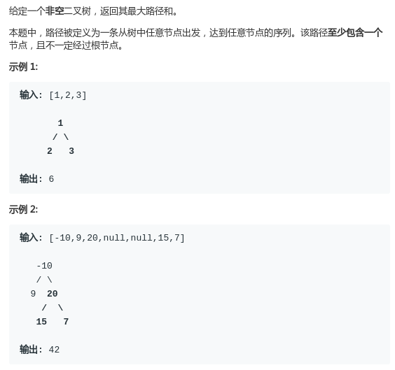
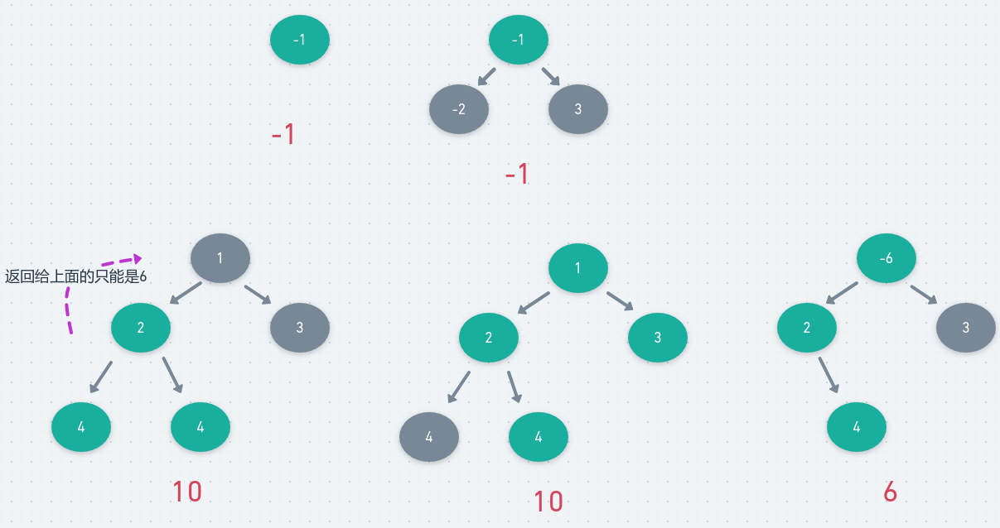

# LeetCode - 124. Binary Tree Maximum Path Sum

#### [题目链接](https://leetcode.com/problems/binary-tree-maximum-path-sum/)

> https://leetcode.com/problems/binary-tree-maximum-path-sum/

#### 题目



## 解析

也是很明显的递归题目。

* 当前递归的节点`node`，先求出左右子树的最大路径和。
* 全局最大值的可能情况有很多。
  * 可能是当前节点和左右子树的最大路径和之和；
  * 也有可能是左右子树其中一个最大和 和 当前节点的和；
  * 也有可能就是自己节点本身就是最大的；
* 然后递归返回给上一层，有两种情况，一种是当左右子树中最大路径和**最大的那个**大于0的时候，就返回`max + node.val`，否则返回`node.val`；


图:




代码：

```java
class Solution {

    private int res; // 需要用一个全局最大值更新

    public int maxPathSum(TreeNode root) {
        if (root == null)
            return 0;
        res = Integer.MIN_VALUE;
        recur(root);
        return res;
    }

    public int recur(TreeNode node) {
        if (node == null)
            return 0;
        int L = recur(node.left);
        int R = recur(node.right);
        res = Math.max(res, L + R + node.val);
        res = Math.max(res, Math.max(L, R) + node.val);
        res = Math.max(res, node.val);
        int max = Math.max(L, R);
        return max > 0 ? max + node.val : node.val;
    }
}
```

